# PLAN-GRAPH - 全项目依赖图（活文档）

> **★ 2026-09-23 梳理**：对外/决策入口改为 **`../docs/v100-dev/`**（3+1：计划突破 / 已突破 / 失败记录 + 规划拓扑）。
> **只认二次开发**（代码/内核/运行时）；`-ub` 等用户配置不入成果。本文件仍是**过程细节与证据**的活图，冲突时以 `docs/v100-dev/` 的收口结论为准。
>
> **这是本项目的唯一入口，也是最高优先级产物。** GitHub 直接渲染 Mermaid 图形；模型廉价加载文本。
> **怎么用**：① 看 §1 主图知道现在在哪、钱在哪、下一步做什么；② 看 **§3 外部项目解读矩阵**知道「这件事该抄谁的哪个文件」；
> ③ 引用任何结论前先查 §1 粉框（条件结论）；④ 每做完一件事按 §4 回来复读接线。
> **规矩（用户 2026-09-21 明确定下）**：
> 1. **试过的每一样东西都要画上来，包括走错的坑**；证伪的节点**只改灰、不删除**（「为什么被否」本身是信息）。
> 2. **每完成一件事，必须回来复读这张图**，检查**某个环节是否还需要接线**。
> 3. 新结论若依赖别的节点，**必须画成粉框『条件结论』并连到依赖方**。
> 4. 外来想法随时接进来（§3）。
> 5. **账在 `PLAN-to-180ts.md`**（已按 tg >= 150 重写，并经 R146/R149 两次更正）：到 150 需要 -18.5 ms；**8K 路径 = N6a + N6b + P-B + N7**（N6a 单独只值 -2~-3）；**N1 是长上下文项**；先手是 Z1-Z6。

## 1. 主图

```mermaid
flowchart TD
  subgraph GOAL["目标（用户 2026-09-21 重申：至少 150 T/s 以上）"]
    G["★ 硬指标 tg >= 150 t/s<br/>= AL 5.55 下 ms/轮 <= 37.0<br/>（现 55.5, 需再 -33%）"]:::goal
    G180["原验收 180 t/s / ~20 ms/轮<br/>= AL 5.55 下 30.8 ms"]:::goal
    G1C["对标 1cat 17.463 ms/轮 221-263 t/s"]:::goal
    G --> G180
    G180 --> G1C
    BASE["基线 tg 99.97/99.18, AL 5.55, 55.5 ms/轮<br/>距 150 还差 +50%；32K prefill 2163 t/s<br/>sha256 f3edac19..."]:::fact
  end
  subgraph BUDGET["每轮细账 55.5 ms（实测）"]
    HOST["meta 主机循环 29.4 ms (53%)"]:::hot
    DEV["dev 19.7 ms"]:::hot
    ARX["ar 6.1 ms"]:::cool
    PRO["prologue 3.3 ms"]:::cool
    GPUQ["GPU 串行约 34.5 ms<br/>权重12.1 + M8增量6.5 + ..."]:::fact
    HOST --> DEV
    HOST --> ARX
    HOST --> PRO
  end
  ADD["可加性: 轮时 ~= 主机 + GPU串行<br/>(4 臂实测 55.1=20.6+34.5)<br/>R142 被强制同步实验独立支持"]:::fact
  HOST --> ADD
  GPUQ --> ADD
  ADD --> G
  subgraph DONE["已落地提速 +78%（项目早期）"]
    D1["并行化 DFlash2 CPU selector<br/>23.45->4.3 ms/轮 +26.8%"]:::ok
    D2["GGML_CUDA_P2P=1 +10.6%"]:::ok
    D3["NCCL 编进 libggml-cuda +18.4%"]:::ok
    D4["Volta D=256 FA Q_in_reg=false<br/>32K +11.1%, 128K +28.6%<br/>(fattn-mma-f16.cuh 配置表)"]:::ok
    D5["C4 Volta MMVQ nwarps=2 +2.8%"]:::ok
    D6["C5 mmvq/mmq 交叉点=4 Q4_K_M +15%"]:::ok
    D7["PR#27858 DFlash2 tensor 崩溃修复"]:::ok
  end
  BASE --> DONE
  D4 -.->|同一张配置表, 后续工作| N3
  subgraph REFUTED["已证伪 / 已排除（不删，只改灰）"]
    X1["layer split<br/>77.0 vs 55.1 ms/轮（慢40%）"]:::no
    X2["KV 压缩<br/>KV 仅占每轮流量~1%<br/>V100 上代价 -6~-22%"]:::no
    X3["R1 设备侧 push AR<br/>省4.8ms主机但轮时不动<br/>在役 61.5us vs NCCL 53.0us<br/>R142 解释: 代价搬到GPU(非重叠)<br/>且 sglang 报 3.35us => 口径仍待查"]:::warn
    X4["A4 更深 FA KV 切分<br/>26.85->22.43 单调变差"]:::warn
    X5["TP2/TP4/TP6<br/>83.5 / 更差 / 95 ms/轮"]:::cond
    X6["MoE 方向（模型稠密）"]:::no
    X7["NCCL 调参"]:::no
    X8["让 VEC 接管 M=8"]:::no
    X9["VLLM_SM70_USE_BREAKABLE_CUDAGRAPH<br/>1cat 实测 -13~-29%"]:::no
    X10["--spec-draft-device<br/>output.weight 在 Meta() 缓冲"]:::no
    X11["自写 WMMA 原型 90 GB/s 慢6.2x<br/>样本可能坏: sm70 无 ldmatrix/swizzle"]:::warn
    X12["AR 的 us 级微优化"]:::no
    X13["并发测量"]:::no
    X14["A2 递归状态索引式写入<br/>逐位中性已验证; 但 prefill 真因<br/>是 mask/KV 宽度, 非递归 head"]:::warn
    X15["HMMA/FP16 TC 权重路线(1.36x)<br/>口径已更正, 见 K5"]:::no
    X16["照抄 jusko D256 FA 常量: -1.19%<br/>pp32768 2162.64 vs 2136.88, 两轮 ABBA<br/>sha256 一致; 只覆盖 ncols=64 行<br/>(ncols=32 行本次没走到)"]:::no
  end
  X1 -.->|它量化出| METATAX
  METATAX["★ meta 税 = 15.8 ms/轮<br/>alloc 15x, enqueue 4x"]:::hot
  METATAX --> HOST
  subgraph CAMP["B5->B6 主机侧战役（2026-09-22 晚，账本 R277-R279）"]
    B5NOW["当前采用链 B5 = 45.94 ms/轮<br/>tg 113.28/94.32/145.65（= B4+FGC 关）<br/>vs B4 -2.1%, vs B3 -8.5%, vs 原版 -54%<br/>sha256 f3edac19..., AL 5.55/4.22/6.38"]:::fact
    CALIB["标定 R278: spin 探针主机穿透 50%<br/>1 ms/call ~ 1.50 ms/轮杠杆（post-T8）<br/>=> 到 37.0 需砍 ~6 ms/call 当量"]:::cond
    FLOOR["GPU 地板直测: 真实 duty 70-85%<br/>nvidia-smi 本平台欠采样(报31.7%)<br/>须用预填充饱和段校准上限<br/>=> 地板 30-36, 饥饿区 10-16 ms/轮<br/>（本战役猎场）"]:::fact
    F1P["✗ F1 指针折印快路径<br/>r_stamp=509/513: split_graph 每调用<br/>ggml_free+ggml_init 重建张量工厂<br/>(ggml-backend.cpp:1085-1087)<br/>+ input_dep 无条件新生(:1514)<br/>=> 指针身份逐调用漂移, 快路永不命中"]:::no
    F1V3["✗ F1-v3 槽命中跳过 needs_realloc<br/>机制生效仅省 7%（852->792 us/call）<br/>=> alloc 2.16ms 真身 = 指派遍历过<br/>meta init 钩子（新张量逐个算分裂态）"]:::no
    FIXA["✗ Fix A 副本/依赖池化（R279）<br/>反向 7.8%（46.06->49.65 ms/轮）<br/>prologue 0.56->1.17 翻倍<br/>=> 身份稳定只是必要不充分<br/>meta 容器乒乓才是缓存线真堵点"]:::no
    FIXB["Fix B 后备大招: 停 meta 容器乒乓<br/>(stc_compute[2] 逐 compute 换容器重建<br/>镜像, meta:2289-2290) + 内容键化<br/>= E6 五次 abort 雷区，慎入"]:::next
    F3N["★ F3 子图级捕获（前置已验）<br/>FGC 悖论 = NCCL 官方铁律:<br/>含集合操作的图其回放本身是集合操作<br/>(docs.nvidia.com deeplearning/nccl<br/>/cudagraph.html) => 三卡整图锁步是设计使然<br/>F3 = 纯计算子图捕获 + AR 图外直发<br/>= 官方推荐形态; 65% compute<20us 达标<br/>预期 -2~4 ms/轮"]:::next
    F2C["F2-1c 调用序重排（进行中, env 门控<br/>GGML_SPEC_EARLY_PROCESS）<br/>特征拷贝前置(:2031 提到 :1954 前) +<br/>process() 入同步窗(:3703 llama_synchronize 前) +<br/>gate 前置于 topk 扫描<br/>预期 -0.8~1.5 ms/轮；零语义"]:::next
    FPDN["FPD 判决: 单槽指纹 last_graph_fp<br/>对三形交替（target/注入/块）workload<br/>结构性永不命中（skipped=0 真因）<br/>TOP 破字段 = (reshaped):RESHAPE.nb2/ne0<br/>= 逐调用新生的视图节点"]:::warn
    B2BLK["B2 图内 selector TP 化: 机制全清<br/>但本模型几何受阻（n_embd_dec=32 行槽<br/>装不下 3k 候选 lattice 240 行/gate 256 行）<br/>复活条件 = 大 hidden draft（槽>=286 行）<br/>残值 -2~3 ms/轮"]:::warn
    RULES["战役纪律新条目（R278-R279 固化）:<br/>① 特性 A/B 必须带机制自证计数<br/>（F1 假零效果 = 机制未生效白读墙钟）<br/>② 分账先于设计（[META]/[GALLOC_FAST] 解剖）<br/>③ 构建验证与 A/B 启动分两步（两次踩坑）<br/>④ 采样计数器须饱和段校准<br/>⑤ 备份用绝对路径 + 新文件入拷贝清单<br/>⑥ 还原须走【树+影子源(/tmp/t15)】双通道<br/>还原后标记串三查（strings 含被撤 env 名=0）<br/>（影子源尸体教训: 假还原 +3.6 潜伏三轮）⑦ **多线程实机互斥（用户 2026-09-23）**: 实机占用由主代理统一排期, 任何实机测试/探针/构建前先盘点 job_list + 子代理清单 + nvidia-smi 只读查询, 有占用即让行"]:::tool
  end
  B5NOW --> CALIB
  FLOOR --> CALIB
  CALIB --> F2C
  CALIB --> F3N
  F1P -.->|真凶定位: 张量工厂逐调用重建| FIXA
  F1V3 -.->|真身=指派遍历/钩子| FIXB
  FIXA -.->|缓存线单独不可赢| FIXB
  FPDN -.->|指纹跳过线关闭| FIXB
  F3N2["F3 v1 判决 R281: 数值根治(水槽签名)<br/>p1 -3.0% / p2 -1.5% 稳态真赢<br/>p3 +6.4% 短负载之谜拖正均值<br/>=> v1 不采用; v2 修点=p3谜+签名成本<br/>record-only 鉴别: 记录语义无病,<br/>命中路径地址漂移(确定性)已根治"]:::warn
  F3N -.->|v1 判决| F3N2
  F3N2 --> METATAX
  F3FIN["F3 终局 R285: 六连不采用关闭<br/>v1 指针签=损坏 / v2 水槽=+0.3<br/>v3 热身出窗=+0.55(一次性假说死)<br/>v4 内容签=门绿+0.0(recs 12507)<br/>v5 二见=+2.4(线性扫描税)<br/>v6 O(1)+槽内seen=净值 0.15%噪声<br/>=> 真实净值 0±0.3%, p1 早测含交叉假象<br/>副产品: 内容签名正确性法/二见政策/<br/>O(1) 直映射槽/record-only 鉴别/热身协议"]:::no
  F3N2 -.->|v2-v6 迭代| F3FIN
  F3FIN --> METATAX
  F3FIN -.->|方法论资产| RULES
  F4MMA["F4 内核战役 R286-R287: mma 路线存档<br/>神谕验证内核+七轮迭代+ncu 双画像<br/>根本洞见: n<=8 matvec 纯访存型,<br/>mma 暂存+碎片重载=零收益纯开销<br/>外链断链否证(寄存器外溢 4.5x)<br/>缺口真因: n=8 内存吞吐 34% vs n=1 95.6%<br/>F4' 三杆: 预取解锁(锁死 DGX_SPARK)/<br/>内链断链/halve-iters 尾判版"]:::no
  F4MMA --> METATAX
  F4MMA -.->|路线图| N12
  F4MMA -.->|方法论资产| RULES
  F2C --> METATAX
  X9 -.->|官方定性其死因, F3 恰是其反形态| F3N
  E4V -.->|同一 split 重建根源| F1P
  METATAX -.->|穿透 50% 定价尺| CALIB
  RULES -.->|约束所有 A/B| CALIB
  B2BLK -.->|大 hidden draft 才解锁| SELGRAPH
  X11 -.->|样本若坏则说明此路未试过| N1
  X14 -.->|A2 的补丁已在树里(门控), 未测 decode| C1
  X4 -.->|其探针| PFA
  subgraph PROBE["探针（env 门控，默认零影响）"]
    P1["LLAMA_ROUND_TIMING / _SYNC"]:::tool
    P2["LLAMA_SPEC_TIMING"]:::tool
    P3["GGML_CUDA_AR_TIMING"]:::tool
    P4["GGML_CUDA_GRAPH_DEBUG"]:::tool
    P5["LLAMA_GRAPH_SLOT_DEBUG"]:::tool
    P6["GGML_META_HOST_TIMING"]:::tool
    P7["GGML_CUDA_DIRECT_DEBUG"]:::tool
    P8["GGML_RS_INDEX_WRITE (A2 门控)"]:::tool
    P9["GGML_CUDA_OP_TIMING (已坏, 负值)"]:::tool
    PFA["GGML_CUDA_FA_SPLIT_FLOOR (A4)"]:::tool
    P10["GGML_SCHED_SPLIT_TIMING"]:::tool
  end
  P4 --> C1
  P7 --> C1
  P7 -.->|R149 疑点(子代理自己标注未验证): 计数器按 graph_key=nodes[0] 分桶<br/>若 nodes[0] 在旋转容器间交替, 则 13.97% 是交错统计| D2S
  P6 --> METATAX
  P5 --> C1
  P8 -.-> X14
  C1["因果链: 图重建 -> split_graph 重发 uid<br/>-> uid 快路径失效 -> 全量 memcmp<br/>-> 指针移动 -> 属性变化 -> direct+warmup重置"]:::hot
  C1 --> DEV
  C1 --> D2S
  D2S["direct 占调用 13.97%（两臂逐位相同）<br/>吃掉 dev 的 59%<br/>抖动主体是形状 ne/nb, 源=GDN递归状态视图"]:::hot
  subgraph COND["★ 条件结论登记册（引用前必查）"]
    K1["KV 保持 q8_0<br/>⇐ 依赖 N1"]:::cond
    K2["长上下文带宽仅105GB/s=低效<br/>⇐ 可能是冗余流量(N8)"]:::cond
    K3["n_max=7 最优<br/>⇐ 依赖当前内核 T 特化"]:::cond
    K4["TP3 最优 / 加卡不买带宽<br/>⇐ 依赖当前 meta 税"]:::cond
    K5["HMMA 天花板 1.36x<br/>= Q8_0 格式内余量, 非换格式收益"]:::cond
  end
  X5 --> K4
  X11 --> K5
  X15 --> K5
  N3 --> X16
  X16 -.->|N1 让 decode 走 MMA 之后必须重测| N1
  K5 --> LOWBIT
  BW1 --> G
  BW1 -.->|同源| N12
  BW1 -.->|QPN 是它的成熟形态| LOWBIT
  LOWBIT["★ 低比特权重(4-5bpw) 路线 —— R154 改判<br/>旧: 端到端仅 +10~13%(按800GB/s,权重占22%)<br/>新: 按实测438GB/s, 权重占轮时 **40%**<br/>=> 省 10.4~13.8 ms/轮 = tg +23~33%<br/>= 与 N6 同级候选主线"]:::cond
  BW1["★ BW1 R154 新主线: 提高 q8_0 权重流有效带宽<br/>现在 438 GB/s(V100 实用 800 的 55%)<br/>到 700 就省 8.3 ms/轮 = tg +16%<br/>不动格式/不动加载, 只动 GEMV 内核效率<br/>抓手: N12 + v100-skinny QPN(620 GB/s 实测)"]:::next
  subgraph TODO["待办节点"]
    N0["N0 定论(R142): 强制同步仅 +0.4~0.8 ms/轮(0.65-1.5%)<br/>两臂 draft_n/draft_acc 逐位相同<br/>=> target 步本就同步, 无整轮重叠"]:::ok
    N2["N2 只读诊断: 打印 D==256&&Q>1 的 FA kernel<br/>成本极小"]:::next
    N13["N13 KV dtype A/B (f16 vs q8_0)<br/>零代码, 1cat 自测长上下文 f16 胜"]:::next
    N1["N1 q8_0 KV 张量核注意力 —— **R170 密集阶梯封顶**<br/>稳态(r=8, 一次加载)浅段斜率只有 0.10-0.14 us/ctx-token<br/>256->8192: 21.35 -> 22.18 ms/token (+0.83 ms, 3.8%)<br/>=> 8K 全注意力约 **1.1 ms/token = 5%**（不是 6-13 ms）<br/>加上 f16 转换（约 0.8 ms/轮）=> 整条 KV 线在 8K 上封顶 ~2 ms/轮<br/>（N8/N8T/N13 同理；长上下文才有价值）"]:::no
    N3["N3 D256 FA 常量 A/B: 已判决<br/>jusko 常量 pp32768 慢 1.19% => 不采用<br/>（decode 走 TILE 未测, N1 后须重测）"]:::ok
    N4["N4 P1-4 GDN x4 预填充 +2~2.3% PP"]:::todo
    N5["N5 P2-6 RMS_NORM+SCALE 融合<br/>去~480次launch"]:::todo
    N6["N6a metadata 缓存本身<br/>R149: 只值 -2~-3 ms (仅省 prologue)"]:::todo
    N6B["N6b ★形状稳定化(GDN 递归状态视图构造)<br/>R149: 它才决定 -7~-9 ms 能否兑现<br/>= N6a 的使能项"]:::next
    E4V["✗ E4 判决 (R180): draft 图 0% 复用是【结构性】的, 不是 bug<br/>三道门**任一**即判 0%: (1) res = gf_res_prev[n_outputs>0] 两槽, 但<br/>gf_res_prev_active 只有**一根**裸指针 (llama-context.h:374)<br/>=> 注入(logits 全 false, 槽0) 与块(logits=true, 槽1) 交替 = 每次换图;<br/>(2) allow_reuse (llama-graph.h:827-831) 明确禁止 token/embd 互斥<br/>(注入只带 embd, 块只带 token); (3) n_tokens 不等 (8.86 变 vs 8.00)<br/>否证: 按槽位各记 active 也救不了 -- sched 只有单份缓冲, miss 路径<br/>sched_reset(:1405) 已把另一张图的分配释放成悬垂<br/>=> 『让 draft 图可复用 = 潜在 ~15 ms/轮』**该奖赏不存在**<br/>那 7.4 ms/轮 (alloc 1.9 + enqueue 5.5) = 每轮必须重建两张图的代价<br/>唯一可动形态 = 每轮 2 次 decode 合成 1 次 (fused, spec.cpp:1396)<br/>≈ -3.7 ms/轮 (53.6 -> ~50, tg 97 -> ~104), 不是 7.4<br/>target 的 92% 由同一机制解释(每轮一次, 形状恒定) => 0%/92% 同源"]:::no
    E5V["★★ E5 实测 (R182-183): meta 主机账被改写 + 唯一够本的款子<br/>口径更正: [META] 打的是**累计均值**, 前 ~2000 次 compute 全是 prefill 且全 direct<br/>=> R174 的 total 21.28 / dev 17.44 **作废**; 稳态实测 **total 10.66 / dev 7.19 ms/call**<br/>sub/call=47.5, ar/call=46.5, 149 compute/call; 每次 AR 47.7us<br/>[GRAPH] 稳态: **replay 85.4% / direct 12.6% / capture 2.0%**; props changed >=17000 (13.7%) 与 direct 一一对应<br/>成本模型: 125x30us + 20.6x281us + 3.4x300us = 10.56 vs 实测 10.66 ms/call (吻合)<br/>=> **direct 20.6 次 x 281us = 5.8 ms/call x 3.27 decode/轮 = 19 ms/轮** (53.6 -> ~34.6, **tg ~150**)<br/>决定性一行: prop diff #712000 node=node_0 MUL_MAT new_ne=[5120,1] **old_ne=[5120,38]**<br/>= **同一个 CUDA 图 key 被两种形状轮流使用** = 上游 **#28652** 标题逐字对应<br/>832 meta calls ~= 850 decode => **target 与 draft 共用同一个 meta 后端上下文**"]:::hot
    E6V["E6 判决 (R185-186): direct 的根因 + 一次失败<br/>[FPSTAT] 实测 832 calls: same_as_prev=0 distinct=24 max_count=266<br/>=> N6a 的单槽(紧邻一次)缓存**结构上永不命中** (追溯解释它实测无效)<br/>=> 图内容只有 24 种, 最高频占 32% => 多槽/内容感知轮转**理论上能兑现**<br/>对照可复现性: e6c0a/e6c0b tg **96.46/96.45 (差 0.01%)**, FPSTAT 逐位相同<br/>x 三个变体全部 abort: ggml-backend-meta.cpp:2144 GGML_ASSERT(bcj.nodes[i])<br/>(1)fp%N 选槽+命中不 reset (2)再加立即提交 stc_compute_index (3)保留无条件 reset 只改槽位<br/>=&gt; **否证: stc_compute 索引不可自由重选** (buffer_simple_tensor 依赖<br/>per-container 状态; 提交点在 :1332 另一个函数)<br/>下一手: 内容感知 2 路轮转(索引永在 {0,1}, 不跳 reset) env GGML_META_FP_SLOTS<br/>WIP 存档 wip-slot-cache.patch; 机器已还原(libdir-instr = libdir-c0)"]:::warn
    N7["N7 P2-selector 上 GPU<br/>4.3 ms/轮 = 7.7%<br/>⚠️ R159: ninfer 那个 op **不是 drop-in** ——<br/>它的契约是「路径选择」(predecessor/successor<br/>codebook 的 K 步链, candidate_ids+unary_scores<br/>+projected_hidden, 16 候选), 与我们的<br/>CPU selector 语义不同 => 需要先做语义映射"]:::todo
    N8["N8-vec GQA read-once —— **R165 同源斜率否定**<br/>6 遍冗余同样没有变成 DRAM 流量<br/>（与 N8T 同因：L2 吸收）"]:::no
    N8T["N8T TILE ncols2 2->3/6 —— **R165 实测否定**<br/>同源斜率 0.070/0.094 us/ctx-token<br/>= 等价于 KV 只读 1 遍 @435 GB/s<br/>=> 指令级的 3 遍/6 遍**没有落到 DRAM**<br/>（L2 吸收了冗余）=> 做它收益约 0<br/>配方仍留档于 §3.6（issue #28761 约束 ncols<=32）"]:::no
    N9["N9 prefill 尾块 split-KV<br/>外测 9.45x"]:::todo
    N10["[RT] 7 处 fprintf 探针规整为 env 门控"]:::todo
    N11["整轮单图 / 静态形状（1cat fullgraph 路线）"]:::todo
    N12["N12 MMVQ x4 权重解码外提（jusko）"]:::todo
    N14["N14 按 context 自适应 n_max<br/>SK6: k=3@65k 比 no-spec 还快 16.5%<br/>零代码, 先测 256K 上 n_max=7 是否反而更差"]:::next
    Z["★ 先手量测 Z1-Z5<br/>R160: Z1 的 ctx 扫描**已作废**(prompt 太短,<br/>--ctx-size 只分配不填充 => 三臂同条件)<br/>Z1 仍有效: 8K 无投机 45.31 t/s = 438 GB/s<br/>Z2 探针已编(FAK 有, MKEY 待增量重编)<br/>Z3 n_max / Z4 KV dtype / Z5 已完成"]:::warn
    Z6["Z6 锁频 (qwen38 的 lock-clocks.sh)<br/>nvidia-smi -pm 1 -lgc max -lmc max<br/>我们没做; 会改变测量条件 => 须先决定再记录"]:::todo
    Z7["★ Z7 模型大小标定 (零代码, 判定 BW1 归因)<br/>同一 harness 换 M=Q2_K_XL(9.14 GiB)<br/>Q8_0 27.04 GiB 实测 22.07 ms/token<br/>若线性 => 7.46 ms/token, 证明纯带宽受限<br/>若远大于 => 说明有非带宽的固定开销"]:::next
    Z8["★ Z8 主机图指纹差异探针 GGML_SCHED_FP_DIFF (R167, 已语法检查通过)<br/>装在**根因层** ggml-backend.cpp:1086 (split_graph 无条件重铸 uid)<br/>报: 逐字段差异 TOP8 + 与最近 8 次同指纹的次数/距离直方图<br/>=> 同时回答『谁在变』与『N6a 该做几槽缓存』<br/>配套一臂同时开 GGML_SCHED_SPLIT_TIMING + GGML_SCHED_SPLIT_CACHE<br/>（[SCHED] 行给 split/alloc us/call 与 cached= 计数）"]:::next
    H5["✗ H5 浅上下文台阶假设 —— **R168 已被否定, 只改灰**<br/>0.7952 us/ctx-token 是「r=10 稳态」比「r=1 瞬态」的假象<br/>稳态下 d300(F 43.56 t/s) 与 d8192(F 42.55) 只差约 2%<br/>保留此节点: 『用 r=1 单点算斜率』这个坑必须留档"]:::no
    TP["✔ TP 卡数扫描已结清 (R169, 复用旧臂数据 /tmp/tp-sweep.txt)<br/>口径: NPRED=192 NODROP libdir-instr P2P=1 三 prompt<br/>**ms/轮** (不是 tg, tg 受 AL 混淆):<br/>TP2 59.8 | TP3 61.8 | TP4 69.6 | TP6 93.7<br/>enqueue_us/轮: 20.0 -> 27.4 -> 36.2 -> 62.0<br/>=> 加卡**不**省时间: 每加一卡 AR 多付 7-26 ms/轮,<br/>远大于权重量少 25%/50% 省下的 5.5/11 ms<br/>⚠️ 但这正是 E1/N11 的商业理由: AR 变便宜后 TP4/TP6 才成立"]:::ok
    RB["⚠️ RB rep-1 瞬态偏差 (R168, 子代理发现并自查)<br/>llama-bench -r 1 的均值偏低 20-27%<br/>d8192: -r1 33.62 vs -r8 41.43 t/s (+23%)<br/>d300 反解 S=34.06 F=43.56 (rep1 慢约 22%)<br/>=> 所有 r=1 的历史点不可入账<br/>规矩: 要入账的 llama-bench 数字必须 -r>=8 且报 +-<br/>(AGENTS 4.36; 同时解释了 R144 那个 49% 离散的臂)"]:::warn
  end
  N0 -->|实测支撑| ADD
  N0 -->|裁决: 非重叠, 而是代价从主机搬到 GPU| X3
  N0 -->|据此重审 A4 是否同类| X4
  N2 -->|为 N1 提供动机| N1
  N1 -->|解锁| K1
  N1 -->|解锁| K2
  N1 -->|令其相关| N3
  Z8 -->|量化 uid 抖动的真实来源| N6
  Z8 -->|它决定形状是否真在变| N6B
  Z8 -.->|判据: 命中距离| N11
  RB -->|它作废了 H5| H5
  X3 -.->|AR 便宜了 TP4/TP6 才成立| TP
  TP -.->|更少卡 = 每卡权重更多 = 更依赖带宽| BW1
  TP -.->|每卡权重更少 = LOWBIT 的替代路线| LOWBIT
  RB -.->|不改 harness(NPRED=512) 的稳态结论| G
  RB -.->|深度曲线必须用 r>=8 重测| Z
  H5 -.->|（已否定, 此边仅留痕）| N1
  N1 -->|解锁| K3
  METATAX -->|消灭它则解锁| K4
  N6 -->|消灭| METATAX
  N8 --> K2
  N8T --> K2
  N8T --> G
  QP1 -.->|其补丁不动我们的路径| N8T
  N8 --> G
  N9 --> G
  N13 --> G
  N13 -->|若 f16 长上下文胜出则须改写| K1
  N1 --> G
  N4 --> G
  N5 --> HOST
  N7 --> HOST
  N12 --> HOST
  N1 -->|消除形状抖动的源头之一| C1
  N11 --> C1
  N10 -->|让归因可信| C1
  subgraph ENABLE["★ 使能链（A 现在看着亏/中性, 但 B 的提速基础是 A）"]
    E1["E1 X3 设备侧 push AR<br/>现 61.5us 看着比 NCCL 53.0us 差"]:::warn
    E2["E2 N7 selector 上 GPU<br/>看着只是 7.7%"]:::todo
    E3["E3 N6 metadata 缓存+状态指纹<br/>看着只是省主机时间"]:::todo
    E4["E4 降 n_max 到 3 (T=4)<br/>看着是 AL 损失"]:::cond
    E5["E5 N1 q8_0 KV 张量核<br/>看着只是 attention 一条线"]:::next
    E6["E6 N13 f16 KV 今天可能赢<br/>但赢的可能是反量化的钱"]:::next
    E7["E7 N12 MMVQ x4 解码外提<br/>看着是零头"]:::todo
    E8["E8 N6 主机循环 53%<br/>看着与加卡无关"]:::todo
  end
  E1 ==>|图内 AR 才可能| N11
  E2 ==>|图安全前置| N11
  E3 ==>|先搞清哪些字段在变| N11
    E4V ==>|否证 draft 侧复用; 只剩 fused 一条| N11
    E5V ==>|19 ms/轮: 候选 A 多槽 / 候选 B 形状敏感 key| N11
    E6V ==>|判据已实测; 实现待解容器契约| N6B
    E7V["x E7 判决 (R189): 形状敏感 CUDA 图 key -- 机制成立, 性能为零<br/>四臂同源 A/B (env GGML_CUDA_GRAPH_KEY_SHAPE, 只动 ggml-cuda.cu)<br/>**direct 17345 -&gt; 13806/13811 (-20.4%)**, replay +3.6% (机制与诊断逐项吻合)<br/>**但 tg: C0 均值 97.40 vs 特性均值 97.31 (-0.09%, 噪声内)**, ms/轮 56.8 vs 57.0<br/>=&gt; 删掉约 1 s 主机工作(臂时 6.8%)**一点没省**<br/>=&gt; **撤销 E5 的 direct =&gt; 19 ms/轮**; 计数器增减不能当墙钟代理<br/>=&gt; 新纪律: 不得再从'省主机时间'推收益; 主机侧改动必须同臂量边际<br/>不采用 (有 +0.7us/compute 与图对象代价); 以该前提为依据的结构性改动同时停<br/>上游坐标: #28652(OPEN) / #28666(关未并, 唯一改 key 的尝试)"]:::no
    E7V -.->|否证: direct 不在关键路径| E6V
    E7V ==>|新判据: 关键路径是主机还是 GPU?| SPIN["SPIN 判定实验 (已结清, 见 E8V)"]:::ok
    E8V["★★ E8 判决 (R191): 主机时间在关键路径上 -- 拿到标定杠杆<br/>四臂同源: spin=0 vs spin=3000us (GGML_META_HOST_SPIN_US)<br/>p1 5262.5 -&gt; 5762.8/5748.0 ms; p2 6486/6488 -&gt; 7143/7147; p3 2718.8/2716.6 -&gt; 3005.1/2980.4<br/>**对照两臂差 0.001%**; 四臂 sha256 f3edac19... 全一致<br/>=&gt; ms/轮 +5.4/+5.5/+5.7 (注入 9.9) =&gt; **穿透率约 55%**<br/>=&gt; **每 1 ms/call 主机时间 约等于 1.8 ms/轮**<br/>=&gt; 要到 37.0 ms/轮 需砍约 11 ms/call, 而总共只有 10.66 =&gt; **必须几乎砍光**<br/>=&gt; 与 E7 不矛盾: direct 只是主机时间一小块 => 关键是那 10.66 是什么"]:::hot
    E8V ==>|把 10.66 拆成三块| E9V
    E8V -.->|否证: 计数器增减不是墙钟代理 (E7)| E7V
    E9V["★★ E9 判决 (R192, 见 E9-DEV-BREAKDOWN.md): dev 拆分<br/>两臂同源 (dev1/dev2, 8281/8282), MEDIAN_TG 97.81/97.09, sha256 门未破<br/>**dev 三卡完全对称**: dev0=2.441 dev1=2.290 dev2=2.292 ms/call (不是掉队卡)<br/>每次 compute (n=118884, 142.9 次/call): min 6 / **中位 24** / max 16367 us<br/>**双峰**: &lt;20us 43% + 20-60us 43% = **86% 便宜**; **&gt;150us 占 11.7% (13963 次)**<br/>反解: 长尾吃掉约 3.1 s (53%), 均值约 224 us/次<br/>**11.7% &gt;150us 与 [GRAPH] 的 12.6% direct 精确对应** =&gt; direct 单价约 224 us (原估 281 基本正确)<br/>但 E7 删 20% direct 零收益 =&gt; **长尾被 GPU 重叠吃掉** (E8 那 45% 未穿透的来源)<br/>=&gt; **靠 replay 治长尾不可靠; 减固定次数才直接命中 86% 主体**<br/>折算(1.8x): 主体&lt;60us 2.4 ms/call =&gt; ~4.4 ms/轮; ar 2.21 =&gt; ~4.0; prologue 1.25 =&gt; ~2.25"]:::hot
    E9V ==>|优先级 1: 减子图数/合并切分| N11
    E9V ==>|优先级 2: 图内 AR (46.5 次主机启动消失)| E1
    E9V ==>|优先级 3: prologue 重建| N6B
    E9V -.->|不可靠: replay 治长尾| E7V
    E10V["x E10 判决 (R195, 子代理 b7316892): 延迟 AllReduce (GGML_META_DELAY_AR) 在本负载上【结构上不可能】<br/>[DLY] 探针实测: target call **n=4950 节点 / 129 个 PARTIAL 边界**, 269/269 **del=0**<br/>linear_attn_out-N gap=8 首消费者 RESHAPE; attn_output-N gap=7 首消费者 ADD; ffn_out-N gap=78/44 首消费者 ADD<br/>draft call n=648 / 11 边界 / uses=3 / del=0; result_output uc=0 在末尾<br/>=&gt; 被归约的值永远被紧邻的下一个节点消费 =&gt; 连上游 MoE 折叠 get_i_delayed (2104-2258) 也从不触发<br/>=&gt; 依赖条件: 唯一 use + 该 use 是求和 ADD + 中间节点 MIRRORED 安全; 且折叠只能折进那个 sum 自己的 AR<br/>=&gt; **优先级 1 (减子图数/合并切分) 用上游现成机制走不通**; 源码已还原 md5 9dbb5135e8eaf057f9e58c2fcd44a9b1"]:::no
    E11V["x E11 判决 (R195, 复核 /tmp/g4-ab.log + /tmp/aron.log): 设备端/内部 AllReduce 路线【死】<br/>g4-ab ARM-A (NCCL): tg=98.12 AL=5.55 ar_us_avg=53.0 **sha256 f3edac19... = 门值**<br/>g4-ab ARM-B (device AR): tg=94.45 ar_us_avg=61.5 (timed 14645 vs 20193) **sha256 69207026... 门破**<br/>aron (device-side push AR enabled): tg=89.80 **sha256 69207026... 门破**, 且 aroff2 对照臂 LAUNCH_FAILED<br/>=&gt; 既更慢又改变数值 =&gt; 不采用; 单次 AR 的 47.7us 压不动, 而次数已被 E10 证明减不动"]:::no
    E9V -.->|优先级 1 的现成机制已否证| E10V
    E9V -.->|优先级 2 的一半已否证| E11V
    FGC["★★★ FGC (R196-R197 **已上机, 采用**): meta 整调用单图捕获 = 1cat fullgraph 路线 -> 见 BASELINE-LEDGER B2<br/>**同源四臂 ABBA (唯一变量 env GGML_META_FULLGRAPH): 均值 ms/轮 54.35/54.14 -> 50.73/50.72 (-6.5%)**<br/>tg p1/p2/p3 = 99.83/80.59/115.78 -> 100.95/88.30/129.12 (p2 +9.6%, p3 +11.5%); 四臂 sha256 f3edac19... 全一致<br/>机制: [META] sub/call 47.6->3.2, ar/call 46.6->3.2, total 9.64->3.87, dev 6.30->1.40, ar 2.21->0.33 ms/call<br/>[RT] target enqueue 18.34->8.68 ms/轮; draft enqueue+alloc 5.42->1.70 ms/轮<br/>但**穿透率只有约 25%** (主机少 14 ms/轮, 轮时只少 3.6) => 轮时已被别的东西占住<br/>实测结构 (读 ggml-backend-meta.cpp:2520-2581 + [DLY]/[RT]): **target 一次调用 = 130 子图 x 3 卡 = 390 次图启动 + 129 次 NCCL AR**<br/>=&gt; 主机账本: target enqueue **18.8-20.7 ms/轮** (6074133/294) + draft 2 次调用 **7.5 ms/轮** (含 alloc 1.8 + build 0.12)<br/>若整调用捕获成每卡 1 张图: 主机 26 ms/轮 =&gt; ~0.1 ms/轮, 且 AR 进图后 GPU 侧启动延迟也消失<br/>难点: 指针必须跨调用稳定 (draft 556/556 rebuild = 每轮都换) + NCCL 必须在 capture 内可用 + 需抑制 CUDA 后端自身的 per-subgraph 捕获<br/>待判: GPU 真实忙碌率 (UTIL 臂在飞) -- 它决定天花板"]:::hot
    E10V ==>|优先级 1/2 都走不通 =&gt; 换层面| FGC
    E11V ==>|同上: 不能再靠改 AR 实现| FGC
    UTIL["★★ R196 实测 (nvidia-smi 100ms 采样 + 活动窗口对齐, 见 /tmp/ut.log + /tmp/util-*.csv): **主机是限流项**<br/>**无投机臂 (SPEC=--spec-type none): 时序几乎全是 &gt;=55% =&gt; GPU 约 95% 忙碌**, MEDIAN_TG 44.92 (22.26 ms/token)<br/>=&gt; 22.07 ms/token 与 438 GB/s 是**真实 GPU 工作**, 不是主机假象 (438/权重流 40% 的两阶段诊断仍成立)<br/>**投机臂 (ut1/q8c): 时序里大量 30-55% 与空隙 =&gt; 轮内 GPU 约 35-45% 空闲**<br/>=&gt; 55.3 ms/轮 里约 20-25 ms 是 GPU 空转 = 串行等主机 =&gt; 与 E8 的 19.2 ms/轮 定量吻合<br/>=&gt; 天花板 = GPU 忙碌约 30-33 ms/轮 =&gt; tg 上界约 168-185, **前提是主机不再挡路**"]:::hot
    E9V ==>|先量 GPU 到底忙不忙| UTIL
    UTIL ==>|达标路径 = 杀主机串行| FGC
    Q4A["x Q4_K_M 目标权重臂 (R196, 同库同口径 A/B: q4a 17.11 GB vs q8c 29.05 GB, NODROP 热加载)<br/>**权重减半不但没省时间, 每轮反而更长**: ms/轮 Q4 = 60.1/56.7/59.0 (均值 58.6) vs Q8 = 57.0/53.6/56.7 (均值 55.8)<br/>AL 同时下降: Q4 = 4.55/3.81/5.62 vs Q8 = 5.55/4.22/6.38 =&gt; tg 75.72/67.14/95.29 vs 97.32/78.78/112.44<br/>GPU 忙碌率反而更高 (util-q4a 时序几乎全是 #, q8c 有大量 = 与空隙) =&gt; **Q4_K_M 每个字节的 GPU 时间更多 (k-quant 反量化在 Volta 上不划算)**<br/>=&gt; **撤销 'LOWBIT 砍一半字节 = 省 10.4-13.8 ms/轮'**; 权重流不是投机轮里的约束<br/>greedy sha256 两边都是 f3edac19... (同一门值) =&gt; 短 greedy 看不出质量差, 但 AL 掉 15-18% 是真的"]:::no
    UTIL ==>|否证: 权重字节不是约束| Q4A
    E16["★★★ E16 (R198, 零改码实测: LLAMA_ROUND_TIMING_SYNC=1): 轮时拆解**闭合**<br/>target ctx **sync_us/rounds = 10836496/294 = 36.86 ms/轮**, 其中 enqueue 8.40 =&gt; **GPU 28.44**<br/>draft ctx 6.13 (214601/35); selector 5.16; sampler+其余约 2.5<br/>**36.86+6.13+5.16+2.5 = 50.65 = 实测轮时 50.7 =&gt; 账目闭合**<br/>三臂同源 (SYNC 关/开/关) 50.73/51.16/50.65 =&gt; 加 sync 只贵 0.4 ms =&gt; **目标 GPU 本来就不与别的工作重叠**<br/>=&gt; **AL 5.55 地板 = 42.2 ms =&gt; tg 上界 132** (主机全部消失也不够)<br/>=&gt; 150 t/s 只有两条路: 砍 target GPU 的 28.44 (每卡字节 或 有效带宽) 或 抬 AL"]:::hot
    FGC ==>|轮时拆解 (sync 探针)| E16
    TP4B["x TP4 判决 (R198, FGC 之后重测, 四臂同源 ABBA, 同库同 env): **仍然不采用**<br/>tp3a/tp3b 均值 ms/轮 **50.86/50.91**; tp4a/tp4b **51.86/51.90** (慢 2%)<br/>且 AL 从 5.58/4.25/6.38 掉到 4.23/3.97/6.08; sha256 变为 ccc284e4...(换卡数必变, 同配置内两臂完全一致)<br/>★ **R217 补齐: TP5 与 TP6 的门值都是 `69207026...`** (= **原版 b11053 基线的门值**, 见 goal-phase1-findings.md:22; E11 的 device-AR 臂也落在它上面)<br/>=&gt; 三个谱系: `f3edac19...` = 改造后的树(B2,TP3) / `ccc284e4...` = TP4 与 layer split / `69207026...` = 原版基线 + device-AR + TP5/TP6<br/>R217 复现 ms/轮: **TP3 51.2 / TP4 51.6 / TP5 53.9 / TP6 60.6** =&gt; 自 TP4 起单调变差 (又一次独立复现「加卡不买时间」)<br/>=&gt; **权重/卡 9.68 -&gt; 7.25 GB 一点没买到 target 时间** = 与 E14 同源<br/>=&gt; 与 E14 合起来: **28.44 ms 不是权重带宽瓶颈** (否则 TP4 应掉到约 21)<br/>=&gt; 卡数这条路封死 (TP6 另有 4 个 KV 头无法 6 分的结构问题)"]:::no
    ALUP["★★★ 由 E16 决定的主攻: **抬 AL** (tg 与 AL 成正比)<br/>现 AL 5.55; 1cat 的 AL 只有 4.06-5.21 却快 3 倍 =&gt; 缺口在轮时不在 AL, 但轮时已有 28.44 硬地板<br/>方案: 一轮串**两块草稿** (8+8=16 verify, 仍只 1 次 target 前向)<br/>预期 +8 verify 约 +7-10 ms, +1 草稿块约 +3 ms =&gt; AL 5.55 -&gt; 约 8.5-9.5<br/>=&gt; 轮时 62-66 =&gt; tg 约 136-161"]:::hot
    E16 ==>|地板 = target GPU| TP4B
    E16 ==>|另一条路| ALUP
    HROOM["★ R200: **arena 根因定位 + 修复** (meta buffer 的 compute 容器按 16x 模型 ctx 定尺)<br/>n_max=14 时 target 首次 decode 撞 `ggml_new_object: needed 754032 &gt; available 753664`<br/>backtrace: ggml_backend_buffer_init_tensor -&gt; 容器 ctx, **只差 1 个 tensor (368 B)**; 容器总共 2048 个槽<br/>=&gt; 上游假定「每个静态 tensor 最多 16 个 view」在块变长时不成立 (选择器/GDN 的 shape 工作是 per-token 的)<br/>=&gt; 已把 headroom 改成可调 (默认 32 = 2x, env GGML_META_COMPUTE_HEADROOM) =&gt; **加长掩码块的 AL 路线重新打开**<br/>盈亏平衡 p &gt; 0.125; 第一块接受率 = 5.55/7 = 0.79 =&gt; 若 OOD 位置保持, AL 约 11 =&gt; tg 约 150-158"]:::hot
    ALUP ==>|先解开 arena 限制| HROOM
    BLK14["x AL 路线判决 (R201, headroom 修好后四臂同源 ABBA): **加长掩码块不划算**<br/>hr7 (8 verify): AL **5.58/4.25/6.38**, ms/轮 **55.72/48.49/49.65 (均 51.26)**, tg 中位 100.1<br/>hr14 (15 verify, n_max=14): AL **6.47/6.06/8.24** (确实涨了! OOD 掩码位置接受率 13-27%), 但 ms/轮 **78.47/70.05/70.88 (均 73.0)**, tg 中位 86.3<br/>=&gt; target 阶段 **37.01 -&gt; 55.13 ms** (sync/rounds 12735075/231) = **每 verify token 1.24 -&gt; 2.59 ms**<br/>=&gt; 盈亏平衡接受率 p &gt; 0.1009 x 2.59 = **26%**, 只有 p3 勉强够 =&gt; **三档全部不如基准**<br/>=&gt; 结论: (a) **headroom 修复有效**, 加长块能跑; (b) 去噪器确实能外推到 OOD 位置; (c) 但 **verify token 的边际代价随批量强烈超线性**, 抬 AL 买不到速度<br/>=&gt; 串草稿块同理 (同样要 16 token verify) =&gt; **AL 路线整体关闭**; 150 只能从 target GPU / 主机 / 链上砍"]:::no
    HROOM ==>|解开后实测| BLK14
    OPS["★★ R203 逐算子表 (test-export-graph-ops 导出真实形状 -> test-backend-ops perf --test-file, CUDA0)<br/>**解码 MUL_MAT n=1: 70-1536 us, 678-820 GB/s** =&gt; 已到 V100 峰值(900) 的 76-91%, **解码矩阵乘没有内核空间**<br/>预填 MUL_MAT n=512: 12.8 TFLOPS ≈ FP32 峰值 82%<br/>**FLASH_ATTN_EXT (D=256/24头/n_q=512): 108972 us, 11.7 GB/s = 病态 (差两个数量级)**<br/>GATED_DELTA_NET 913us (49.4 GB/s); SSM_CONV/CONCAT/SILU/RMS_NORM 55-110us (386-705 GB/s)<br/>=&gt; 与 E16 自洽: 8-token target GPU 28.44 ≈ 17.3(矩阵乘,n=8 559 GB/s) + 9.4(非矩阵乘)<br/>=&gt; **解码侧已近硬件极限; 最大的未开发矿脉在预填充的 FA n_q&gt;1** (第二大缺口 2162 vs 3567-4069)"]:::hot
    E16 ==>|量化每一块还剩多少空间| OPS
    HMMA["★ R207 在飞 (子代理 37e83355): **sm70 预填充 Q8_0 -> FP16 张量核 GEMM**<br/>动机 (实测): 预填充 ffn_gate (m=17408,k=5120,n=512) = 1502 us = **60.8 TFLOPS ≈ INT8 dp4a 峰值 62.8 的 97%** =&gt; 已贴 roofline<br/>而 **V100 FP16 张量核 125 TFLOPS ≈ 2x dp4a** =&gt; 这就是 1cat 预填充领先 1.65-1.88x 的来源<br/>已否证的注意力侧 (别重做): PR #27997 的 sm70 tile 配置 (-1.2% / -4.2%), KV f16 vs q8_0 (无差别)<br/>★★ **R211 路线转向 (子代理实测)**: 手写 `m8n8k4` 当前形态只有 **26.7 TFLOPS** (纯寄存器 0 spill 也是 26.7) 而 **cuBLAS 在同一颗芯片上是 103 TFLOPS** (C16F 103.0 / C32F 101.3, 用同一套 m8n8k4 指令)<br/>&gt;= 26.7 **不是指令天花板**而是**占用率** (V100 每 SM 4 个张量核, 1 warp/SM 上限约 125/4 = 31, 与实测 26.7 吻合)<br/>**⇒ 收益来自「用 cuBLAS」而非「手写 mma」** ⇒ 新形态: Q8_0 权重**逐层反量化成 FP16** -&gt; 走**已有 fp16 cuBLAS 路径**, env `GGML_CUDA_SM70_HMMA_Q8`, 只挂 `ne11&gt;=64`, 只动 `ggml-cuda.cu`<br/>⚠️ 两条硬约束: ① **16 GB 卡装不下 19.4 GB 整模型 FP16 副本** ⇒ 必须逐层复用同一块 scratch; ② **每 ubatch 重反量化一次** ⇒ `-ub 2048` 时 pp8192 付 4 次约 216 ms (6.7%), 故 A/B 要同时测 `-ub 8192`<br/>预登记期望: pp8192 **2524 -&gt; 3300-3400**, pp32768 **2165 -&gt; 2900-3100**<br/>验收: pp8192 或 pp32768 提升 &gt;=5% (>=2 臂报 ± 与 r) + 解码不回退 + sha256 门<br/>基线: pp8192 **2524.55 ± 4.63** / pp32768 **2164.72 ± 3.19** / pp8192@d100k 1031.49 ± 0.51<br/>★★ **R209 弹药已找到（见 3.2.3 / NF10）**: `v100-refs/ninfer-v100` 里有 **Volta 门控（sm_70）的 W8G32 `mma.sync.m8n8k4` 融合反量化 GEMM，而 W8G32 ≡ Q8_0**（int8 码 + 每 32 元素一个 fp16 scale）<br/>含 int8-&gt;half2 **魔数解码**（每 2 元素 2 条指令、无 int-&gt;float）、**无 ldmatrix** 的 fragment 加载器、smem 行填充 `kXPad=8`、K 循环**单 barrier**<br/>=&gt; 「q8_0 要新写 34 字节块解包分支」这条**对矩阵乘已不成立**（对注意力仍成立，见 3.2.9）；且 Large-T 版是 sm_80+（`ldmatrix`），**别往 Volta 搬**"]:::hot
    OPS ==>|瓶颈已定量: dp4a roofline| HMMA
    HMMA -.->|若不收敛: 全部还原并入灰色名单| OPS
    FGCCONF["★ R204 FGC 独立复现 (本轮有一个真非-FGC 对照臂: 漏设 env)<br/>非 FGC: sub/call 47.6, total 9.66 ms/call, 均值 ms/轮 **54.33**<br/>FGC: sub/call 3.2, total 3.88, 均值 ms/轮 **50.91-51.20** =&gt; **-6.3%** (与 E15 的 -6.5% 一致)<br/>⚠️ **陷阱: GGML_META_FULLGRAPH 用 getenv()!=nullptr 判断 =&gt; 设为 0 也照样开启; 要关就完全不设**<br/>捕获路径拆解 (新计数器): sig=0.103 / fgrun=0.272 / fgcap=0.442; loop=2.798; prologue=1.118 ms/call (主要是 24 次 rebuild)"]:::ok
    FGC ==>|复核收益| FGCCONF
    CFIRST["x R204 capture-first (env GGML_META_CAPTURE_FIRST): **不采用**<br/>策略: !needs_rebuild 时第一次见到签名就录制, 省掉一次 plain loop<br/>四臂 ABBA: 控制 51.20/51.16 vs 特性 51.00/50.93 =&gt; **-0.4%, 落在同日噪声带 (0.7%)**<br/>=&gt; 又一次: 计数器变化 != 墙钟收益; 代码保留, env 默认不设"]:::no
    FGCCONF ==>|下一步试: 首次即录制| CFIRST
    CURVE["★ R214 **预填充曲线的机制变化 (新线索)**<br/>二次模型 (8K+32K 两点定) 在 **256K 上低估 2.5x**: 模型 282 s vs 实测约 708 s (370 t/s)<br/>并且**不存在任何 (a,b) 能同时拟合 8K/32K/256K** (强行拟合 256K 则 32K 差 30%)<br/>=&gt; **32K 与 256K 之间有机制变化, 最可能是注意力** (与 R203 把 FLASH_ATTN_EXT 标成病态 11.7 GB/s 同源)<br/>=&gt; 对**用户真实的 256K agent 场景**比 GEMM 更值钱; 对当前 32K 标尺注意力只占约 19%<br/>判别 (已并入子代理扫描): `-p 8192,32768,65536,131072` 看 log-log 是**平滑幂律**还是**有拐点**<br/>★★ **R215 按卡归一更正**: 1cat 的 3567-4069 是 **4 卡**, 我们全是 **3 卡** =&gt; 32K prefill 真实缺口约 **1.40x** (我们 721 t/s/卡 vs 1010-1017), **不是 1.65-1.88x**<br/>★★ **R218 翻案: 那个 256K 点是 `248901 token / 672.2 s` 的真实请求, 而 harness 启动行根本没有 `-ub` =&gt; 它跑在默认 ub=512 上; 我们的基线是 `-ub 2048`**<br/>=&gt; **「32K→256K 机制变化」的首要解释改为「ub 口径差」** (佐证: p0.log 那批也无 -ub, 其反解 b=6.58e-9 恰好是 -ub 2048 组 b=2.68e-9 的 2.5 倍, 与「低估 2.5 倍」同倍数)<br/>⚠️ 但用 ub=512 参数外推仍乐观 29% =&gt; 长上下文**还有**一个未解释项 (量级远小)<br/>★★ 现货假设 (待测): 按 -ub 2048 外推 n=248901 = **259 s (961 t/s)**, 实测 370 t/s =&gt; **对用户 256K 场景可能比 32K 的 1.4x 更值钱**; 但这是 8 倍外推, 必须实测<br/>实验: ① 长度扫描**必须锁死 `-ub 2048`**; ② **长长度 ub 对照** `-p 65536,131072` x `-ub 512/2048/8192`<br/>★ **待测 (零改码, 已派): 预填充的 TP 扩展性** —— TP3/TP4/TP6 的 pp32768 之比是否约 4/3; 明显小于 4/3 =&gt; TP 开销在吃预填充, **上 4 卡就是现货**【R291 判决: 实测比值 0.976/0.935 远低 4/3 =&gt; **加卡负收益, 此线关闭**; 部署=TP3, 卡数按显存包络】"]:::cond
    DEQ -.->|GEMM 之外的另一半| CURVE
    OPS ==>|R203 的 FA 病态项| CURVE
    DEQ["★ R213 **新主轴 A' (已派子代理): 去掉「每次 matmul 的全量反量化」**<br/>**A1** 零改码: `test-backend-ops perf -o MUL_MAT` 扫 ne11 8..2048 看 **64 处跳变** + `GGML_CUDA_CUBLAS_COMPUTE_TYPE=f32` 交叉验证<br/>**A2** 零改码 (**可能白捡**): **`-ub` 扫描** 512/2048/8192/16384 —— 反量化是**每次 matmul 的固定开销、与 n 无关** =&gt; ubatch 越大摊得越薄, 且 cuBLAS 大 n 效率更高<br/>**A3** 一行改码: env 放大 `MMQ_DP4A_MAX_BATCH_SIZE` =&gt; 预填充改走 **MMQ 融合 dp4a (不建 F16 副本)** 对打; 打平即说明反量化≈免费<br/>~~**A4** 仅在有真头寸时: 融合反量化+HMMA 内核 / F16 副本缓存~~ **← R215 已否证, 作废**<br/>★★ **R215 实测 (子代理同源 A/B, 库 md5 89fe01bd... 已变+标记串在)**: 把「Q8_0 -&gt; F16 反量化 + cuBLAS」**显式实现一遍**得 **pp8192 2523.66(控) vs 2504.18(特性) = -0.8%**, **pp32768 2163.16 vs 2153.60 = -0.4%**<br/>=&gt; **默认路径本来就是这件事** (读码已证), 重写一遍自然换不到东西<br/>★★ **R216 把代价直接量出来了 (同库同形状 m=4096,n=512,k=14336)**: f16 纯 cuBLAS **880.84 us / 68.26 TFLOPS** vs q8_0 现状 **1090.11 us / 55.16 TFLOPS** =&gt; **算子级 -19%, 即 209.3 us/call**<br/>验算: 62.4 MB 读 + 117.4 MB 写 = 179.8 MB, 按 900 GB/s 应 200 us, 实测 209 us =&gt; **有效带宽约 860 GB/s (峰值 95%) = 已在带宽墙上, 只能少做几次不能做快一点**<br/>=&gt; 端到端 (每卡 TP3, 27.9 GB/ubatch, -ub 2048 => 4 个 ubatch = 112 GB 约 124 ms) = **仅 3.8%**; `-ub 8192` 能拿回约 **2.9%** =&gt; **不足以解释 1.4x 缺口**<br/>⚠️ **撤销跨形状对比**: 「裸 cuBLAS 103 vs 现状 60.8」是两个形状 (n=8192 vs n=512), **不得再引用**<br/>★ 可证伪预测: 两点二次拟合 `t = 3.742e-4*n + 2.678e-9*n^2` =&gt; **8K 注意力占 5.5%, 32K 占 19.0%, 相等点在 n≈140K** =&gt; **预测 pp65536 ≈ 1820 t/s** (两点定两参数无误差估计, 只是假设)"]:::hot
    DISPATCH ==>|甲成立: 本来就是 cuBLAS-F16| DEQ
    DEQ -.->|若无头寸| HMMA
    MMVQWIDE["★★★ R224 **被关闭的 AL 路线应当重开**: R202 的「MMVQ 不支持 9-16 批量」是**错的**<br/>根因: `mmvq.cu:1199` 只实例化 `case 1..8`, 其余 **`GGML_ABORT`** =&gt; 当时看到的 `tg=0/PARSE_FAIL` 是**进程 abort**, 不是算错也不是不支持<br/>补 case 所需一切都在: `calc_rows_per_block`/`calc_nwarps`(含 **Volta 分支**) 对 ncols&gt;8 都有 `default: return 1`<br/>**默认零行为改变** (env 不设时 `MMVQ_MAX_BATCH_SIZE`=8 =&gt; 新分支不可达)<br/>粗估 (非测量): 15-token 验证回到 MMVQ 每 token 代价 =&gt; tg **约 108/101/140** (现 100.95/88.30/129.12), **p3 已接近硬指标**<br/>⚠️ 编译代价: 每个量化类型各实例化一次 =&gt; 用 `if constexpr (type == GGML_TYPE_Q8_0)` 收窄<br/>**已上机判决 (R228): 假设证伪** —— 同形状 env 开/关对照: n=9 **+7.4%** / n=12 **+44.1%** / n=15 **+65.6%** / n=16 **+84.3%** (n<=8 两臂同为 MMVQ, ±1-2% 是噪声本底)<br/>=&gt; **MMQ 耗时几乎与 n 无关, MMVQ 随 n 线性涨** (= 源码注释 *mvq redoes that per column*) =&gt; **宽 ncols 走 MMVQ 更慢**<br/>=&gt; **R224 的假设证伪; R202 在效果上是对的; BLK14 的关闭有了第二个独立理由**<br/>=&gt; **已全部还原并验证** (三文件回 .orig md5, LIB_MARKER_R224=0)"]:::no
    MMVQWIDE ==>|若成立: 抬 AL = 唯一还能到 150 的路| BLK14
    MMVQWIDE -.->|更正 R202 的关闭理由| MMVQCAP
    UBLEVER["⚠️ R222/R223 + R239/R240 **`-ub` 是【用户调参】，不是内核成果**（用户 2026-09-22 红线：DeepSeek 曾跑偏）<br/>pp32768 ub512->2048 = +27.8%，但**不入采用链、不当项目收益**；仅作 A/B 的固定测量形状<br/>同库同会话解码 50.25/50.22/51.36 ms/轮 ⇒ ub2048 用 -2.2% 解码换预填充<br/>门在两种 ub 下都是 f3edac19…<br/>⚠️ `-b 8192 -ub 8192` abort（显存不足）<br/>⚠️ 生产 unit（只读红线）没有 -ub ⇒ 只能由用户自己加 override"]:::warn
    UBLEVER -.->|生产服务与 harness 都没写 -ub| UBLEVER2["⚠️ **生产 `llama-server.service`(只读) 与 harness 都无 `-ub`/`-b` =&gt; 跑在默认 512**; 而 **`n_ubatch` 被 `n_batch` 钳制** (`-b` 默认 2048) =&gt; **`-ub 8192` 被静默钳到 2048**(实测 +0.11%, 噪声内)<br/>=&gt; 要再往上必须 `-b` 一起提, 但 R223 有界预测只值 **4-5%** (C=79.7 ms/ubatch)"]:::cond
    DEQ ==>|反量化只是 C 的 32ms, 另有 48ms 成分不明| UBLEVER
    BUCKET["⚠️ R231 **分相括号不是稳定桶**: 同配置两臂 tg 都约 100, 而 `draft_decode` **6.03 vs 13.67 (2.27x)**、`selector` **5.19 vs 2.78 (1.87x)**<br/>=&gt; 时间在括号间搬家 =&gt; **E16 的分相分解桶间边界不可靠**, **不能从分相里挑最大的块来优化**<br/>=&gt; 可靠的是**函数内部探针** (selector 内部三段 1.74/1.89/1.89 ms/次) 或**整轮总时长差**<br/>另: `inject timing gather 0.36-0.78 + copy 0.07 + submit 1.44 = 约 1.9-2.3 ms/次 (layers=5)`; `draft ctx t_eval=0.0` **不可用**<br/>&gt;= **规矩: 选目标只用内部探针或整轮总时长; 收益必须用整轮总时长验**"]:::hot
    SELCPU["★★ R230 **selector 的 5.16 ms/轮 拆开了**: `[SPEC] selector=` 的括号内**只有** `build_dflash2_selector_cpu` 一行 (`speculative.cpp:1514-1535`)<br/>同臂交叉核对: 内部三段恒为 **约 1.8 ms/次** (fetch 0.06 + topk 0.71 + gate 1.05, rank=256/8tok/5120)<br/>=&gt; **逐臂的 5.19 / 2.04 / 2.78 差别是「每轮调用次数」(约 3 / 1 / 1.5), 不是单次成本**<br/>=&gt; 热点: **gate 10.5M FMA 仅 1.2 GFLOPS/线程 (标量)**; topk 2M 次扫描 + 每 token 两次 vector 分配<br/>★ **安全约束**: 源码注释要求**逐位一致** (same order, same operands) =&gt; 向量化必须**跨 token** (8 条 lane 各按原顺序累加), 不是点积内并行<br/>预期 (估算): 单次 1.8 -&gt; 约 0.7 ms =&gt; 每轮省 **1.1-3.3 ms (2-6.5%)**"]:::hot
    E16 ==>|其 selector 5.16 ms 的分解| SELCPU
    SELCPU -.->|若不收敛则不动| PB
    OPS8["★★ R229 **验证批 (n=8) 的逐算子账 (新能力: `test-export-graph-ops -ub 8` + `perf --test-file`)**<br/>**MUL_MAT 2867 us** (其中 **LM head `result_output` = 2165.60 us**, 1.27 GB 权重 / 2.17 ms = 586 GB/s)<br/>**FLASH_ATTN_EXT 5249.82 us** (单个 op, n_q=8, **n_kv 未知**); **MUL/ADD/RMS_NORM/SILU/SSM_CONV/... 合计约 40 us = 基本为零**<br/>=&gt; **E16 的「非矩阵乘 9.4 ms」是错误归因**: 逐元素总和仅 0.04 ms; 目标阶段是**矩阵乘主导** (按层数乘开 FFN ~21.6 + 投影 ~8 + LM head 2.2 = 约 32 ms vs 实测 28.44)<br/>=&gt; **选项 (a) 没有靶子**; 剩下唯一未知量 = **FA 在真实 n_kv 下的份额** (导出里那个 5.25 ms 的 n_kv 未知, 乘 16 层得 84 ms 与实测矛盾)"]:::hot
    E16 ==>|改写其非矩阵乘分解| OPS8
    OPS8 ==>|LM head 2.17 ms/轮, 除非减少 logits 位置数否则无空间| UBLEVER
    SELCPU2["★★ R232/R233 **selector 向量化已落地 = B3（采用，当前基准）**<br/>改法: topk 换定长数组 + 块嵌入转置 embd_T + work_gate 里 8 lane(= 8 个位置) 手工展开, **每 lane 保持原累加顺序 = 设计上逐位一致**<br/>内部探针(可靠口径): gate **0.84/0.84/0.89/0.88 -&gt; 0.55/0.55/0.56/0.55 = -0.33 ms/次 (-37%)**; selector 三段合计 **1.52 -&gt; 1.21 ms/次**<br/>整轮(5 臂, 顺序交叉): 标量均值 **50.64** vs 向量均值 **50.22** = **-0.42 ms/轮 (-0.8%)**, 四臂 sha256 全 = f3edac19... 门未破<br/>**B3 = tg 102.09 / 89.22 / 130.72, ms/轮 54.36 / 47.44 / 48.48 (均值 50.22)**, 取代 B2(50.73)<br/>⚠️ 用户 2026-09-22 纠正: 我原判「端到端小于臂离散 ⇒ 不记采用链」是**错的** —— **点估计为正就必须采用并记一笔, 离散只当注脚**"]:::ok
    SELCPU ==>|R232/R233 落地| SELCPU2
    PASSCOST["★★★ R234/R235/R236 **一轮 = 一次 8-token 目标前向（决定性拆账）**<br/>同源两臂: 无投机 r235NS tg 41.61/42.78/42.76 = **23.4-24.0 ms/token**（与 E13 的 22.07 一致 ⇒ 服务路径没退化）; 投机 r235SP tg 102.51/89.44/131.08、ms/轮 **54.36/47.44/48.48**（= B3 最好单臂）<br/>**口径更正: llama-bench 的 `-p` 绝对值被高估约 17 ms/次**（pp1 40.3 而服务 n=1 只有 23.4; 若按 n 缩放则 pp8 会是 187, 与实测 52.6 矛盾）⇒ **只引用同框架内的差**<br/>曲线(`-r 8`, d0/d8192 的 ms): n=1 **40.3/42.2**、2 42.1/43.6、4 44.0/46.2、8 **52.6/56.1**、16 79.1/82.2、32 100.3/107.0、64 **235.6/242.2**; n=1..8 拟合 = **38.5 + 1.8n**<br/>逐算子(R236, 单卡 q8_0 m=4096 k=14336): n=1 **82.10 us (715 GB/s)** -&gt; n=8 **111.66 us (526 GB/s) = 仅 1.36x** ⇒ 「MMVQ 每列重读权重」不成立<br/>强制 MMQ(ne11&gt;=5) pp8 **111.12**(72.0 ms, -22%)、全 MMQ **132.66**(60.3 ms) ⇒ **换内核是负收益, 只能在 MMVQ 内部调**<br/>=&gt; 每轮账: **verify 约 36-43 + draft 5.94 + selector 1.5 + 主机暴露约 10**; 服务有效带宽 438 GB/s vs 逐算子 715 GB/s 的差额 = **约 130 次 AR(估约 6.5 ms) + 注意力 + 启动间隙**"]:::hot
    OPS8 ==>|R234/R235 把它接到整轮口径| PASSCOST
    SELCPU2 ==>|它的 1.2 ms 已不是主项| PASSCOST
    PASSCOST ==>|R237 靶子: n=5..8 的 nwarps| NWARPS
    PASSCOST ==>|主机侧: target enqueue 8.36 ms/call| HOSTX
    PASSCOST ==>|同一曲线的 n&gt;=64 段| PPCLIFF
    NWARPS["x R237 **否证: nwarps 4 比 2 更慢** —— 算子级 q8_0 n=8 **111.66 -> 119.83 us (+7.3%)**、pp8@d8192 **142.49 -> 137.80 t/s (-3.3%)**、pp16 不动<br/>已还原（`patch-nwarps.py 2`, 与 /root/mmvq-c4.cu.orig 逐字节相同）<br/>=&gt; **n=5 拐点的机制不是 nwarps, 而是 ncols=8 时的寄存器压力**（每线程 8 组 y + 16 累加器）; 加 warps 只放大 smem 归约<br/>=&gt; 要吃 526 -> 715 GB/s 的 30% 差额 **只能重写内核**（参考 ninfer w8_volta_mma_gemm.cuh: mma.sync.m8n8k4 + 融合反量化 = 节点 HMMA 的 decode 版）<br/>⚠️ 首次 r237 因补丁脚本路径错且脚本没 exit ⇒ **两个作业并发 build/install** ⇒ PERF_RC=139 / BENCH_RC=135（§4.37）; 已重做<br/>**R244 把第二个参数也否证了**: rows_per_block 2 -&gt; 1（ncols 5..8）⇒ q8_0 n=8 **111.66 -&gt; 156.43 us (+40%)**、pp8@d8192 **-21%**（n=1/n=3/n=512 不动）⇒ **526 GB/s 是这个内核结构的固有值**（靠 2 行分块摊薄 y 重读）; 已还原 + 复现门 f3edac19…（R245, MEDIAN_TG 101.12）<br/>=&gt; **两个方向都到局部最优** ⇒ 剩下的唯一路 = **换内核结构**; 设计已写成 **`DESIGN-W8VOLTA-MMA.md`**（新内核文件 + 一处 dispatch + env GGML_CUDA_SM70_MMA_Q8，**等用户批准**）"]:::no
    HOSTX["★★ R235 **主机侧新头寸**: target `[RT]` **enqueue 8.36 + alloc 2.14 + build 0.14 = 10.6 ms/call**（无投机臂只有 2.85/0.30/0.02）<br/>draft 侧 rounds=556 = **2.04 次/轮**, 3.58 ms/call ⇒ **7.3 ms/轮**<br/>算术吻合: **24/294 次重建**摊出来 = 270 次约 4 ms + 24 次约 50 ms = 2.28 s vs 实测 2.46 s ⇒ **重建轮是主机侧的大头**<br/>&gt;= 与 E8 的约 55% 穿透率相乘 ⇒ 每轮约 10 ms 暴露"]:::hot
    REBUILD["★★★ R246/R247 **"每轮重建图"的价码被量出来了: 单次重建 23.2 ms, 24 次/臂 = 每轮 2.05 ms（约 4% tg）**<br/>= 关掉图复用（`LLAMA_GRAPH_REUSE_DISABLE=1`）: **50.34 -&gt; 71.63 ms/轮**（tg 101.74 -&gt; 73.96），两臂门都是 f3edac19…（数值不变）<br/>反解: 复用一次的轮 48.45 ms vs 重建一次的轮 71.63 ms; `[RT]` 重建轮 **build 1.73 + alloc 15.6 + enqueue 13.0 = 30.3 ms** vs 复用轮 10.8 ms ⇒ **钱在 `alloc_splits`**<br/>重建来自两处（R246 探针）: ① prompt 分块/收尾形状各异（42/30/60/38/4，约 12 次/臂 ⇒ 单槽缓存必 miss）② 验证轮 9 次 `can_reuse` 因 `kq_mask->ne[0] == n_kv` 越界失败（约 209 ms/臂）<br/>=&gt; **推翻旧账**: HANDOFF §5 把"多形状 decode graph 缓存"判为"上限 2%，放弃" ⇒ 实测 **4%**，**回到候选**<br/>=&gt; 修法都要动单槽 sched（E6 五次 abort）或 mask 定尺 / 统一分块 ⇒ **中等偏大改动，先问用户**"]:::hot
    E4 ==>|把它的 7.4 ms/轮 重新定价| REBUILD
    REBUILD ==>|与 PASSCOST 的账并列| PASSCOST
    GALLOCR["★★★ R248/R249/R250 **主机侧最大的一笔: sched 每次调用都走慢路径 = 重新 reserve + 对 3 张卡各一次 device synchronize（约 5 ms/call）**<br/>R248 `[SCHED]`: BIG **split 228-257 us/call、alloc 4770-5212 us/call**（每次调用都付）; SMALL alloc 437-492<br/>=&gt; 贵的是 **alloc** 不是 split ⇒ 旧 split cache（`GGML_SCHED_SPLIT_CACHE=1`: 50.27 -&gt; 50.29 = 零效果、探针 `cached=0`）本来就救不了<br/>R249（`GGML_SCHED_DEBUG_REALLOC=1`）**abort 留下证据**: `ggml-backend.cpp:1625 unexpected graph reallocation (graph size = 66, nodes = 66, leafs = 31)`<br/>=&gt; `ggml_gallocr_alloc_graph()` 失败 ⇒ 走 `1614-1639` 慢路径: **`ggml_backend_synchronize` x3 + `ggml_gallocr_reserve_n`**<br/>R250b 计数器: 一臂 **total=560 次 realloc**（同臂 `[SCHED]` 调用 512）⇒ **约每次 sched 调用一次** ⇒ **每轮把 3 张 GPU 全同步 2-3 次 = 跨调用无法流水** = E13「GPU 35-45% 空闲」/E8「主机穿透 55%」的**机制落点**<br/>=&gt; **R251/R253 两层根因定案**: `needs_realloc` 内部几乎不触发（`nodes_diff=0 leafs_diff=0 grow=2..3`，肇事者只是 DFlash2 的 `inp_target_features`）；慢路径成因分开计数 = **`bic=556 allocfail=4`** ⇒ **99.3% 是 `backend_ids_changed`**（`||` 短路 ⇒ 此时 `ggml_gallocr_alloc_graph()` 根本没被调用；它自身只有一个失败返回 `ggml-alloc.c:1065`）<br/>=&gt; **链条**: 每轮交替 4-6 种图（目标验证 659 节点 / draft 注入 / draft 块 / KV 拷贝 66 节点 / prompt 分块）⇒ 逐节点后端编号向量与上一张图必然不同 ⇒ **每次调用都 sync x3 + 重算整套 buffer 方案（约 5 ms/call）**<br/>=&gt; 修法（结构性，先问用户）: ① **只在真重分配时才同步**（现在无条件同步；最小改动）; ② 按图指纹缓存分配方案（单槽 -&gt; 最近 4-6 张图各自记账）; ③ 统一图形状（prompt 分块 / mask 定尺，属 R246/R247 线）"]:::hot
    HOSTX ==>|它才是那约 10 ms 暴露的落点| GALLOCR
    GALLOCR ==>|与 PASSCOST 的账并列| PASSCOST
    PPCLIFF["★★ R234 **预填充在 n=64 处的分派拐点（首次直接量到）**: pp64 = **235.6 ms** vs pp32 = 100.3（**按次** 2.35x, 但**按 token 只有 3.68 vs 3.13 ms = +17%**; 到 n=512 又回落到 0.396 ms/token）<br/>= 分派链在 `ne11 &gt;= 64` 落到 `mul_mat_cublas`（每次调用全量反量化成 F16）<br/>⚠️ 我最初写成「断崖 2.35x」是**按次而非按 token 比**, 已就地更正<br/>&gt;= 与 R216「反量化已在带宽墙上、只能少做几次」一致"]:::hot
    PPCLIFF -.->|同属预填充第二缺口| UBLEVER
    FFNDOWN["★ R221 **新头寸 (此前无任何节点覆盖): `ffn_down` 形状在 cuBLAS 里差约 33%**<br/>子代理独立微基准 (`cublasGemmEx`, C32F/C16F 两次都给): W[17408,5120]xX[8192,5120] = **103.0 / 101.3**; QKV 101.5; W[4096,14336] 96.2 / 82.0<br/>但 **W[5120,17408]xX[8192,17408] (`ffn_down`) 只有 67.8** =&gt; 比其它形状差约 **33%**<br/>而它占 GEMM FLOPs 约 **21%** =&gt; 折算端到端约 **4%**<br/>属于「换 cuBLAS 算法 / cublasLt heuristic」类, **不是内核改写** =&gt; 成本低<br/>⚠️ 口径: 单形状微基准, 尚未进真实图"]:::hot
    OPS ==>|预填充 GEMM 的下一步| FFNDOWN
    FFNDOWN -.->|若 algo 能修, 与反量化无关| DEQ
    DISPATCH["⚠️ R212 **开放问题: 预填充到底在跑 MMQ(dp4a) 还是 cuBLAS-F16?**<br/>触发: R211 的转向建立在「ffn_gate 60.8 TFLOPS ≈ dp4a 峰值 62.8 的 97% ⇒ 在跑 dp4a」上, 但**源码不支持这个前提**<br/>证据: `mmq.cu:334` `return !fp16_mma_hardware_available(cc) || ne11 &lt; 64`, 而 `common.cuh:327` 对 sm_70 返回 **TRUE**<br/>=&gt; 按源码 Volta+Q8_0 应是 **`ne11 &gt;= 64` 落 cuBLAS**; 且 `ggml-cuda.cu:1763` **`mul_mat_cublas` 自带量化 src0 反量化成 F16**<br/>⇒ 甲: 早就在跑 cuBLAS =&gt; 缺口是「每次 matmul 现反量化整张权重」, 不是「dp4a vs 张量核」<br/>⇒ 乙: 仍在 MMQ =&gt; 另有分支抢先 (疑 CMake `GGML_CUDA_FORCE_MMQ`), 改动只需约 3 行<br/>★★ **R213 已定论: 甲成立** —— CMakeCache 两个 FORCE 开关**都是 OFF**; `mmf.cu:135` 对量化类型直接 return false; `mmvq` 要 ne11&lt;=8; `mmq` 要 ne11&lt;64<br/>=&gt; **n&gt;=64 一直走 `mul_mat_cublas`**, 且它 `:1585-1608` **每次调用都 alloc + 全量反量化整张权重成 F16**<br/>=&gt; **「给 mmq 加 sm70 mma 路径」已无意义**(n&gt;=64 根本不到 mmq), 子代理已叫停并要求还原源码<br/>=&gt; **真缺口 = 那 40%**: 60.8 (llama.cpp 路径) vs **103 TFLOPS (裸 cuBLAS)**, 差在「每个 matmul 一次全量反量化」"]:::ok
    HMMA -.->|前提待验证| DISPATCH
    OPS ==>|R203 该行已更正| DISPATCH
    PB["★ R210 **draft 侧「11 ms 浪费」这个数字已过期，降级**（防下一轮追幽灵）<br/>Round 178 记的 *draft 前向 13.8-14.4 ms（1.14 GB 应 2.6 ms）* 是 **FGC 之前**的口径<br/>E16 的 post-FGC 轮时拆解里 **draft 阶段只剩 6.13 ms/轮**（target 36.86 + draft 6.13 + selector 5.16 + 其余 ~2.5 = 50.65）<br/>=&gt; 可砍的上限从 ~11 ms 缩到 **~3.5 ms**（且这 3.5 里还含真实的 2.6 ms 权重流）<br/>=&gt; **DFlash2 线自己的头号项不再是它**；`[RT]` 实测 draft enqueue+alloc 已由 FGC 从 5.42 压到 1.70 ms/轮<br/>=&gt; 与 E4（draft 图 0% 复用是结构性的）叠加后：draft 侧**已无 10 ms 级现货**"]:::no
    PB -.->|过期数字的来源| E16
    FGC ==>|把 draft enqueue 5.42 -&gt; 1.70| PB
    MMVQCAP["x R202 (内核级): 把 MMVQ 批量上限做成可调 (env GGML_CUDA_MMVQ_MAX_BATCH, 默认不变)<br/>动机: `#define MMVQ_MAX_BATCH_SIZE 8` => **8 token 正好卡上限, 9 个以上掉进 MMQ** (Q8_0 走 MMQ 是 -31%)<br/>=> 猜想: hr14 的 +2.59 ms/token 不是批量变贵, 而是**换了内核**<br/>实测: cap=16 + n_max=14 两臂 **tg=0 / PARSE_FAIL** (15 token 验证在 MMVQ 下不出结果), 控制臂 100.07 正常<br/>=&gt; 内核不支持该批量 =&gt; **AL 抬升的两条路都关闭** (MMQ 太慢 / MMVQ 不支持)<br/>=&gt; 150 t/s 只能从 target GPU 的 28.44 或链上的 20 ms 里砍"]:::no
    RBSKIP["x RBSKIP 判决 (R199, 四臂同源 ABBA, 同库同 env): **不采用 (+2.3%)**<br/>控制 rbs0/rbs3 均值 ms/轮 **50.79/50.78** (= B2 复现); 特性 rbs1/rbs2 **51.94/51.81** (**慢 2.3%**)<br/>两侧 sha256 门都未破 (f3edac19...) =&gt; 跳过 rebuild 语义上没算错, 但**反而更慢**<br/>且 scheduler 的 alloc 反而升高: target 633937 -> 705433 (+11%), draft 995075 -> 1098725 (+10%)<br/>=&gt; 结论: FGC 之后 meta rebuild 已不是瓶颈 (它在 8% 的调用里发生但被 GPU 吃掉), 直方图式的 host 归因再次失效<br/>代码保留但**两个 env 必须保持不设**; 新增的 skipped= 字段保留作探针"]:::no
    FGC ==>|host 里最大的单项| RBSKIP
    E6V -.->|否证: 容器索引不可自由重选| N11
    E5V -.->|判据 FPSTAT distinct| N6B
    E5V -.->|上游 #28652/#28666 同一条线| Z8
    E4V -.->|同一根因: 形状不稳定| N6B
    E4V -.->|归入主机侧总账| METATAX2
  E4 ==>|换来整个 T=4 解码栈| T4
  T4["T4 路线: n_max=3 复用 jusko T=4 栈<br/>q8 TC kernel / Q5_X4 / Q6_W4R4"]:::cond
  MT1["★ MT1 R151 实测发现: 我们的 target GGUF 自带 MTP 头<br/>(blk.64.nextn.eh_proj/enorm/hnorm/shared_head_norm<br/>+ blk.64.ffn_up/down)，加载器报 unused 忽略<br/>= draft-mtp 路线零下载成本可用"]:::next
  T4 ==> K3
  MT1 ==>|它就是 T4/MTP 路线缺的那一块| T4
  MT1 --> K3
  T4 -.-> N1
  E5 ==>|先证手写 mma 在 V100 值钱| N8
  E5 ==>|先证手写 mma 可行性| LOWBIT
  E5 ==>|D256 常量才在 decode 生效| N3
  E6 ==>|决定 K1 怎么改写| K1
  E7 ==>|先验证解码外提收益| LOWBIT
  N6B ==>|缓存必须配它才有收益| N6
  N6 -->|其实只值这么多| METATAX2["★ R149 更正: N6 单独不够<br/>prologue 3.3 只省 2-3; ar 6.1 不可去"]:::warn
  METATAX2 --> K4
  E8 ==>|meta 税不灭则加卡不买带宽| K4
  N1 -.-> N13
  SK6 -.-> N14
  N14 --> G
  N14 -.-> K3
  Z -->|把 N1/N6 的推算变成实测上限| N1
  Z -->|先量再改, 不许跳步| G
  Z6 -->|先固定条件再谈离散度| BASE
  Z7 -->|把 438 GB/s 拆成 带宽 vs 固定开销| BW1
  Z7 -.->|同时给出小模型的可行上限| G
  REFS["★ 外部项目解读矩阵（7 个项目 / 57 条提取）<br/>见 §3 - 含该抄谁的哪个文件反查表"]:::ref
  REFS --> N1
  REFS --> N6
  REFS --> N8
  REFS --> N9
  REFS --> N7
  REFS --> LOWBIT
  REFS -->|1cat 验收表| N13
  REFS -.-> X3
  REFS -.-> X1
  REFS -.-> C1
  TRAP["★★★ R258 **基础设施陷阱（先读这条再动手）**<br/>`/mnt/3.84t/v100-opt/llama.cpp` 是**陈旧副本**（打补丁不生效）<br/>真开发树 = `/root/llm/test/v100-opt/llama.cpp`（本地 HEAD 与它 md5 一致）<br/>`/mnt/.../build-instr` 的 CMakeCache 指向 /root ⇒ nvcc 编的是 /root 源码<br/>harness 默认 `L=/mnt/3.84t/v100-opt/libdirs/libdir-instr` = **过期库**(64317717/d283439c)<br/>=> 必须显式 `L=/root/libdir-instr`；改动后必须 `strings <lib> | grep -c <标记串>` 验证"]:::hot
  NCU8["★★★ R259 ncu 把 n=8 的 MMVQ 定死: **不是带宽受限**<br/>dram 两边都 63 MB；L2 只 1.7x；**warp 指令 7.44M -> 26.16M (3.5x)**<br/>= **每条 dp4a 付 7.2 条线程指令**（y 载入 + 5 条 scale 换算 + 地址）<br/>n=8 只有 547 GB/s（n=1 是 751 = DRAM 顶），issue 46%<br/>L1 扇出 17x（每 lane 读一行、行间距 15 KB）"]:::hot
  RPB["x R258b `rows_per_block` 2->4/8/16（Volta ncols 5..8）<br/>首轮三臂因 TRAP 全废；机制：y 读取次数 =(row,token) 对数<br/>rpb 变大时 CTA 数同比变小 => **总流量不变** ⇒ 此杠杆结构上无效<br/>(与 R237 nwarps / R244 rpb->1 合起来 = 该内核参数已局部最优)"]:::no
  W8V["x R260 **Volta MMA kernel**（DESIGN-W8VOLTA-MMA 的 decode 版）: 已实现且**数值正确**<br/>置换探针 + fp64 对拍（maxabs 3.5e-2 / ref 110.7 = f16 舍入预期）<br/>673 µs(lane=row) -> 320(8 lane 协作+smem) -> **238**(split-K=8+预取一块) vs 现役 **111 µs**<br/>ncu: lane=row 版 **16.8x L1 扇出**(33.0M sectors)、No-Eligible 92.7%、3.0 warps/scheduler<br/>★★ 判决性: **ptxas 拒绝 `m8n8k4.s8`**（`Illegal matrix shape`；`m16n8k16` 要 sm_80）<br/>= **sm_70 没有 int8 张量核** ⇒ mma 必付 ~2 指令/值的 int8->f16 解码，<br/>而 **dp4a 对权重编码是零解码** ⇒ mma 的理论优势被解码成本吃光<br/>= V100 上 Q8_0 + n<=8 的 mma 路线**架构性不成立**（非调参问题）"]:::no
  MMVQW["★ **MMVQ-WIDE（下一轮 kernel 候选，直接来自 R259 的数字）**<br/>把 `vec_dot_q8_0_q8_1` 加宽 VDR 2 -> 8: 一个线程吃完整 32 值块<br/>=> 8 条 dp4a 只付**一次** scale（7.2 -> 约 2.5 inst/dp4a）<br/>估算 warp 指令 26.16M -> 约 9M；改动小（vecdotq.cuh + mmvq.cu 各 20-30 行）<br/>只对 Q8_0；**会改累加顺序 ⇒ 必须重立门值**；先做算子级 perf（20 s 出数）"]:::next
  SRETRY["x R261 sched 快路径重试 `GGML_SCHED_RETRY_ALLOC`: **ok=0/563**<br/>四臂 ABBA 同源 100.96 / 101.18 / 102.00 / 102.32，门全 `f3edac19…`<br/>计数器 `bic=563 retry=563 **ok=0** bad=0` ⇒ **一次都没成功**<br/>= 单槽 gallocr 的 `needs_realloc` 每轮必真（一轮在 4-6 张节点数不同的图间交替）<br/>= **慢路径是必需的**；便宜修法穷尽 => 只剩多槽/按指纹的 gallocr（= E6V 那条线）"]:::no
  T8SLOT["★★ **T8 多槽 gallocr（R273，SRETRY 的后继，实现已上机）**: 按图形状指纹缓存多套分配方案, 命中即跳过 **sync x3 + reserve（约 5 ms/call）**<br/>实现: `ggml-alloc.c` 每 key 一套 {node_allocs, leaf_allocs, vbuffers}（**LRU 8 槽**, env `GGML_GALLOCR_SLOTS=N` 默认 OFF）+ `ggml-backend.cpp` `backend_ids_changed` 时先试 `alloc_graph_n`, 命中绕过慢路径<br/>**接手审查修正 3 处（已修）**: ① `plan_key` 原只哈希 ne[0..2]+view ⇒ 补 **op/ne[3]/src 槽位模式/src 形状**（分配方案按生命周期放置, 同形状不同连线不得共享）② `reserve_n_size`（预热量尺寸）原绕过槽记账 ⇒ 会把量尺寸方案写进活动槽并 free 其缓冲 ⇒ 已套 activate/sync ③ 删只写不读的死字段 `plan_key/plan_key_set`<br/>构建: BUILD_RC=0 / error 0 / 标记串 `GGML_GALLOCR_SLOTS` 在 libggml-base.so=2 ⇒ 装 `/root/libdir-t8`（不动 libdir-instr 基线）<br/>★★ **R273 判决: 采用 = B4** —— 四臂 ABBA 均值 ms/轮 **50.27 -> 46.99（-3.29, -6.5%）**<br/>tg p1/p2/p3 101.73/89.15/130.40 -> **107.24/95.88/141.19**（+5.4/+7.5/+8.3%）; 四臂 sha256 全 = f3edac19… 门未破, draft_n/acc 四臂逐字相同<br/>机制: `[GALLOC_SLOT] hit=513 miss=11` = **97.9% 命中**; draft_decode **6.0 -> 3.4 ms/轮**<br/>注脚: 控制臂差 0.33%（特性臂 0.11%）; NODROP 口径; env 默认 OFF 待用户拍板; 距 37.0 ms/轮 还差 **-21%**"]:::ok

  OPS --> NCU8
  NCU8 --> RPB
  NCU8 --> W8V
  HMMA -.->|其 decode 版已否证| W8V
  NCU8 ==>|数字直接指向的唯一方向| MMVQW
  W8V -.->|同一根因: 没有 int8 mma| MMVQW
  MMVQW ==>|先算子级 perf 再上机| PASSCOST
  GALLOCR --> SRETRY
  SRETRY -.->|只剩多槽这一条| E6V
  SRETRY -->|慢路径确认为必需| GALLOCR
  GALLOCR ==>|修法② 按指纹缓存方案| T8SLOT
  SRETRY ==>|便宜修法穷尽后的唯一余项| T8SLOT
  T8SLOT ==>|目标 -3 ms/轮 冲 tg 约 110| PASSCOST
  TPSWEEP["x R275 **TP 卡数重扫（Phase B4 欠账）: 加卡全线变差，方向关闭**<br/>镜像 8 臂（TP3/4/6 x2 + TP2 探针）, B4 配置, `ms/轮 = pred_ms/(draft_n/7)`<br/>**TP3 47.06（复现 B4）-> TP4 48.76（+3.6% 变差）-> TP6 60.50（+28.6% 变差）**; TP2 两臂 `cudaMalloc out of memory`（14.5 GB/卡）不可用<br/>两重税: ① `enqueue_us/轮` **8.1 -> 10.5 -> 20.5**（加卡翻倍提交窗口，吃光权重流摊薄）② **TP 改 FP 求和序 => DFlash2 接受率 65.3% -> 45.9%/57.4%**，tg 双重受损<br/>门值: TP3=f3edac19…（锚 ✓）, TP4 两臂同 ccc284e4…, TP6 两臂同 69207026…（臂内一致 ✓）<br/>=> **TP3 保持最优, B5=B4 不变**; 剩余路径 = selector 4.6 + enqueue 8.3 + fused（约 -1.7）"]:::no
  T8SLOT ==>|「解码地板靠加卡摊薄」的假设被它否证| TPSWEEP
  K4 -.->|R275 在 NCCL+FGC+T8 时代复证并加强| TPSWEEP
  FRESH["★★★ R276 **新鲜度 A/B（用户提示图可能过时）: 三个老结论两个过时一个成立，且发现 FGC 边际反转 -> B5**<br/>B4 库重验（12 臂全门值 f3edac19…）: **P2P** 旧记 +10.6% -> 实测 **0%**（过时, butterfly 时代收益被吃尽）; **SELVEC** 复核成立（开=快 0.23 ms/轮）<br/>**FGC 重大反转**: B2 旧记 -6.5%（开更快）-> **关更快 2.1%**（45.94 vs 46.94 均值）; 机制线索: 关掉后 enqueue 8.3 -> 18.6 ms/轮（主机翻倍）**墙钟反而快** = cudaGraphExec 整图回放已成串行化税, T8 拿掉其收益基础只留代价<br/>⚠️ 又踩 `GGML_META_FULLGRAPH=0` 也是开的坑（首轮 FGC 两臂同 ON 作废, `env -u` 重测）<br/>=> **B5 = B4 + FGC 完全关闭: 45.94 ms/轮, tg 113.28/94.32/145.65**（距 37.0 还差 -19.5%）"]:::hot
  FRESH -.->|R276 反转其边际, B5 已改关闭| FGC
  FRESH -.->|R276 实测归零| RBSKIP
  SELGRAPH["★ R277 **B2 图内 selector TP 化: 首上机被 meta 分裂代数挡住（待拍板）**<br/>env `GGML_SPEC_SELECTOR_INGRAPH` 放开现成非 TP 路径 -> **ON 臂 LAUNCH_FAILED x2**（OFF 控制 46.13 复现 B5, 门值全过）<br/>病因: `ggml-backend-meta.cpp:550` 断言拒绝轴 0 切分源 -- `t_logits` vocab 切分 = top_k 归约轴, **全局合并是框架缺失的语义**; `get_rows(sel_next)` 沿切分轴选行是第二堵墙<br/>残值实测口径: B2 完整 **-2~3 ms/轮**（需 meta 新语义）; 退化版 **-0.6~1**（top-k/拷贝留）; A 融合 **-1.1~1.3**（需混合模态批）"]:::hot
  SELGRAPH -.->|给出 TP 禁用的准确机制| SELCPU2
  T8SLOT ==>|同属主线主机残账| SELGRAPH
  TRAP --> RPB
  TRAP --> W8V
  TRAP -.->|所有上机实验的前提| G
  W8V -.->|RAM 实测 7.2 inst/dp4a 的另一个解释面| PASSCOST

  KVCT["x R263 **KV 类型 A/B: 每 ubatch 反量化整条 KV 的假设被证伪**<br/>代码确实 O(n_kv)/ubatch（`fattn-common.cuh:1026-1088` to_fp16 整条 K/V）<br/>但 f16 KV（**零转换**）在 131K **慢 31%**: 1271.21 -> 879.36 t/s<br/>8K/32K 两者相同（+0.8%/+1.0%）⇒ 转换不是墙<br/>⇒ 长上下文是**注意力读 KV 的字节数**在说话（也不是纯带宽）<br/>⚠️ 口径: 账本旧值 pp32768=2162.44 是 `llama-bench` 默认 **f16 KV**；q8_0 KV 实测 1920.27"]:::no
  FA78["★★★ R264 **预填充真正的墙（带名字的逐算子表，单卡 -ub 2048，合计 470.3 ms）**<br/>**`FLASH_ATTN_EXT(D=256,24头,n_q=2048,n_kv=262144) = 368757 µs = 78.4%**<br/>LM head(`result_output` 248320x2048) 66518 µs = 14.1%<br/>全部 MUL_MAT 加起来约 **5%**<br/>⚠️ R269 更正: ~~FLOPs 550 GFLOP = 1.49 TFLOPS = 1.2%~~ **漏乘 24 头**<br/>⇒ **13.2 TFLOP / 0.369 s = 35.8 TFLOPS = 峰值 28.6%**（不是 1.2% 病态）<br/>折算 256K 预填充: 16 层约 357 s（实测 672 s）⇒ **370 t/s 的主因**"]:::hot
  FAD256["★ **FA-D256（下一手主攻）—— R266 零改码诊断已完成**<br/>[FAK] 32K 预填充: **kernel=MMA_F16 D=256 n_q=2048 n_kv=32768 kv_type=8(Q8_0) need_f16_K=1 need_f16_V=1**<br/>decode: kernel=VEC n_q=1 need_f16=0（与旧账一致）；pp32768 q8_0=**1924.40 ± 4.71**<br/>**分派（读码）**: Volta + gqa=6 -> `switch_ncols1 ncols2=2` -> n_q=2048 落 **ncols1=32, ncols2=2, ncols=64**<br/>Volta D256/64 配置: nthreads=128 occ=2 **nbatch_fa=32** K2=128 V2=128 combine=128 nstages=2 Q_in_reg=**false**<br/>`launch_fattn(..., stream_k=true)`；split-KV/combine **非主因**: ntiles_KV=n_kv/32（32K=1024 档、256K=8192 档），combine/fixup 是尾部小核；墙在 **MMA_F16 本体扫全量 KV + 每 ubatch 整条 to_fp16**（1.49 TFLOPS）<br/>**JS4 门控不直接命中本形状**: 要求 nbatch_V2==**64**（我们 128）、n_q **&lt;1024**（我们 2048）、且 small_tp 路径还要求 f16 KV + n_kv&gt;=64K<br/>**JS2** `fattn-q8-volta.cuh` 仍是 smem 反量化参考；**JS3 常量照抄已被 X16 否证** (-1.19%)<br/>下一步（按赔率）: ① 算子级拆时间: to_fp16 vs MMA 本体 vs combine ② 若 to_fp16 占大头则试 f16 KV 长上下文（R263 已示 131K f16 更慢，须重测 32K/256K 分段）③ 结构: 移植 JS4 需先改门控匹配我们的 nbatch_V2/n_q，或改走 JS2 独立 kernel"]:::next

  NCU8 --> FA78
  FA78 ==>|84% 在注意力+LM head| FAD256
  JS4 -.->|R266: 门控 nbatch_V2=64 且 n_q&lt;1024, 不直接命中| FAD256
  JS2 ==>|smem 反量化参考实现| FAD256
  FAKP["R266 [FAK] 实测: 预填 MMA_F16 need_f16=1/1; decode VEC"]:::ok
  FAKP ==> FAD256
  FASPLIT["R267 算子级: 真实形状 n_q=2048 n_kv=262144 = **371.3 ms** (f16 KV, 无 to_fp16)<br/>n_q=1 = 5.2 ms / 193 GB/s<br/>=> **墙= MMA_F16 主核本身**; to_fp16 估 <1 ms; combine 尾核可忽略<br/>上游 #28761: D=256 长 KV 需更大 Q-tile (sm_75 tile64 +19~50%)<br/>sm70-attn: prefill-only, 只收 F16/Q4_0 (**拒 q8_0**), 声称 +39.9%@176k (C级)<br/>sglang dense D256: BM=64 BN=32; 尾块 split-KV 表 (SG3)"]:::hot
  R269["★★★ R269 **FA 效率口径更正（读码）**: 1.49 TFLOPS 漏乘 24 头<br/>真实 **35.8 TFLOPS = FP16 峰值 28.6%**；KV 3x 重读也只要 3.6 ms ⇒ 非带宽墙<br/>Volta 只吃 ncols2=2（6 不被 4/8 整除）⇒ GQA 打包 2/6<br/>机会是 **1.5-2x**（与 JS4 +13% / sm70-attn +40% 同量级），不是 10-50x"]:::hot
  FASPLIT ==> FAD256
  R269 -.->|更正 FA78 的 TFLOPS 口径| FA78
  R269 ==>|机会重估后仍为主线| FAD256
  SM70P["★★★ R270/R271 **sm70-attn Path A 已上机并端到端验证**<br/>算子级 n_q=2048 n_kv=262144: **370.3 -> 287.5 ms (-22.3%, 1.29x)**<br/>端到端 pp32768 q8_0 KV: **1916 -> 1994 t/s (+4.0%)**, tg64 零回退<br/>Path A q8_0 ACCEPT (Ktype=8); env LLAMA_SM70_D256=1; 库 8481a6ed…<br/>+4% = Amdahl(32K FA 约 19% x 22%); **256K 理论约 +17% = 下一臂**<br/>⚠️ 门值/累加序须重立; ub 仅作固定形状(非杠杆)"]:::ok
  SM70P ==>|FA-D256 路径 A 落地| G
  SM70P ==>|FA-D256 路径 A 落地| G
  G256["★★★ R272 **256K 端到端 A/B 完成: +17.5%**<br/>stock 598.02 vs sm70 **702.42** t/s（臂内 ±0.04–0.31）<br/>与 Amdahl 预测 17.4% 逐字吻合；ACCEPT×10, Ktype=8<br/>⇒ 算子 -22% / 32K +4% / **256K +17.5%** 三层闭合<br/>⚠️ sha256 门值须重立; 默认 OFF 是否翻转待用户拍板"]:::ok
  SM70P -.-> FAD256
  UP28761["上游 #28761 OPEN: D=256 Q-tile 自适应 n_kv>8192 -> tile64"]:::warn
  UP28761 -.->|方向旁证, 非 sm70 直接可抄| FAD256
  KVCT -.->|否证了便宜的零改码解| FA78
  R264 -->|口径: f16 KV 2162 vs q8_0 1920| KVCT
  FAD256 ==>|预填充缺口 = 第二大缺口| G
  FAD256 ==>|已走 Path A| SM70P
  OPS --> FA78
  MMVQW -.->|R262 实测: +17.3% 慢 ⇒ 已否证| NCU8
  subgraph RFILT["R289 重过滤更正 (2026-09-23, docs/v100-dev 已同步)"]
    LAD["★ FA 定标: stock 35.8 / Path A 45.9 TFLOPS (R269 口径 x24 头; 1.49 已作废)<br/>78.4% = 峰值 ubatch 口径; 全程 32K~19% / 256K~2/3<br/>梯子 17.92 -> 46.6-47.1 (v1.3.0 Split-D = 移植源) -> 60.8 (PR#286/79T)<br/>=> 真差距 1.33x (非 3.1x); 及格线重立: 探针 FA>=+5% 或 256K>=+3%; 分解 FA>=+25% 或 256K>=+15%"]:::hot
    PP3FIX["P-P3 合同三处更正: ① tile 加大 = 每 FLOP 开销摊薄 (HMMA.884 固定 ISA, 非每条 mma 更多 FLOP)<br/>② rescale 降频属 kBlockN 轴, 合同 kBlockN=32 买不到 => 承诺删除<br/>③ T2 阻塞加深: SmemLayoutV kDChunk=128 非双射 (偏移 128 两解碰撞) = 错布局<br/>解法: 显式 mma.m8n8k4 PV + 常量按 kDChunk 泛化 (jusko/NF10 形态, 推荐)"]:::hot
    DANGLE["✔ 悬空实验已结清 (R291, 2026-09-23): **M1 吞吐杠杆证伪** —— TP4/TP3 @8K/32K/131K = 0.973/0.976/0.968 三档持平<br/>TP 扩展扫描: **加卡全线负收益** (TP4 x0.97, TP6 x0.94, 每卡吞吐递减 27%/54%), '上 4 卡'不成立<br/>=> 部署 = 全场景 TP3 (R275 同向无冲突), 卡数只按显存包络 (验收 <=4 卡); 131K 首跑 ub2048 全 OOM -> ub512 重测 (R282 同族)"]:::no
    VER["版本事实 (已核): 我方移植 = tag v1.3.0 commit 6ada86ed64<br/>v100-refs/1cat-vllm = 1.5.0 main b711d53 (PR#645); 79T 在树 (csrc/attention/sm70_79t/)<br/>Split-D 后裔在树 (sm70_v37/tail.cu, splitd_pv_gemm_tt 同名, B 碎片同样未泛化)<br/>=> P-P3/P-P3-T 学习源都在本地; DFlash2 属解码线, 不改预填充算术"]:::fact
  end
  LAD ==>|真天花板| PP3FIX
  DANGLE -.->|同量级零代码, 排最前| LAD
  VER -.->|学习源定位| PP3FIX
  R269 -.->|口径闭合| LAD
  FA78 -.->|78.4% 收窄为峰值 ubatch 口径| LAD
  SM70P -.->|梯子定位 = Split-D 台阶| LAD
  PP3FIX ==>|探针 P-P3-T 先行| G
  subgraph P3R["R290 P-P3 设计侦察 (2026-09-23, 全文见 P3-DESIGN-RECON.md)"]
    P3RE["79T 数据流定案: QK=一次 cuBLAS 大 GEMM 物化 score 块 -> PV=CUTLASS 大 GEMM (FP16 操作数/FP32 累加/FP32 块输出)<br/>-> 每 kBlockN=24576 行一次 FP32 rescale; prefix 零 mask + 因果尾批三角 + 首 64 token 修复 (prefill.cu:6121-6636)<br/>数值配方原文 = sm70_79t/README:37-51 + VALIDATION:41-72 (实现 stable_rows.cuh:8-94); 66KB 优化史是 page-784 另一条线<br/>必须件 10 / 可省件 9; **op 形态 = 单算子内部双流 + 私有 workspace, 不拆 QK/rescale/PV 三段** (拆段令 score 入图被多槽按槽翻倍 = R282 式 OOM)"]:::hot
    P3MEM["★ 条件结论 (显存账): score ws = rows x kBlockN x 2B, rows = n_q x 6/组; 1cat 2.4GB = 48000x24576x2<br/>我方 TP3 (KV 1/1/2, Q 6/6/12): n_q=2048 -> 0.60 GB/组 (rank2 0.60/1.21); n_q=8192 -> 2.42 GB/组 (kBlockN=8192 降档则 0.81)<br/>16 GB 判定: rank2 负重约 15.8-18.2 GB (KV/镜像为公式估算) => n_q=2048+24576 块 **可行但贴边** (锚 R272 跑通)<br/>⇐ 限槽 + 组间共享单缓冲; n_q=8192+24576 **不可行** (7/23 -b8192/ub8192 已 OOM) ⇐ 须 kBlockN 三档自适应降档 + tail 串行"]:::cond
    P3RSK["风险台账: FP16 分子溢出 (实测 75310>65504) / 采样 max 漏尖峰 / KV 非 32 对齐静默错值 (+8/16/24 = 误差 72/48/24%)<br/>q8_0 镜像将叠至 3 份全 KV f16 / TP3 rank2 双组耦合 (与 P-P0/M1 同账) / CUDA graph 捕获 x op 内多流互斥 (我方捕获栈未验)<br/>近似路径必破 greedy sha256 门 (须重立一次, 配额留给 P-P3)"]:::warn
  end
  P3RE ==>|结构件清单 + op 形态定案| PP3FIX
  P3MEM ==>|显存前置约束 (立项必带)| PP3FIX
  P3RSK -.->|立项风险表| PP3FIX
  VER -.->|报告落地| P3RE
  classDef goal fill:#ffe6cc,stroke:#d79b00,stroke-width:3px
  classDef fact fill:#e8e8e8,stroke:#666
  classDef hot  fill:#ffcccc,stroke:#cc0000,stroke-width:2px
  classDef cool fill:#e6f2ff,stroke:#4d94ff
  classDef ok   fill:#d5f5d5,stroke:#2e7d32
  classDef no   fill:#f0f0f0,stroke:#999,color:#666
  classDef warn fill:#fff3cc,stroke:#d79b00,stroke-width:2px
  classDef cond fill:#ffe0f0,stroke:#cc3399,stroke-width:2px
  classDef tool fill:#e6e6fa,stroke:#7b68ee
  classDef run  fill:#cce5ff,stroke:#0066cc,stroke-width:3px
  classDef next fill:#ffd700,stroke:#cc9900,stroke-width:3px
  classDef todo fill:#ffffff,stroke:#999,stroke-dasharray: 5 5
  classDef ref  fill:#e0f7fa,stroke:#00838f,stroke-width:3px
```

## 2. 图例

| 颜色 | 含义 |
|---|---|
| 橙框粗边 | 目标 |
| 红框粗边 | **关键路径 / 热点（钱在哪）** |
| 绿框 | 已落地提速（已验证正确性） |
| 蓝框粗边 | 正在跑的实验 |
| **金框粗边** | **下一步该做的** |
| **粉框粗边** | **条件结论** —— 引用前必须看它依赖谁 |
| 黄框粗边 | 存疑 / 待重审 |
| 灰框 | 已证伪（**保留**） |
| 白虚框 | 尚未开始 |
| 紫框 | 探针 |
| **青框粗边** | **外部参考项目 / 提取物（§3）** |
| **粗箭头 ==>** | **使能 / 前置** —— A 现在看着亏或中性，但 **B 的提速基础是 A**（见 §1 ENABLE 子图与 §3.4） |
| 虚线箭头 | 旁证 / 派生 / 同源关系（非因果） |

## 3. ★ 外部项目解读矩阵（用户给的 7 个项目）

> **用法**：要做某个节点时，**先看 §3.3 反查表** —— 那里写了「该抄哪个仓库的哪个文件:行」。
> **证据等级**：**A** = 仓库内可复核（文件+行号+作者同 sitting 实测）；**B** = 仓库内声明但数据不可复核（GAP-ANALYSIS §7.4）；**C** = 文档/自述，无实测。**只把 A 当依据，B/C 只当线索。**
> 方法学副作用：6 个仓库里 5 个是 **depth=1 浅克隆**，仓库内做不出 fork 层 delta；靠本地 llama.cpp 克隆里有它们声明的 merge base（上游 `465e49b9c`）+ `git archive` + `git diff --no-index` 才拿到可信 delta。**以后分析这类 fork 先确认能否拿到 merge base。**

### 3.1 解读图：项目 -> 提取物 -> 落到我们哪个节点

```mermaid
flowchart LR
  subgraph RCAT["1cat-vllm 本体（4xV100 FP8+DFlash2，221-263 t/s = 17.463 ms/轮）"]
    CT1["整轮 fullgraph<br/>q1..q7 尾图省 4.07-6.55 ms@256K"]:::adopted
    CT2["图内 allreduce 18 us"]:::adopted
    CT3["push-based TP4 AR default-on<br/>_CONCURRENCY +3.4% / _SMALL_MESSAGES +1.0%"]:::adopted
    CT4["128K TPOT 真账本 21.30 ms<br/>GEMM 8.946 / attn 5.274 / AR 1.874"]:::fact
    CT5["1.3.0 验收表 FP16 vs FP8 KV<br/>128K PP +61% / 256K PP +59%<br/>128K dec +11% / 256K dec +17%"]:::pending
    CT6["FP16 GEMV + GDN 融合开关族<br/>SM70 内核跨模型复用"]:::pending
    CT7["生产 = 跨岛 TP4 0,1,3,4<br/>仍 221.6-263.2 t/s"]:::fact
    CT8["BREAKABLE_CUDAGRAPH<br/>实测 -13 ~ -29%"]:::killed
    CT9["精确概率比拒绝采样<br/>log p > log u + log q_d"]:::todo
  end
  subgraph RSKIN["v100-skinny（45 文件 / 1 MB，最可复核）"]
    SK1["metadata 缓存 + 状态指纹失效<br/>失效条件 = req_id, mamba_state_idx, block_lens<br/>= 正是 GDN 递归状态视图"]:::adopted
    SK2["稳态 75/97 字段逐字节不变"]:::adopted
    SK3["per-field byte-diff 探针方法<br/>_sm70_e5_diff_probe"]:::adopted
    SK4["QPN 切 N / A-stationary<br/>56 寄存器 / 主循环无 smem / 1 barrier"]:::adopted
    SK5["4-bit 权重保持压缩穿 HBM<br/>寄存器内 nibble 解包，无 shuffle"]:::adopted
    SK6["k 随 context 扫描<br/>k=7: 127.4@0.5k -> 54.7@65k<br/>k=3@65k 76.26 比 no-spec 快 16.5%"]:::pending
    SK7["4 卡整轮 25 ms<br/>= verify 17.48 + drafter 5.85"]:::fact
    SK8["v1 / B_ring 两个版本都因 K 切分而死"]:::fact
    SK9["qpn_matrix csv 不可复核"]:::killed
  end
  subgraph RNINF["ninfer-v100（1501 文件 / 62 MB）"]
    NF1["GPU DFlash2 selector<br/>约 80 行 / 1 block per row / 256 线程"]:::pending
    NF2["selector RNG 必须换 counter-based<br/>否则图重放会漂"]:::pending
    NF3["CUDA Graph 按 exact-B topology 建<br/>request identity / page IDs 是稳定输入<br/>不是 graph key"]:::adopted
    NF4["公开计时契约<br/>decode_host_exposed / device_wait_exposed"]:::adopted
    NF5["INT8 group-64 KV: K 与 Q 都做<br/>D256 归一化 Hadamard"]:::pending
    NF6["FP8 KV 在 SM70 掉 scalar paged +4.82 ms/轮<br/>权重 QPN2->QPN8 仅 +1.08 ms/轮<br/>= KV dtype 比权重 dtype 值钱"]:::fact
    NF7["单卡体检: 2K 无投机 29.28<br/>MTP-K3 67.66 / 8K 92.74 / 32K 55.04"]:::fact
    NF8["不重排权重: 对激活施加同一置换<br/>两次 __byte_perm; Q4 nibble 天然是 B-fragment 序"]:::adopted
    NF9["单卡整轮 34.2 ms（2K 无投机）"]:::fact
  end
  subgraph RJUSK["jusko-llama-volta-qwen3flash（3561 文件 / 166 MB，同题 llama.cpp fork）"]
    JS1["-sm layer vs -sm tensor: 34.16 vs 28.11 t/s<br/>+21.5%, PP +37.7%, GPU util 减半"]:::killed
    JS2["fattn-q8-volta.cuh 336 行<br/>smem 反量化 q8_0 -> mma.m8n8k4<br/>101k 2.674->1.419 / 260k 6.879->3.363 ms<br/>TG 27.591->36.471 +32.19%, SHA 一致"]:::pending
    JS3["D256 只差 6 个常量<br/>combine 128/nstages 2 vs 64/1"]:::pending
    JS4["2-CTA 紧凑核 +13.11%<br/>门控 gqa_ratio==6 && D==256（正是我们形状）"]:::pending
    JS5["GDN 128x4 volta 1642->1067 us<br/>整模型 +2.32% PP@8k / +2.03%@16k"]:::pending
    JS6["RMS_NORM + SCALE 融合<br/>去掉 480 次多余 launch"]:::pending
    JS7["MMVQ x4: 权重解码提到 4 列循环外"]:::pending
    JS8["全部解码加速为 n-max=3 / T=4 写<br/>与我们的 T=8 不兼容"]:::fact
    JS9["其 graph_update_required 与我们逐行等价<br/>backend 无 split 缓存 / uid 复用新招"]:::fact
    JS10["V100 上 planar3/iso3 走 VEC 所以更慢<br/>turbo3 反量化成 f16 + MMA 才快"]:::fact
  end
  subgraph RSGL["sglang-V100（6763 文件 / 94 MB）"]
    SG1["GQA read-once: 1 CTA 吃掉 1 个 KV 头的<br/>全部 6 个 Q 头, K/V 只取一次<br/>128K 30.04 -> 200K 49.58 t/s<br/>TPOT 33.289 -> 20.170 ms"]:::pending
    SG2["E5M2 KV -> FP16 只左移 8 位<br/>无查表（避开 Volta K-panel 关键路径）"]:::pending
    SG3["D256 尾块精确 split-KV 阈值表<br/>Q<=64/128/256/512/1024/2048 -> 64/32/16/8/4/2<br/>4.306 vs 40.675 ms = 9.45x"]:::pending
    SG4["反面证据: 满 8K chunk 故意不切分<br/>splits 2/3/4/5 全慢于 dense"]:::fact
    SG5["decode split-KV 常量<br/>DECODE_SM_TARGET=80 / MIN_TOKENS_PER_SPLIT=64<br/>block_n=32@D256; 目标 80->120 反而更慢"]:::pending
    SG6["D256 dense prefill 几何<br/>BLOCK_M=64 / BLOCK_N=32 / THREADS=256<br/>-27.9 / -32.0 / -34.3%"]:::pending
    SG7["只捕获单形状 CUDA 图<br/>--cuda-graph-bs 1 --cuda-graph-max-bs 1<br/>+ overlap plan stream"]:::adopted
    SG8["主机侧小算子 +19.4%（内核未动）<br/>QSA split-merge 23.69->4.84 us<br/>page-table metadata 23.26->2.11 us"]:::fact
    SG9["one-shot push all-reduce 3.35 us"]:::pending
    SG10["marlin W4A16 MoE + sm70_bf16_compat.h"]:::killed
    SG11["长前缀先 gather 成 dense 再算<br/>MIN_QUERY_TOKENS=3920 / MIN_CONTEXT=8192"]:::pending
  end
  subgraph RXLL["xllama.cpp（2677 文件 / 151 MB）"]
    XL1["四种 KV 压缩在 V100 全负收益<br/>turbo2 -6% ... planar4/iso4 -22%<br/>200k: 上游 q8_0 16.92 / 本分支 11.15 / turbo3 7.46 t/s"]:::killed
    XL2["planar/iso 被自己 PPL 表判死<br/>3.03-3.06 vs f16 1.0023（+203%）"]:::killed
    XL3["用的是更老的上游<br/>图抖动线同样没有新招"]:::fact
    XL4["多卡长上下文实测表（200k）"]:::fact
  end
  subgraph RUP["★ 上游 PR/issue 侦察（R152，全部经 api.github.com 核实 state/日期）"]
    UP1["#28912 MERGED 2026-09-21<br/>tune MMVQ->MMQ crossover for SM70<br/>= 我们的 C5！用 Qwen3.8-27B Q4_K_XL + DFlash2 n_max=7 实测<br/>54.52 -> 69.36 t/s (+27%)"]:::fact
    UP2["#28037 OPEN 结论: m8n8k4 的差距是架构性的<br/>config tuning gives nothing<br/>= 独立验证我们的 N3 (-1.19%)"]:::fact
    UP3["#26360 CLOSED(not planned)<br/>正是我们的 N8T 想法（一个 GQA 组只读一次 KV）<br/>上游不做 => 只能我们自己来"]:::fact
    UP4["#28761 OPEN: ncols1*ncols2 > 32 是空 stub(NO_DEVICE_CODE)<br/>= N8T 必须落在 ncols<=32"]:::warn
    UP5["f16 反量化缓存: 上游零提案<br/>(need_f16 搜索 0 命中; 只有 vulkan #25494 已合并)"]:::fact
  end
  UP1 --> D6
  UP2 --> X16
  UP3 --> N8T
  UP4 --> N8T
  UP5 --> N1
  subgraph RSM["★ sm70-attn 分支（R152 新发现，第 9 个项目；1Cat 风格 Split-D N32 D256 张量核 + 核内读 q4_0 KV）"]
    SM1["声称 176k prefill 372.94 -> 521.93 t/s (+39.9%)<br/>⚠️ R158 审计: 数字**不可复核**(无 log/csv,<br/>runner 引用的基线与 README 不同, md5 守卫在 HEAD 就失败)<br/>=> 证据等级 C"]:::no
    SM2["★ R158 审计判决: **对我们的 verify 路径什么都不改**<br/>两道硬门都把我们挡掉:<br/>(1) 入口要求 Q->ne[1] >= 256 (开 black_magic 也要 >=17), 我们只有 8<br/>(2) KV 类型只支持 {F16, Q4_0}, 我们是 q8_0<br/>且它自己的核内 q4_0 反量化实测 **-3.6%**(457 vs 474 tok/s @176k)<br/>默认路径照样整条 KV 建 f16 镜像<br/>=> 它是 **prefill-only / 大 q** 路径"]:::fact
    SM3["★ SM3 可借用项(与 N1 无关):<br/>① ~40 行 hook (fattn.cu:512/679/742/867 + sm70-hook.patch)<br/>② D256 prefill 张量核内核(64x32, Split-D, 2 CTA/SM, 45568 B smem)<br/>③ smem 布局经验(pitch-68 K / TT-swizzle / Swizzle<3,3,3>)<br/>④ to_fp16_nc 的 stride 教训<br/>=> 对准的是**预填充缺口**(我们第二大), 不是 decode"]:::pending
  end
  SM1 --> N1
  SM1 --> N9
  SM2 --> N1
  SM2 -.->|反例: 核内反量化不是自动赢| N1
  SM3 --> N9
  SM3 -.->|prefill 缺口| G
  subgraph RQP["★ qwen38-v100-serve（R148 联网新发现，单卡 V100-32G + Qwen3.8-27B，同题！）"]
    QP1["ncols2=3 GQA 打包补丁<br/>128K KV 流量 26.37->8.59 GB/token (-67.4%)<br/>decode 16.45->23.83 t/s (+44.86%)<br/>KLD 0.000000, 100% top-1"]:::pending
    QP2["现役选择器只打包 2 个 Q 头<br/>= 我们的 KV 冗余是 3x, 不是 6x<br/>（修正 Z1 先验预测）"]:::fact
    QP3["该补丁只对 F16/BF16 KV 开启<br/>（寄存器压力）=> q8_0 不在覆盖范围"]:::cond
    QP4["单卡 V100-32G @128K: 16.49 stock<br/>23.83 no-mtp 补丁 / 42.22 MTP<br/>@8K: MTP 62.41"]:::fact
    QP5["--cache-prompt 多轮 agent<br/>每轮 22.94s -> 3.08s (7.45x)"]:::pending
    QP6["lock-clocks.sh 锁频 + serve.env<br/>+ check-env.sh 完整可复现栈"]:::pending
  end
  QP1 --> N8
  QP2 --> N8
  QP2 -.->|修正先验| Z
  QP3 --> K1
  QP3 --> N13
  QP4 --> T4
  QP4 --> K3
  QP5 --> G
  subgraph RFA["flash-attention-v100（63 文件 / 1 MB）"]
    FA1["sm_70 的 nvcuda::wmma 只有 m16n16k16<br/>ldmatrix 要 sm_75 => 直接写 Volta attention 走不通<br/>必须手写 PTX"]:::pending
    FA2["D=256 时 smem 88.1 KB => 只能 1 CTA/SM<br/>K/V 共用一块 smem 是唯一出路（union 布局）"]:::fact
    FA3["decode 硬 TORCH_CHECK<br/>num_splits > 1 not supported"]:::fact
    FA4["kv_head_idx = head_idx / (H_Q/H_K)<br/>6 个 Q 头各读一遍全量 KV<br/>= GQA read-once 的反面对照"]:::fact
    FA5["flashinfer-sm70.patch 的 D256 spec<br/>warps_m=1 / warps_n=2 / share_smem_k_v=True<br/>loop_step=16; warps_n 8->2 重调"]:::pending
  end
  subgraph PLAN["我们的节点"]
    N1["N1 q8_0 KV 张量核注意力 ★前置"]:::hot
    N3["N3 D256 FA 常量 A/B"]:::hot
    N4["N4 GDN x4 预填充"]:::todo
    N5["N5 RMS_NORM+SCALE 融合"]:::todo
    N6["N6 主机 metadata 缓存 + 状态指纹"]:::hot
    N7["N7 selector 上 GPU"]:::todo
    N8["N8 GQA read-once"]:::hot
    N9["N9 prefill 尾块 split-KV"]:::hot
    N11["N11 整轮单图 / 静态形状"]:::todo
    N12["N12 MMVQ x4 权重解码外提"]:::todo
    N13["N13 KV dtype A/B (f16 vs q8_0)"]:::next
    K1["K1 KV 保持 q8_0（条件结论）"]:::cond
    K2["K2 长上下文带宽=低效（条件结论）"]:::cond
    K3["K3 n_max=7 最优（条件结论）"]:::cond
    K4["K4 加卡不买带宽（条件结论）"]:::cond
    X1["X1 layer split 已证伪"]:::killed
    X2["X2 KV 压缩 已证伪"]:::killed
    X3["X3 R1 push AR 存疑"]:::cond
    X4["X4 A4 更深 KV 切分 存疑"]:::cond
    X11["X11 自写 WMMA 90 GB/s 存疑"]:::cond
    C1["C1 图属性抖动因果链"]:::hot
    LOWBIT["LOWBIT 低比特权重路线"]:::cond
    G["G 目标 tg >=180"]:::hot
  end
  CT1 --> N11
  CT1 -.-> N6
  CT2 --> N11
  CT3 --> X3
  CT4 --> G
  CT4 --> N1
  CT5 --> N13
  CT5 --> K1
  CT6 --> N4
  CT7 --> K4
  CT8 --> X9["X9 禁止 breakable cudagraph"]:::killed
  CT9 -.-> K3
  SK1 --> N6
  SK2 --> N6
  SK3 --> N6
  SK4 --> LOWBIT
  SK5 --> LOWBIT
  SK6 --> K3
  SK6 --> N13
  SK7 --> G
  SK8 --> X11
  NF1 --> N7
  NF2 --> N7
  NF3 --> N6
  NF3 -.-> N11
  NF4 --> N10["N10 探针规整"]:::todo
  NF5 --> K1
  NF5 --> N13
  NF6 --> K1
  NF7 --> K4
  NF8 --> LOWBIT
  NF9 --> G
  JS1 --> X1
  JS2 --> N1
  JS3 --> N3
  JS4 --> N3
  JS5 --> N4
  JS6 --> N5
  JS7 --> N12
  JS8 --> K3
  JS9 -.-> C1
  JS10 --> X2
  SG1 --> N8
  SG2 --> N8
  SG3 --> N9
  SG4 --> X4
  SG5 --> N9
  SG6 --> N9
  SG7 --> N6
  SG8 --> N6
  SG9 --> X3
  SG9 --> N0["N0 sync A/B（裁决 R1）"]:::run
  SG10 --> X6["X6 MoE 方向"]:::killed
  SG11 --> N8
  XL1 --> X2
  XL2 --> X2
  XL3 -.-> C1
  XL4 --> K2
  FA1 --> X11
  FA2 --> N1
  FA3 --> X4
  FA4 --> N8
  FA5 --> N3
  classDef ref fill:#e0f7fa,stroke:#00838f,stroke-width:3px
  classDef adopted fill:#b2ebf2,stroke:#00838f
  classDef pending fill:#ffd700,stroke:#cc9900,stroke-width:2px
  classDef killed fill:#f0f0f0,stroke:#999,color:#666
  classDef cond fill:#ffe0f0,stroke:#cc3399,stroke-width:2px
  classDef fact fill:#e8e8e8,stroke:#666
  classDef hot fill:#ffcccc,stroke:#cc0000,stroke-width:2px
  classDef todo fill:#ffffff,stroke:#999,stroke-dasharray: 5 5
  classDef next fill:#cce5ff,stroke:#0066cc,stroke-width:3px
  classDef run fill:#cce5ff,stroke:#0066cc,stroke-width:3px
```



**颜色**：青底 = 已采纳/已落地；金框 = 待做（有外部实测支撑）；灰 = 外部负结果（对我们即证伪）；粉 = 条件结论。

### 3.2 逐项目解读卡

#### 3.2.1 1cat-vllm 本体 —— 对标本体，只读（不是抄它，是要打平它）

| # | 解读到的内容 | 证据 | 落到 |
|---|---|---|---|
| CT1 | 整轮 fullgraph + 按 q1..q7 分档的 target 尾部图，256K 省 **4.07-6.55 ms**；llama.cpp 只按 key 缓存图，**没有等价机制** | A（`tail_graphs_20260911.md:118-123`） | **N11** |
| CT2 | allreduce 在图上（18 us） | A | N11 |
| CT3 | **push-based TP4 allreduce 是 V100 原生通信路径且 default-on**；变体远多于档案所记：`_CONCURRENCY` C=16 **+3.4%**、`_SMALL_MESSAGES` **+1.0%**、`_SUM2_M1`、`_QWEN38_BATCH`、TP8 分层版；注册接口 `vllm/_custom_ops.py:3228-3249`。注意：文档提到「matched all-fast graph + PUSH_ALLREDUCE=1 被拒」⇒ **与 CUDA Graph 捕获有交互** | A（`csrc/custom_all_reduce.cu`、`vllm/envs.py:277-278`、设计文档 :44153） | **X3 重审**、N0 |
| CT4 | **128K TPOT 真账本 21.30 ms**（Nsight graph-node 归因）：FP8 GEMM 8.946(42.1%) / **attention 5.274(25.2%)** / all-reduce 1.874(8.6%) / lm_head+sample 1.301 / 其它 3.6 | A（`sm70_qwen38_130_acceptance.md:59-67`） | 标尺 G、N1 |
| CT5 | **FP16 vs FP8 KV 验收表**：128K PP **+61%**、256K PP **+59%**、128K dec **+11%**、256K dec **+17%**（只有 1K 短 prefill 是 FP8 快）⇒ 与「量化 KV 让长上下文更慢」一致；出处是 anyei fork 的实测，**不是 1cat**（档案归属已更正） | A（`:45`） | **N13**、K1 |
| CT6 | `VLLM_SM70_QWEN38_FP16_GEMV` / `FUSED_GDN_INPUT_FP16` / `FUSED_HC_FP16` / `DFLASH2_FUSED_GDN_METADATA` / `DFLASH2_FUSED_GDN_VERIFY` 五个开关（默认 False，按能力自动开）；FP16 GEMV 的 SM70 内核**跨模型复用**（4 个变体，GLM53/DeepSeek-V4 也在用） | A（`vllm/envs.py:179-248`、`benchmarks/sm70_qwen38_baseline.py:52-54`） | N4 |
| CT7 | 生产服务本身是**跨岛 TP4（0,1,3,4）** 且 221.6-263.2 t/s ⇒ 跨 NUMA 不是瓶颈 | A | **K4** |
| CT8 | `VLLM_SM70_USE_BREAKABLE_CUDAGRAPH` 实测 **-13 ~ -29%** | B | X9（禁止） |
| CT9 | 精确概率比拒绝采样（`log p_t > log u + log q_d` + relu(p-q) 残差），我们这边是「target 抽的 token == draft 才接受」 | A（`rejection_sampler_utils.py:656-658` vs `common/sampling.cpp:699-727`） | K3（**暂不做**，已定位） |

#### 3.2.2 v100-skinny —— 最可复核的仓库（45 文件 / 1 MB），主机侧与低比特两条线的源头

| # | 解读到的内容 | 证据 | 落到 |
|---|---|---|---|
| SK1 | **metadata 缓存 + 状态指纹失效**：缓存 metadata 对象（alias 同批 buffer），失效条件 `(req_id, mamba_state_idx, block_lens)` —— **正是 GDN 递归状态视图** | A（`gpu_model_runner.py:531-536,570-617,675-688`） | **N6 ★ 直接打我们 53% 的循环** |
| SK2 | 稳态 **75/97 字段逐字节不变** | A | N6 |
| SK3 | `_sm70_e5_diff_probe`：graph 构建对象树**逐叶快照 + delta**，出 per-field byte-diff 报告 | A | N6（先做纯诊断） |
| SK4 | 赢法是 **QPN 切 N、A-stationary**：56 寄存器、主循环无 smem、全程 1 barrier | A（`skinny_kernels.cu:1145`、`docs/qpn_race_notes.md:30-34`） | LOWBIT / X11 |
| SK5 | 4-bit 权重**保持压缩穿过 HBM**，寄存器内直接解包成 mma 的 B fragment（nibble 预交织、无 shuffle、零 spill） | A | LOWBIT |
| SK6 | **k 是每请求杠杆不是 boot 参数**：4 卡 k=7 从 0.5k 的 127.4 掉到 65k 的 54.7（2.33x），同臂 no-spec 只掉 1.32x；**k=3 在 65k 达 76.26，比 no-spec 的 65.46 还快 16.5%** | A（`results/ctx_depth_20260819.md`） | **K3 ★**、N13 |
| SK7 | 4 卡整轮 **25 ms**（target verify 17.48 + drafter 5.85） | A | 标尺 G |
| SK8 | 他们的 v1 / B_ring 两个版本**都因 K 切分而死** | A | X11 |
| SK9 | `results/qpn_matrix_20260817.csv` 在仓库内不可复核 | - | 引用只用可复核那半 |

#### 3.2.3 ninfer-v100 —— 架构级纪律 + GPU selector 的现成契约

| # | 解读到的内容 | 证据 | 落到 |
|---|---|---|---|
| NF1 | **GPU DFlash2 selector**：1 block/row、256 线程、约 80 行有效代码；`candidate_selector.h:11-45` 有完整 **K=1..15 / B=1..8 契约与精确数学** | A（`src/ops/candidate_selector/bf16/dflash2_selector_volta.cu:29-112`） | **N7** |
| NF2 | selector 的 **RNG 必须换 counter-based**，否则图重放会漂 | A | N7 |
| NF3 | *CUDA Graph 按「合法的 exact-B topology」建立，**request identity 与 page IDs 是稳定输入数据，不是 graph key*** | A（`docs/maintainer/engine-architecture.md:489`） | **N6**、N11 |
| NF4 | 把 `decode_host_exposed_seconds` / `decode_device_wait_exposed_seconds` 写进**公开计时契约** | A | N10（我们的对等物是 7 处 fprintf） |
| NF5 | INT8 group-64 KV 对 K 与 Q 都做 **D256 归一化 Hadamard**（我们 head_dim 恰好 256） | A | K1、N13 |
| NF6 | **FP8 KV 在 SM70 掉到 scalar paged ⇒ +4.82 ms/轮；权重 QPN2->QPN8 只 +1.08 ms/轮** ⇒ **KV 的 dtype 比权重的 dtype 更值钱** | A | **K1** |
| NF7 | 单卡体检：2K 无投机 **29.28** / MTP-K3 **67.66** / 8K 92.74 / 32K 55.04 | A | K4（加卡体检的对照组） |
| NF8 | **不重排权重**：对激活施加同一置换（两次 `__byte_perm`）—— *the permutation is a relabeling of the reduction*；Q4 nibble 序**天然就是 B-fragment 序**，0 条 pack 指令 | A（`nvfp4_volta_qpn_gemm.cuh:21-35,105-115`、`q4_volta_qpn_gemm.cuh:36-40`） | LOWBIT |
| NF9 | 单卡整轮 **34.2 ms**（2K 无投机）—— 与我们 3 卡 target 整步 32.3-34.3 ms 持平 | A | 标尺 G |
| **NF10** | ★★ **Volta 可用的 W8G32 张量核 GEMM（= 我们的 Q8_0）**：`src/ops/linear/w8/w8_volta_mma_gemm.cuh` 是 **sm_70 门控**（`__CUDA_ARCH__ == 700`）的 `mma.sync.m8n8k4` 融合反量化 GEMM，注释原话 *dequantise into **shared** memory and feed the tensor cores directly, so the weight is read once per K pass at its stored density*；**W8G32 = 每元素 1 个 signed int8 + 每 32 个 K 一个 FP16 scale ⇒ 与 ggml Q8_0 同构**（只差 codes/scales 分开存 vs 交错）；**魔数解码**（`:120-134`，每 2 元素仅 2 条指令、全程无 int->float）：`0x6400|u` 作为 fp16 恰等于 1024+u，XOR 0x80 把码 byte 变成 u=b+128 ⇒ `0x6400|u == 1152+b`，一条 `__hsub2` 减 1152.0 还原有符号码 + 一条 `__hmul2` 上 scale；**fragment 取数在 `ops/common/volta_mma.cuh`**（`volta_load_qp`=A / `volta_load_k`=B(I-major-mirrored) / `volta_mma_qk`=`mma.sync.aligned.m8n8k4.row.col.f32.f16.f16.f32` / `volta_d_get_i|j`；**Volta 没有 ldmatrix**，用普通 smem 取数）；调度 `kWarps=4`（每 warp 8 输出行）/`kKStep=32`/`kTTile=32`/**`kXPad=8`（注释：hardware floor）**/128 线程/双缓冲/**K 循环全程只 1 个 `__syncthreads()`**（`:142-144` 有解释）；**陷阱**：Large-T 版 `w8_rowsplit_gemm_mma.cuh` 是 `m16n8k16`+`ldmatrix` = **sm_80+**，且 Volta 的 48KB 静态 smem 会让 nvlink 直接以**链接期**失败拒绝（`w8_rowsplit_gemm_medium_t_splitk.cuh:22-29`）；它的 SIMT W8 回退 *re-reads the entire weight once per 8 output columns ⇒ cost exactly linear in T*（T=24 时搬 3.9 GB 而只需 1.31 GB）—— **我们的 dp4a 没这个缺陷，别拿它当基线** | A（`src/ops/linear/w8/w8_volta_mma_gemm.cuh:1-179`、`src/ops/common/volta_mma.cuh:30-131`、`w8/w8_rowsplit_gemm_mma.cuh:1-59`） | **HMMA**（预填充 GEMM）；次要 LOWBIT |

#### 3.2.4 jusko-llama-volta-qwen3flash —— 同题 llama.cpp fork，注意力线的金矿

| # | 解读到的内容 | 证据 | 落到 |
|---|---|---|---|
| JS1 | `-sm layer` vs `-sm tensor`（2xV100，其余参数逐字相同）：**34.16 vs 28.11 t/s（+21.5%）**、PP **+37.7%**、**GPU util 减半**（43.5/45 -> 23.5/30）；作者原话 *the tensor-split AllReduce + Meta path was the tax* | A（`docs/examples/windows-dual-v100/bench-results.jsonl`、`docs/fork-benchmarks.md:69-71`） | **X1** —— 我们实测 layer 反而慢 40%，**保留张量模式**；但它的诊断（meta path 是税）与我们一致 |
| JS2 | **`fattn-q8-volta.cuh`（336 行独立 kernel）**：在 smem 里把 q8_0 反量化成 f16 再喂 `mma.sync.m8n8k4`，HBM 只读 q8_0。q8 子核 **101k 2.674->1.419 ms**、**260k 6.879->3.363 ms**；四件套同 fork A/B **TG 27.591->36.471（+32.19%）**，生成 token **SHA 一致** | A | **N1 ★ 前置项** |
| JS3 | D256 配置表与我们**只差 6 个常量**（我们 combine=128/nstages=2 vs 他们 64/1 的 32 列版） | A（`fattn-mma-f16.cuh:124-129`） | **N3** —— ⚠️ **Round 144 实测证伪**：照抄后 pp32768 **慢 1.19%**（base 2162.64 vs v2 2136.88，两轮 ABBA，臂内离散 0.06-0.09%，且四库 md5 证明只有 libggml-cuda.so 变）⇒ **不采用**。但这是 **prefill 口径**；我们 8-token verify 走 TILE，所以 **N1 让 decode 走 MMA 之后必须重测** |
| JS4 | **2-CTA 紧凑核 +13.11%**，门控要求 `gqa_ratio==6 && D=256` —— **正是我们的形状** | A（`:2005-2291`，门控 `:2221-2251`） | N3 |
| JS5 | `gated_delta_net_cuda_128x4_volta`（S_v=128、每 warp 4 个独立状态列、共享 Q/K/g 载入）：孤立 kernel **1642->1067 us**，整模型 **+2.32% PP@8k / +2.03%@16k**，V100 40/40 正确 | A（`gated_delta_net.cu:172`） | **N4** |
| JS6 | `RMS_NORM + SCALE` 融合，*removes 480 extra launches* | A（`norm.cu:556` + `ggml-cuda.cu:4226`） | **N5** |
| JS7 | MMVQ 的 **x4 版**把权重解码提到 4 列循环外（上游是逐列 `vec_dot`） | A（`mmvq.cu:562-609`） | **N12（本轮新增）** |
| JS8 | **他们全部解码加速都是为 n-max=3 / T=4 写的**（q8 TC kernel、Q5_X4、Q6_W4R4）⇒ 我们 n_max=7（T=8）与整个 T=4 专用解码栈不兼容；**kernel 级 T 特化是我们完全没利用的维度** | A | **K3 ★** |
| JS9 | 逐行核对：他们的 `ggml_cuda_graph_update_required` 与我们**逻辑完全一致**（uid -> ne/nb -> data_ptrs 三级比较）；`ggml-backend.cpp` 只有三处改动（moe-cache 失效、`n_pipeline_copies` 暴露、MoE 预取），**没有 split 缓存 / uid 复用新招** | A（`ggml-cuda.cu:2631-2671` vs 我们 `:3036-3069`） | **C1** —— **否定性结论：这条线只能我们自己解，别再去外部找捷径** |
| JS10 | V100 上 `planar3/iso3` 比 `turbo3` 慢，因为前者走 **VEC（循环内反量化）**，后者**反量化成 f16 + MMA** | A | X2 |

#### 3.2.5 sglang-V100 —— 长上下文与主机侧的钱都在这里

| # | 解读到的内容 | 证据 | 落到 |
|---|---|---|---|
| SG1 | **GQA read-once**：*One CTA evaluates every GQA query head belonging to a KV head, so K/V pages are fetched once instead of once per query head*；grid=`(heads_kv, max_splits, batch)`。**128K 30.04 -> 200K 49.58 tok/s；TPOT 33.289 -> 20.170 ms** | A（`tilelang_fa_v100/_kernels_paged_decode.py:1-7,73-77`） | **N8 ★** |
| SG2 | E5M2 KV -> FP16 **只左移 8 位、无查表**（*avoids a dependent LUT load on Volta's K-panel critical path*）；分组 attention 微内核 0.065/0.186/0.444/0.766 ms @1K/25K/70K/128K | A（`:131-137`） | N8 |
| SG3 | **D=256 长上下文尾块精确 split-KV 阈值表**：仅当 logical_dense_kv 且 max_seq_len>=32768 且 num_tokens<=2048；Q<=64/128/256/512/1024/2048 -> splits=64/32/16/8/4/2。**Q=64,K=245760,Hq/Hkv=6/1 => 4.306 ms vs 40.675 ms（9.45x）**，max abs diff 4.8e-7 | A（`_paged_adapter.py:33,95-115`） | **N9 ★** |
| SG4 | **反面证据**：满 8K chunk **故意不切分** —— *two through five splits were all slower than the dense one-CTA-per-query-tile path at Q=4096/K=32768* | A（`_kernels_dense_d256_splitkv.py:1-8`） | **X4** —— **这解释了我们 A4 的负结果，避免重犯** |
| SG5 | decode split-KV 常量：`DECODE_SM_TARGET=80`、`MIN_TOKENS_PER_SPLIT=64`、`max_splits=ceil(80/(batch*heads_kv))`、`block_n=32 if dim==256 else 64`、`threads=block_m*4`；**CTA 目标 80->120 反而更慢** | A（`:17-18,334-340`） | N9 |
| SG6 | D=256 dense prefill 几何：BLOCK_M=64 / BLOCK_N=32 / THREADS=256、QK=FullCol / PV=FullRow、D=256 单独开 fast-math；GDN prefill 2048/4096/8192 = **1.455/2.199/3.725 ms** vs 旧 2.017/3.236/5.674（**-27.9/-32.0/-34.3%**） | A（`_kernels_dense_d256.py:15-34`） | N9 |
| SG7 | 服务参数：`--max-running-requests 1` + **`--cuda-graph-bs 1 --cuda-graph-max-bs 1`（只捕获单形状图）** + `SGLANG_ENABLE_OVERLAP_PLAN_STREAM=1` | A | **N6**（静态形状纪律） |
| SG8 | **主机侧/小算子级优化单独拿到 +19.4%**（内核未动，63.206->71.977 tok/s）：QSA split-merge **23.69->4.84 us**（in-model 每层 34->5.80 us）、page-table metadata（8192 页）**23.26->2.11 us** | A（`benchmark/qwen38_nvfp4_v100_70tps_20260907/README.md:21-28,88-95,122-127`） | **N6 ★** |
| SG9 | **one-shot push all-reduce 3.35 us** —— 我们 R1 在役 61.5 us，**差 18 倍**（口径待查：几卡/多大消息/是否含同步） | A（README `:150-152`） | **X3 必须重审 + N0 的直接输入** |
| SG10 | marlin W4A16 MoE + 给 sm70 补 bf16 向量 intrinsic 的 `sm70_bf16_compat.h` | A | X6（我们模型**稠密**，意义有限） |
| SG11 | 长前缀**先 gather 成 dense 再算**（去掉每元素 load 的 page-table 查表/整除/散页解析）；阈值 MIN_QUERY_TOKENS=3920 / MIN_CONTEXT=8192 | A（`_kernels_dense_d256.py:1-7`、`_paged_adapter.py:30-31`） | N8（我们无 paged KV，但「统一 logical 布局再算」可用） |

#### 3.2.6 xllama.cpp —— KV 压缩的证伪样本

| # | 解读到的内容 | 证据 | 落到 |
|---|---|---|---|
| XL1 | 四种 KV 压缩在 V100 上**全是负收益**：turbo2 **-6%** ... planar4/iso4 **-22%**；其多卡长上下文 200k：上游 q8_0 **16.92** / 本分支 **11.15** / turbo3 **7.46 t/s** | A | **X2** |
| XL2 | `planar*/iso*` 被该仓库**自己的 PPL 表**判死（3.03-3.06 vs f16 1.0023，**+203%**） | A | X2 |
| XL3 | 用的是**更老的上游**，图抖动线同样没有新招 | A | C1（否定性） |
| XL4 | 200k 多卡长上下文对照表 | A | K2 |

#### 3.2.9 ★ sm70-attn（R152 新发现 / R158 审计完毕）—— **prefill 专用，不解决我们的 verify 路径**

> `fishlikeX/sm70-attn`（clone @ `3bcab55`，shallow，无 merge base；用 blob hash 对 b11053 做的 diff）。
> base 声明 = 上游 master `25ae3a9b3`(8/18) + 103 commits(8/24)；相对 b11053 = 342 改 / 205 增 / 67 删，**但其中大部分是上游年代差，不是它的工作**。

| # | 结论 | 证据 |
|---|---|---|
| **SM2** | **对我们的 verify 路径零影响**：① 入口 `Q->ne[1] >= 256`（开 `FISHLIKEXIE_BLACK_MAGIC=1` 也要 ≥17），我们只有 **8** ⇒ 被拒；② KV 只支持 **{F16, Q4_0}**，我们 **q8_0** ⇒ 被拒。落到我们**已有的同一条 TILE** | `fattn-sm70-d256.cu:369, :383`；hook 在 `fattn.cu:679-680` |
| SM2b | 它**自己的核内 q4_0 反量化实测 -3.6%**（176k: 457 vs 474 tok/s），且默认路径**照样整条 KV 建 f16 镜像** | `fattn-sm70-d256.cu:121-157, :184-196` |
| SM1 | **数字不可复核**：`372.94/521.93` 只在 README 与手绘图里；仓库内无任何 log/csv；提交的 runner 引用的基线（394.66/278）与 README 表不同；`verify/run.sh` 的 md5 守卫在 HEAD 就失败（期望 `00f7d130...`，实际 `3c5e842d...`） ⇒ **证据等级 C** | 全仓库 `**/*.{log,csv}` 只命中上游资产 |
| **SM3** | **可借用项（对准预填充缺口，不是 decode）**：① 约 40 行 hook（`fattn.cu:512/679/742/867`，另有独立 `sm70-hook.patch`）② D256 prefill 张量核内核（kBlockM=64/kBlockN=32/Split-D、2 warps 各占 128 维、`kNThreads=256`、**smem 45568 B → 2 CTA/SM**）③ smem 布局经验（pitch-68 K、TT-swizzled V、`Swizzle<3,3,3>`）④ `to_fp16_nc` 把 dst 线性化成 `[ne1][ne2][ne0]`（**pos-major 不是 head-major**）的 stride 教训 ⑤ SplitKV3（prefill-only，`kv_len>=2048` 且 batch=1） | 审计逐行 |
| 不可移植 | D=256 硬编码；HMMA 需要 f16 操作数（q8_0 要新写 34 字节块的解包分支）；默认路径仍建整条 f16 镜像；PagedKV 路径在该 fork 里是死代码；162 个 vendor 头（Apache/BSD，许可干净但很重） | 同上 |

**⚠️ 对 N1 的反面证据**：目前**唯一真正实现了 Volta 核内量化-KV 反量化**的开源实现，实测是 **-3.6%**。
（口径不同：它是 **prefill**、**q4_0**、q_len≥256；jusko 是 **decode**、**q8_0**、T=4 且报 +32%。所以不构成对 N1 的否定，但说明「核内反量化」**不是自动的赢**。）

#### 3.2.8 ★ qwen38-v100-serve（R148 联网新发现 —— 与我们同题：Qwen3.8-27B / V100 / 长上下文 agent）

> 仓库 `https://github.com/jackinthebox52/qwen38-v100-serve`，2026-09-05 创建，27 KB / 10 文件，3 star。已克隆到 `v100-refs/qwen38-v100-serve`。
> 描述原文：*LLama.cpp patches for serving Qwen 3.8 27b on Nvidia Volta V100 hardware efficiently under long-context agentic loads.*

| # | 解读到的内容 | 证据 | 落到 |
|---|---|---|---|
| QP1 | **`ncols2=3` GQA 打包补丁**（`patches/0001-t2-001-gqa-packing-sm70.patch`，改 `fattn-vec.cuh`，+71/−21）：把 `ncols` 拆成 `ncols1 x ncols2`，3 个共享同一 KV 头的 Q 头打进一个 block；守卫原文 `packing_supported = (type_K==F16 || type_K==BF16) && (type_V==F16 || type_V==BF16)`；理由是 D=256 时量化路径要 ~252-255 寄存器（实测 30 STL + 17 LDL）。⚠️ **只改 `Q->ne[1]==1` 的 VEC 分支 ⇒ 对我们 n_q=8 的生产 verify 无作用** | **C**（数字只在 README，仓库内**无任何 benchmark 脚本/日志/trace**，不可复核） | **N8-vec**（思想可借）/ **N8T**（我们真正要做的） |
| QP2 | ★ **现役选择器只打包 2 个 Q 头（ncols2=2）** ⇒ GQA ratio 6 的 KV 重读冗余是 **3 遍不是 6 遍**（26.37/8.59 = **3.07** 精确吻合） | 补丁 commit message 原文 | **N8** + **修正 Z1 先验预测**（204 -> 102 KiB） |
| QP3 | ⚠️ 该补丁**只对未量化（F16/BF16）KV 开启**（寄存器压力），q8_0 不在覆盖范围 | 补丁 commit message + diff 守卫 | **K1**、**N13** —— 这条把 N8 与 KV dtype 绑在一起了 |
| QP4 | 单卡 V100-SXM2-32GB 实测：**128K** stock 16.49 / 补丁 no-mtp 23.83 / **MTP 42.22 tok/s**；**8K** MTP 62.41 tok/s | README 表 | **K3**、**T4**（MTP 是 DFlash2 之外的另一条草稿路线） |
| QP5 | **`--cache-prompt` 多轮 agent 会话**：每轮 wall time 22.94 s -> **3.08 s（7.45×）** | README 表 | **G**（用户真实场景就是 256K agent 多轮） |
| QP6 | 附带的运维栈：`lock-clocks.sh`（锁频）、`serve.sh` / `serve.env.example`（完整服务参数）、`check-env.sh`、`stack-requirements.txt`、`build.sh` | 仓库文件 | 测量纪律（锁频=减少漂移）与部署对照 |

> ⚠️ **待核**：README 的表是作者自测、单卡、温度 0、agentic 语料，与我们 3 卡 NPRED=512 drop_caches 口径**不可直接比**；
> 补丁本身是否适用于我们的树（base b11053 的 `fattn-vec.cuh`）也**还没验**。CP1-CP6 的深入解读由子代理进行中。

#### 3.2.7 flash-attention-v100 —— Volta attention 的硬约束

| # | 解读到的内容 | 证据 | 落到 |
|---|---|---|---|
| FA1 | **sm_70 上 `nvcuda::wmma` 只有 m16n16k16，且 `ldmatrix` 要 sm_75** ⇒ 拿 wmma 直接写 Volta attention **走不通**，必须手写 PTX | A（`include/mma_m16n16k16.h:5-16`、`utils/docs/volta.md:139,143`） | **X11** —— 我们「90 GB/s 慢 6.2x」的原型**选错了 API**，不能用来否定整条路线 |
| FA2 | D=256 时 smem 合计约 **88.1 KB => V100 上只能 1 CTA/SM**，K/V 共用一块 smem 是**能放下的唯一原因**（`include/forward.h:42-61` 的 union 布局） | A | N1 |
| FA3 | decode **明确不支持 split-KV**：`fused_mha_forward_kvcache.cu:462` 硬 `TORCH_CHECK` `num_splits > 1 not supported now` | A | X4（旁证） |
| FA4 | `template.h:58,73` 用 `kv_head_idx = head_idx/(H_Q/H_K)` ⇒ **6 个 Q 头各读一遍**（GQA read-once 的反面对照） | A | **N8** —— 两个仓库正好形成对照：**谁做了 GQA read-once，谁就把长上下文救回来了** |
| FA5 | `flashinfer-sm70.patch` 新增 D=256 spec：`warps_m=1` / `warps_n=2` / **`share_smem_k_v=True`** / `loop_step=16`（*share_smem=True required - D=256 overflows Volta's 96KB SMEM without sharing*）；并用 hmma884 重新调参把 `warps_n=8` 全改成 **2** | A | N3 |

### 3.3 ★ 反查表：想动哪个节点，就去读哪个文件

| 目标节点 | 去哪里 | 文件:行 | 抄什么 |
|---|---|---|---|
| **N1** q8_0 KV 张量核 | jusko | `fattn-q8-volta.cuh`（336 行） | smem 内反量化 q8_0 -> `mma.sync.m8n8k4`；kernel 硬编码 T=4/QH=24/KVH=4，**我们 T=8 要重写分块** |
| N1 另一路 | flash-attn-v100 | `include/forward.h:42-61`、`utils/docs/volta.md:139,143` | D=256 只能 1 CTA/SM；wmma 不可用必须手写 PTX |
| **N3** D256 FA 常量 | jusko | `fattn-mma-f16.cuh:124-129`、2-CTA 核 `:2005-2291` | 6 个常量 + `gqa_ratio==6 && D=256` 门控 |
| N3 另一路 | flash-attn-v100 | `flashinfer-sm70.patch` | `warps_n=2`、`share_smem_k_v=True`、`loop_step=16` |
| **N4** GDN x4 | jusko | `gated_delta_net.cu:172` 起 | `gated_delta_net_cuda_128x4_volta`（S_v=128、每 warp 4 状态列） |
| N4 另一路 | 1cat | `vllm/envs.py:179-248` | FP16 GEMV / FUSED_GDN_* 开关族与 SM70 内核 |
| **N5** norm 融合 | jusko | `norm.cu:556` + `ggml-cuda.cu:4226` | RMS_NORM + SCALE 融合（去 480 launch） |
| **N6** 主机 metadata | v100-skinny | `gpu_model_runner.py:531-536,570-617,675-688` | 缓存对象 + **状态指纹失效**（`req_id, mamba_state_idx, block_lens`）；`_sm70_e5_diff_probe` 的 per-field byte-diff |
| N6 另一路 | sglang | README `:21-28,88-95,122-127` | 主机侧小算子清单与量化（+19.4% 全来自主机/小算子） |
| N6 第三路 | ninfer | `docs/maintainer/engine-architecture.md:489` | exact-B topology 建图；stable input data 不进 graph key |
| **N7** selector | ninfer | `src/ops/candidate_selector/bf16/dflash2_selector_volta.cu:29-112` + `candidate_selector.h:11-45` | 80 行 kernel + K/B 契约；**RNG 换 counter-based** |
| **N8** GQA read-once | sglang | `tilelang_fa_v100/_kernels_paged_decode.py:1-7,73-77` | 每 CTA 吃一个 KV 头的全部 6 个 Q 头；grid=`(heads_kv, max_splits, batch)` |
| N8 反面对照 | flash-attn-v100 | `template.h:58,73` | 6 个 Q 头各读一遍（我们 FA 现在的行为） |
| N8 打包路线 | 本项目 | `1CAT-PORT-BACKLOG.md` P1 / `RESEARCH-gqa-packing.md` | `flash_attn_ext_vec` 支持**非 2 的幂打包 `ncols2=3`**，消掉 3x KV 重读（实测 +44.9%） |
| **N9** 尾块 split-KV | sglang | `_paged_adapter.py:33,95-115`、`_kernels_paged_decode.py:17-18,334-340` | 阈值表 64/32/16/8/4/2 + `DECODE_SM_TARGET=80` / `MIN_TOKENS_PER_SPLIT=64` / `block_n=32@D256` |
| N9 **不要**怎么切 | sglang | `_kernels_dense_d256_splitkv.py:1-8` | 满 8K chunk 不切分（2/3/4/5 全慢）—— 我们 X4 的负结果有外部解释了 |
| **N11** 整轮单图 | 1cat | `tail_graphs_20260911.md:118-123` | q1..q7 尾图分档（256K 省 4.07-6.55 ms） |
| **N12** MMVQ x4 | jusko | `mmvq.cu:562-609` | 权重解码提到 4 列循环外 |
| **N13** KV dtype | 1cat | `sm70_qwen38_130_acceptance.md:45` | FP16 vs FP8 KV 全表（长上下文 FP16 全胜） |
| **K1 / KV 精度** | ninfer | `nvfp4_volta_qpn_gemm.cuh` 及 FP8 KV 数字 | Hadamard 归一化（D256）；**KV dtype 比权重 dtype 更值钱** |
| **K3 / n_max** | v100-skinny + jusko | `results/ctx_depth_20260819.md`；jusko 的 T=4 栈 | k 随 context 扫描表；T 特化的代价 |
| **LOWBIT** | v100-skinny + ninfer | `skinny_kernels.cu:1145`、`qpn_race_notes.md:30-34`、`nvfp4_volta_qpn_gemm.cuh:21-35,105-115`、`q4_volta_qpn_gemm.cuh:36-40` | QPN 切 N / A-stationary / 56 reg / 无 smem；不重排权重而是置换激活（`__byte_perm`） |
| **X3 / AR 重审** | sglang + 1cat | README `:150-152`；`csrc/custom_all_reduce.cu` | push AR 3.35 us 的口径；1cat default-on 的 push TP4 及其变体 |
| **X11 重审** | v100-skinny + flash-attn-v100 | `qpn_race_notes.md:30-34`；`volta.md:139,143` | K 切分是死路；wmma 在 sm70 不可用 |

### 3.4 ★ 使能链（用户要求的逻辑依赖：**A 现在看着亏，但 B 的提速基础是 A**）

> 这张表是**防止短视**用的。单看 A 的收益会得出"不值得做"，但 A 是 B 的前提。评估 A 时必须按"解锁 B 之后"重新算。

| # | A（现在看着亏 / 只是零头） | B（它的提速基础是 A） | 为什么 A 是前提 | 证据 |
|---|---|---|---|---|
| **E1** | **X3 设备侧 push AR**（我们 R1 在役 61.5 us 看着比 NCCL 53.0 us 差，已挂灰） | **N11 整轮单图** | 要把 allreduce 放进图里（1cat 图内 AR **18 us**），就必须有**图兼容的 AR**；1cat 的 push-based TP4 AR 是 **default-on**，且其文档记录「matched all-fast graph + PUSH_ALLREDUCE=1 被拒」⇒ 它**就是为图内 AR 服务的**。不做 A，B 无从谈起 | CT2/CT3、SG9 |
| **E2** | **N7 selector 上 GPU**（4.3 ms/轮 = 7.7%，看着只是零头） | **N11 整轮单图** | CPU selector 是**图中间的主机往返**；且 ninfer 明确 **RNG 必须换 counter-based，否则图重放会漂**。不做 A，整轮塞不进一张图 | NF1/NF2 |
| **E3** | **N6 metadata 缓存 + 状态指纹**（看着只是"省点主机时间"） | **N11 整轮单图** | 必须先知道**哪些字段在变、变成什么**，才能决定哪些进 graph key、哪些作为稳定输入数据（ninfer 的 exact-B 纪律）。v100-skinny 的做法正是 N11 的第一步 | SK1/SK2/SK3、NF3 |
| **E4** | **降 n_max 到 3（T=4）**（看着是 AL 的直接损失） | **jusko 全部 T=4 解码栈**（`fattn-q8-volta.cuh`、Q5_X4、Q6_W4R4） | 他们**所有**解码加速都是为 n-max=3 / T=4 写的 ⇒ **不降 n_max，一个都用不上**。所以"n_max 该取多少"不是纯 AL 题，而是 **AL 损失 vs 整个内核生态**的题 | JS2、JS8 |
| **E5** | **N1 q8_0 KV 张量核**（看着只是 attention 一条线） | **N8 GQA read-once**、**LOWBIT**、**N3 在 decode 上的相关性** | ① 只有真的走 MMA 路径，D256 常量（N3）才会在 **decode** 上生效（今天 verify 走 TILE，N3 只影响 prefill）；② 它是"手写 mma 在 V100 上到底值不值钱"的**最便宜实证**，做完才知道要不要碰 LOWBIT；③ KV 一旦只读一遍，dtype 取舍才变成纯带宽题 | JS2、FA1/FA2、§7.1 |
| **E6** | **N13 KV dtype A/B（f16 vs q8_0）**——今天很可能是 f16 赢 | **K1（KV 保持 q8_0）怎么改写** | 今天 TILE 每轮把整条 KV 反量化成 f16（**读 1.06 B + 写 2 B + 读 2 B**），f16 存储反而**省掉这个往返** ⇒ **今天 f16 赢的钱可能是"反量化的钱"，不是"精度的钱"**。N1 之后结论可能翻转 | §7.1、CT5、NF6 |
| **E7** | **N12 MMVQ x4 权重解码外提**（看着是零头） | **LOWBIT 整条路线** | 低比特只有在**解码不进关键路径**时才值钱（v100-skinny 是寄存器内 nibble 解包、零 shuffle、主循环无 smem）。先在现役格式上验证"解码外提"值多少，再决定要不要碰格式 | JS7、SK4/SK5、NF8 |
| **E8** | **N6 主机循环（29.4 ms, 53%）**（看着与加卡无关） | **K4（加卡到底买不买带宽）** | meta 税不消灭，加卡只是把主机税摊到更多卡上；P4「每多一张卡买到多少」必须在 N6 之后测才有意义 | NF7、NF9、K4 |

**本轮由这张表新查出的缺口**：
- **N14（新节点）**：v100-skinny 的 k 随 context 扫描（SK6）说明 **k 是每请求杠杆**：k=7 从 0.5k 的 127.4 掉到 65k 的 54.7，而 **k=3 在 65k 达 76.26，比 no-spec 的 65.46 还快 16.5%** ⇒ 我们 256K decode 34 t/s 很可能**不如关掉投机**。**零代码**可测，已列为金框。
- **T4 路线（新节点）**：把"降 n_max"从"损失"重新归类为"**用 AL 换内核生态**"的选项，并且它反过来让 N1 有了**更便宜的替代品**（约 80 行 GPU selector + 现成 T=4 栈 vs 336 行 kernel 按 T=8 重写）。T4 指向 N1 的那条虚线是"双向义务"的体现。

### 3.5 ★ 上游侦察结论（R152，全部经 `api.github.com` 核实 state 与日期）

| # | state | 内容 | 对我们的意义 |
|---|---|---|---|
| **#28912** | **MERGED 2026-09-21** | tune MMVQ->MMQ crossover for **SM70 (Volta)**；benchmark 用 **Qwen3.8-27B Q4_K_XL + DFlash2 `--spec-draft-n-max 7`**，54.52 -> 69.36 t/s（**+27%**） | **这就是我们的 C5**（我们也是判 4）。上游今天刚合并 => ① 我们的工作被独立确认；② **要对账上游的交叉点取值是否也是 4**，若不同则取更好的 |
| **#28037** | OPEN 2026-08-30 | Volta FA 分析：**m8n8k4 的差距是架构性的，config tuning gives nothing**；建议 1Cat 风格 split-D WMMA kernel | **独立验证我们的 N3 负结果（-1.19%）**，并指出方向就是 N1 |
| **#26360** | CLOSED (not planned) 2026-09-14 | 要求「一个 GQA 组只读一次 KV x 多个 query token」的 tile | **正是 N8T**。上游明确**不做** => 我们做不重复劳动，也说明这是真空白 |
| **#28761** | OPEN 2026-09-11 | `ncols1*ncols2 > 32` 的变体是**空 stub（NO_DEVICE_CODE）** | ⚠️ **直接约束 N8T**：只能走 `ncols2=3 x ncols1=8 = 24`（2 遍），**不能走 48** |
| #25494 / #23620 / #22094 | MERGED(vulkan) / CLOSED / CLOSED | 只有 Vulkan coopmat1 做了「q8_0 KV 只反量化一次」；CUDA 侧**零提案**（`need_f16` 搜索 0 命中） | **N1 的前提上游无人解决** => 是空白，但也没有现成补丁可抄 |
| #24166 | CLOSED | KV scratch 按 **allocated**（而非 used）大小分配 => q8_0 长上下文回归 / VRAM 抖动 | 与我们长上下文问题相关，值得单独看 |
| #25749 / #25835 | MERGED / OPEN | Volta 启用 CUDA graph / **V100 上 CUDA graph 的 VRAM 泄漏报告** | 泄漏那条要知道，避免把 OOM 误判成别的原因 |
| #28549 / #25406 | MERGED / CLOSED-UNMERGED | 已在树里 / split uid 每次重铸导致复用打不中 | 与 C1 因果链一致 |

**其他 V100 分支**（除 jusko / qwen38 / sm70-attn 外）：`poisonxa16/pxa`、`WyvernTKC/llama.cpp-4xV100`、`123123213weqw/dual-v100-llama.cpp`、`TheTom/llama-cpp-turboquant`（"all FA quant instances"）—— 尚未审计。

### 3.6 ★ N8T 的可执行配方（R153，子代理逐行核实，**4 处编辑，不需要新文件**）

```
ncols2 = 3  @ D=256（=> 2 遍，-33% 的 KV 读）:
  (a) 配置表: GGML_CUDA_FATTN_TILE_CONFIG_CASE(256,256,24, 256, 2, 64, 64)  插在 fattn-tile.cuh:74 附近
      （打包值 537921792，与 :73 同值只要字段一致；key 是总列数 ncols1*ncols2=24，不是 ncols2）
  (b) 阶梯: 在 :1174 之后加一档 cols_per_block=24 的 rung，构造 flash_attn_tile<DKQ,DV,8,3>
  (c) 选择器: 在 launch_fattn_tile_switch_ncols2 的 %2 判断之前插 gqa_ratio % 3 == 0 -> switch_ncols1<DKQ,DV,3>
  (d) 核对 cpw = ncols/nwarps = 24/8 = 3、np = 1（合法，:873 的 static_assert 只在 cpw==1||np==1 时通过）
  => 不需要新的 .cu（现有 template-instances/fattn-tile-instance-dkq256-dv256.cu 会隐式实例化）
  => 不需要改 CMake（那是 generate_cu_files.py 按 (DKQ,DV) 生成文件时才要）

ncols2 = 6 @ D=256（要 1 遍就必须 ncols=48，occupancy 1；ncols=24 时只与 3 等价）:
  (a) CONFIG_CASE(256,256,48, 256, 1, 64, 64) 或 512 线程版； (b)(c)(d) 同理

⚠️ 陷阱（会静默算错）: ncols 与 nwarps 不整除时只有 static_assert(cpw==1||np==1) 把关(:873)；
   例如 ncols=12 + 256 线程 => cpw=1，只算 8/12 列。
⚠️ 前提: use_gqa_opt 要求 K->ne[1] % 256 == 0 且 mask != NULL（fattn-tile.cuh:1246-1253）；
   不成立时 ncols2=1 => 6 遍。Z2 探针打印的 n_kv 正好能验这一条。
⚠️ TILE 读不了 q8_0: need_f16_K/V 恒真（fattn.cu:744-748），整条 K/V 每次调用转 f16（fattn-common.cuh:1041-1051, :1054-1087）；
   所以那 3 遍是走在 **f16 副本**上的 => 每 context token 实际流量 = 读 q8 34 + 写 f16 64 + 3x读 f16 64 = **290 KiB**（先验预测已按此更正）。

### ⚠️ R155 补正：那个「4 处编辑」不够 —— 通用阶梯会把不相容的 ncols 一起实例化

```
阶梯里每一档都是 flash_attn_tile<DKQ, DV, cols_per_block/ncols2, ncols2>（fattn-tile.cuh:1164/1180/1192/1204/1216/1227），
而 kernel 内部 static_assert(ggml_cuda_fattn_tile_get_config(DKQ,DV,ncols1*ncols2) != 0)（:841-843）。

对 ncols2 = 3、D=256，四个通用档会依次产出：
  cols_per_block=32 -> ncols1 = 32/3 = 10 -> ncols = 30   ← 配置不存在
  cols_per_block=16 -> ncols1 = 16/3 =  5 -> ncols = 15   ← 不存在
  cols_per_block= 8 -> ncols1 =  8/3 =  2 -> ncols =  6   ← 不存在
  cols_per_block= 4 -> ncols1 =  4/3 =  1 -> ncols =  3   ← 不存在
=> 这 4 个模板**无论运行期走不走都会在编译期实例化**（它们在同一个函数体里）=> 直接编译失败。

所以正确的做法不是「加一个 ncols=24 的配置」，而是**给 ncols2=3 一条自己的、与 3 相称的阶梯**：
  cols_per_block = 24 / 12 / 6 / 3（全部能被 3 整除），并配 4 个配置表项；
  同时保证 cpw = ncols/nwarps 或 np = nwarps/ncols 为 1（否则 :873 的 static_assert 不够，会**静默算错**）。
  例：ncols=24 + nthreads=256(8 warps) => cpw=3, np=1 OK；ncols=12 + nthreads=128(4 warps) => cpw=3 OK；
      ncols=6 + nthreads=64(2 warps) => cpw=3 OK；ncols=3 => 需要 nthreads<=96 使 cpw=1 或 np=1。

**结论：N8T 是 4 个配置项 + 一条专用阶梯 + 一个选择器分支（约 40-60 行），不是 4 行。**
（子代理的「不需要新 .cu 文件」仍然成立；错的是「只加一个配置项就够」。）
```

**8K 下的实际收益（用 438 GB/s 校准）**: 3 遍 2.43 GB/轮 = 5.5 ms -> 2 遍 1.9 GB = 4.3 ms -> 1 遍 1.36 GB = 3.1 ms
  => ncols2=3 省约 **1.2 ms/轮（2%）**，ncols2=6 省约 **2.4 ms/轮（4%）**。**8K 上不大，长上下文才放大。**

## 4. 维护规矩（**最高优先级，不得省略**）

```
1. 每做完一个实验：立刻更新节点状态（run -> ok/no/cond），并补上它的边。
2. 每得出一个结论：若依赖别的节点，必须画粉框并连到依赖方。
3. 每引入外部想法：在 §3 登记（项目 -> 提取物 -> 节点），并补进 §3.3 反查表。
4. 证伪节点【不删除】，只改灰并保留边。
5. 向用户汇报用节点 id（N0/N1/X5/K4）指代，不重复解释。
6. ★ 每完成一件事【必须回来复读全图】，逐项检查：
     - 要不要加新节点？
     - 已有的边要不要补/改？（含双向：新节点指回旧节点也要画）
     - 某个环节是否还【需要接线】？
   —— Round 140 首次复读查出 5 处缺线：A2(X14) 没在图上、低比特权重没有节点、
      X11 少一条指向 N1 的边、D4 与 N3 是同一张配置表却未相连、N8 少了指向目标的边。
   —— Round 141 复读（用户要求把 7 个项目解读画进来）又查出 4 处：
      ① jusko 的 MMVQ x4 (P2-5) 从来没有节点 -> 新增 N12；
      ② 1cat 的 FP16 vs FP8 KV 验收表指向一个零代码实验，我们却只有条件结论 K1、没有实验节点 -> 新增 N13；
      ③ N8 的实现路线（fattn-vec ncols2=3 打包 +44.9%）没写在节点上，只躺在 PORT-BACKLOG 里 -> 写进 N8 与 §3.3；
      ④ SG4（满 8K chunk 不切分）本可以解释 X4 的负结果，但 X4 与 sglang 之间没有边 -> 补 SG4 --> X4。
   —— Round 142（N0 出结果）：
      ⑤ ADD（可加性）此前只有"4 臂实测"一个来源，N0 是它的独立验证，但图上没有 N0 -> ADD 这条边 -> 补上；
      ⑥ X3 的旧表述只写了"轮时不动"，没说为什么 -> 就地写进 R142 的解释，避免以后重复猜。
   —— Round 143（用户要求：更新目标 + 学习 7 个项目 + 保持逻辑依赖）：
      ⑦ 目标节点只写了 180 t/s，**没写用户重申的 150 t/s 硬指标**，也没把 tg 与 ms/轮的换算写出来 -> 改 G 节点并新增 G180/G1C 阶梯；
      ⑧ **"使能/前置"这一整类关系此前完全没有边**（只有因果与旁证）-> 新增 ENABLE 子图 + §3.4 表 + 粗箭头 ==>；
      ⑨ SK6（k 随 context）此前只连到 K3，**它其实指向一个零代码实验** -> 新增 **N14**；
      ⑩ JS8 的"T=4 专用"此前只是 K3 的一句注脚，**它其实是一条路线选择** -> 新增 **T4** 节点并连回 N1（互为替代）。
   —— Round 144（N3 判决）：
      ⑪ N3 是"正在跑"，出结果后**必须改成判决并把结论单独成节点**（X16），否则"我们试过并否掉了"这条信息会丢 -> 新增 X16 + `N3 --> X16`；
      ⑫ X16 与 N1 之间必须有一条边：这个负结果**只对 prefill 成立**，N1 让 decode 走 MMA 之后结论可能翻转 -> 补 `X16 -.-> N1`。
   —— Round 145（Z1/Z2 准备 + 一次事故）：
      ⑬ Z2 的探针写进代码后，**图上没有 Z1-Z5 的位置** —— 先手量测是新的一类对象，已写进 `PLAN-to-180ts.md` §5 并在本文件 §5 记纪律；
      ⑭ 事故（source 导致真跑 harness）**不是代码问题而是纪律问题** -> 记进 §5 与 AGENTS §4。
   —— Round 147（N3 彻底闭环）：
      ⑮ N3 的判决此前只写了"慢 1.19%"，**没写它只覆盖哪一行配置**；补上"只覆盖 ncols=64 行（pp32768 => Q->ne[1]=2048 => ncols2=2），ncols=32 行本次没走到" -> X16 标签就地改；
      ⑯ 正确性门通过（两臂 greedy sha256 都是 f3edac19...）也要写在 X16 上，否则"正确性没退"这条信息会丢；
      ⑰ 两条纪律补进 §5 与 AGENTS：**实验改动的源码必须还原**、**pgrep 自匹配**。
   —— Round 149（N6 规格到手，账被改）：
      ⑱ N6 此前是**一个节点、一笔账（-12~-16）**，规格证明它是**两件事**：缓存本身只值 -2~-3（省 prologue），
         那 -7~-9 的 direct 路径**只有在形状稳定化之后**才兑现 -> 拆成 **N6a / N6b** + 使能边 N6b ==> N6a；
      ⑲ **ar 6.1 ms 被判不可去**（真实 NCCL 流量）-> 新增 METATAX2 记录这次更正；
      ⑳ 我们**自己的量具**被指出一个疑点（`ggml_cuda_dp_probe` 按 graph_key 分桶，若 nodes[0] 交替则 13.97% 是交错统计）
         -> 补 **P7 -.-> D2S** 虚线，标注**假设未验证**，待探针实测。
   —— Round 151（N8T 机制 + MTP 头 + 锁频）：
      ㉑ N8T 此前只写「放开 gqa_ratio % 2」，**没写机制** -> 查明 `fattn-tile.cuh:1291-1317` 依次试 %8/%4/%2/否则 1；
         gqa=6 只命中 %2 => ncols2=2 => **3 遍**；ncols2=3 => 2 遍、=6 => 1 遍，代价是新增 ncols=24/48 的 config 与实例化 -> 写进 N8T 标签；
      ㉒ 从 Z1 的服务器日志里**掉出一条事实**：我们的 target GGUF **自带 MTP 头**（`blk.64.nextn.*`）而被加载器当 unused 忽略
         -> 新增 **MT1** 并连到 T4/K3。**规矩：日志里顺手发现的事实也要有节点，否则会丢。**
      ㉓ qwen38 的 `lock-clocks.sh`（锁频）我们从来没做 -> 新增 **Z6**；它会改变测量条件，须先决定再记录。
   —— Round 152（上游侦察回来）：
      ㉔ 上游侦察是一类**新的信息来源**，此前图上只有「项目」没有「PR/issue」-> 新增 **RUP 子图（UP1-UP5）+ §3.5 表**，每条都带 state 与日期；
      ㉕ **#28761 直接改写了 N8T 的做法**（ncols>32 是空 stub => 只能 24，不能 48）-> 补进 N8T 标签；
      ㉖ **#28912 就是我们 C5 的上游版本**（今天合并，+27%，benchmark 也是 Qwen3.8-27B + DFlash2 n=7）-> 连到 D6 并新增对账待办；
      ㉗ 第 9 个项目 **sm70-attn** 入库（1Cat 风格 Split-D N32 D256 张量核 + 核内读 q4_0 KV）-> SM1/SM2 节点，连到 N1/N9。
   —— Round 153（Z1 首点 + 带宽校准 + N8T 配方）：
      ㉘ **Z1 8K 无投机 = 45.31 t/s = 22.07 ms/token** -> 反推**有效带宽 438 GB/s**（我们一直按 800 估）=> 所有带宽类估算 ÷1.82；
         与 qwen38 数字反推的 ~434 GB/s 独立吻合。**旧结论「权重流 12.1 ms 已到 roofline」撤销**（按 438 算是 22.1 ms，正好等于实测）。
      ㉙ N8T 从「一个想法」变成**4 处编辑的配方**（且不需要新 .cu / 不改 CMake）；同时发现两个坑（ncols 与 nwarps 不整除会**静默算错**；use_gqa_opt 不成立时退回 6 遍）-> 写进 §3.6；
      ㉚ 先验预测第三次更正：TILE 的 3 遍是走在 **f16 副本**上，所以每 context token 是 **290 KiB** 不是 230（已改）；
      ㉛ 用 438 GB/s 重算 N8T 的 8K 收益：ncols2=3 省 ~1.2 ms/轮、=6 省 ~2.4 ms/轮 => **8K 上小，长上下文才放大**（与 N1 同一结论）。
   —— Round 154（校准的连锁推演）：
      ㉜ 用 438 GB/s 重算发现**权重流占 8K 轮时的 40%（不是 22%）**，而且它就在显存里 => 438 是**显存带宽达成率**，只到实用值的 55%；
      ㉝ 因此 **LOWBIT 改判：+10~13% -> +23~33%**（砍一半权重字节 = 省 10.4~13.8 ms/轮），从「非主线」升为**与 N6 同级的候选主线** -> 改写 LOWBIT 节点；
      ㉞ 并**新增一条此前没有的主线 BW1**：提高 q8_0 权重流的有效带宽（438 -> 700 就值 +16%），抓手是 N12 与 v100-skinny 的 QPN；
         注意它**不是「换个内核就行」**：438 里有多少是 q8_0 解包、多少是小 M 非合并访问**尚未分解**，需要 op 级测量。
      ㊟ **本轮最重要的方法论收获**：一个校准常数（438 GB/s）同时改写了两条路线的评级 —— 说明「先量基准常数」比「先优化模块」更值钱。
      ㊱ 为判定 BW1（438 里有多少是带宽、多少是固定开销）新增 **Z7**：同 harness 换 Q2_K_XL 模型（9.14 GiB vs 27.04 GiB），**零代码**；
         若 ms/token 随模型大小线性 => 纯带宽受限（则 BW1 的抓手只能是内核效率或格式）；若不线性 => 存在与权重无关的固定开销（那 N6/P-B 的优先级更高）。
   —— Round 155（动手前读代码，发现配方有漏洞）：
      ㊲ 子代理给的「N8T = 4 处编辑」**只覆盖了直接路径**：通用阶梯会用 ncols2=3 去整除 32/16/8/4，
         产出 ncols = 30/15/6/3 —— 这 4 个配置都不存在，而它们**在编译期一定会被实例化** => 直接编译失败。
         => 正确做法是给 ncols2=3 **一条与 3 相称的专用阶梯**（24/12/6/3）+ 4 个配置项 ≈ 40-60 行 -> §3.6 已改写；
      ㊳ 教训：**「配置表加一项」这类配方必须在读完整个调用链之后再采信** —— 子代理给的是它看到的那一段，不是全链。
         （这就是为什么 AGENTS 写「子代理产出当证据不当结论」。）
   —— Round 157（Z1 第二点，零斜率）：
      ㊴ 32K 无投机 44.50/45.25 vs 8K 44.54/45.31 => **几乎完全相同**（斜率 ~0.008 us/ctx-token，比最乐观模型小一个数量级）
         => **H2（1 遍）与 H3（6 遍）双双被证伪**；短/中上下文 decode **不是 KV 带宽受限**。
      ㊵ 新假设 **H4：KV 流量藏在权重流的富余带宽里**（只用 438/800 GB/s）=> 32K 时 KV 应值 5.1 ms/token，实测 0.2 ms。
      ㊶ 由此给 128K 臂预先约定判据：~22.3 ms/token => KV 仍被隐藏（**N1/N8T 在 128K 以下全无价值**）；~42.4 ms/token => KV 开始显形。
      ㊷ **这条改写了 N1/N8T 的定位**：它们不是「长上下文项」，而是「**256K+ 项**」（前提是 H4 在 128K 成立）。
   —— Round 159（N7 动手前读契约）：
      ㊸ 读 ninfer 的 candidate_selector.h 全文后发现：那个 op 是 **candidate_selector_path（路径选择）**——
         输入是 candidate_ids[16,K,B] + unary_scores + projected_hidden[256,K,B] + predecessor_codebook/successor_codebook[256,248320]，
         沿 K 步链传播 predecessor => **它的数学与我们的 CPU selector 不是同一件事**。
      ㊹ => N7 的「移植约 80 行」是**乐观估计**：先要做**语义映射**（我们的 selector 在 llama.cpp 里做什么、能否表达成同一算子），
         否则会写出一个「看起来对但语义不同」的 kernel —— 属于 §2 红线里的「大改动先停下问用户」。
         **本轮不动手实现，先把这一条记进 N7 标签**（避免下一轮照着旧描述直接开写）。
   —— Round 160（自查发现，推翻自己上一轮的结论）：
      ㊺ 读 harness 固定 prompt 块发现：**P1/P2/P3 各只有一句话**（约 100-200 字符）。
         `--ctx-size` 只**分配** KV 缓存、**不会填充**它 => 8K/32K/128K 三臂的 decode 都发生在 n_kv 只有几百的**同一条件**下。
      ㊻ => **Z1 的零斜率是测量设计的假象**；由此推出的「KV 被隐藏」「N1/N8T 是 256K+ 项」**全部作废**，
         **硬证据**：三臂的 `prompt_n` 逐字相同（8K/32K/128K 都是 **76 / 106 / 84** token，取自响应 JSON），
         三臂 tg 44.90-45.31 t/s（22.02-22.18 ms/token，总离散 0.7%）—— 条件相同所以相等，与深度无关。
         并已从 AGENTS.md §1 撤下（那是最危险的地方 —— 每次会话自动加载）。
      ㊼ 仍然有效：8K 那一个点（45.31 t/s => 438 GB/s）与只依赖它的三条（权重流 40% / LOWBIT 改判 / 两阶段）。
      ㊽ 教训：**「改了哪个参数」不等于「那个参数真的起作用了」** —— 上机前必须确认实验条件真被改变。
         与 R155/R159 同源：都是「表面参数/二手描述」与实际语义脱节。
      ㊾ 正确的深度测试：`llama-bench -d <depth>`，或先用长 prompt（`/tmp/prompt256k.txt`）填满 KV 再测。
      ㊿ 已把它做成 **turnkey 脚本 `/root/z-depth.sh`**（`bash -n` 通过、已上传）：llama-bench -d 三档 + 臂间 drop_caches + busy 守卫 + `-ts` 斜杠，
         输出 `/tmp/z-depth.txt`。**教训固化成可执行物，而不是只写在文档里。**
   —— Round 161（用户提问触发：加载速度是不是 A/B 的瓶颈）：
      ① **是，而且是本会话最被低估的时间黑洞**：每臂 `health ok=1 after 255s`；29.0 GB / 255 s = **114 MB/s**（= 无盘 NFS 千兆线速）；
         FA prefill 臂 284 s 里只有 **15 s** 是真正的测量 => **加载占 85-95%**。
      ② 同一文件热读（`NODROP=1`）harness 自述 **~15 s**（1.9 GB/s）=> **冷/热差 17 倍** => 瓶颈在**网络**，不在 GPU/PCIe。
      ③ **我们一直在付不该付的钱**：Z1 的三个**诊断**臂按**官方**口径做了冷加载，白付约 13 分钟。
      ④ 固化：(a) `AGENTS.md §4.34` 两档口径（官方 = drop_caches + 全尺寸；诊断 = NODROP=1 + 可选小模型）；
         (b) `z-depth.sh` 加 `DIAG` 旋钮（默认 1 = 不 drop，输出显式标注「诊断口径，非官方数字」）；
         (c) 记下两个待验省时手段：`-r 3` 一次加载出 3 个点、`-d` 逗号列表一次加载扫多深度。
      ⑤ **每小时能做的实验数**是本项目真正的稀缺资源 —— 排实验前先问：这臂需要官方口径吗？
    —— Round 162-165（Z1 的正确版：同源深度四点 + 两条判决）：
       ① 弃用 ctx 旋钮后改用 `llama-bench -d` 取同源四点（全部 `-ts 1/1/1 -ctk q8_0 -ctv q8_0 -fa 1 -ub 2048 -p 0 -n 32`）：
          d300 = 42.61+-3.01 (r=10)、d8192 = 33.62、d32768 = 31.78、d131072 = 24.56（后三点 r=1）
          => 23.469 / 29.744 / 31.466 / 40.717 ms/token。
       ② **N8T 与 N8-vec 改灰**：深段斜率 0.0701（8K->32K）与 0.0941（32K->128K）us/ctx-token，
          反解 B = 34816 x P / slope，**只有 P=1 给出 370-496 GB/s**（= 实测有效带宽）
          => 指令级的 3 遍/6 遍**没有落到 DRAM**（L2 吸收）=> 做 read-once 收益约 0。
       ③ **N1 收敛为「省掉 f16 转换」≈ 0.8 ms/轮**（8K：写 0.537 GB + 读 0.537 GB，除以 3 卡与 438 GB/s）。
       ④ **N3 判决（prefill 口径）**：照抄 jusko 的 D256 FA 常量在 pp32768 上 **-1.19%**（base 2162.64 vs v2 2136.88，
          两轮 ABBA，臂内离散 0.06-0.09%，四库 md5 证明只有 libggml-cuda.so 变，greedy sha256 两臂相同）=> 不采用；
          decode 走 TILE 未测 => N1 之后必须重测（X16 -.-> N1 这条边就是它）。
       ㊟ 教训：**没有深度旋钮的实验不要叫深度实验**（R160 的直接后果）。
    —— Round 166（子代理把「跨工具 35% 差异」查清了：主要是深度，不是工具）：
       ⑤ 同一支 llama-bench 放到**同深度** d300 = 42.61 t/s（r=10，离散 7.1%）vs harness 无投机臂 45.31 t/s @ n_kv~300
          => 只差 **6.0%**，与臂内离散同量级 => **AGENTS §1「跨工具对照在查清前不可信」这条撤回**（真因是 300 vs 8192 的深度差）。
       ⑥ **深度曲线是分段的，不是一条直线**：300->8192 = **0.7952**，8192->32768 = 0.0701，32768->131072 = 0.0941 us/ctx-token。
          任何跨全段取值的 us/ctx-token 都是把两个机制混在一起。
       ⑦ d131072 无 OOM（BENCH_RC=0；GPU0/1/2 峰值 11454/11454/11552 MiB of 15360）。
    —— Round 167（本轮：把「谁在变」的量具放到根因那一层 + 一个新的台阶假设）：
       ⑧ 复读 §1 因果链后确认：**uid 重铸的源头在 `ggml-backend.cpp:1086`**（`split_graph` 开头无条件 `graph->uid = ggml_graph_next_uid()`），
          meta:2296 只是下游。所以探针装在**调度器层**：新增 env 门控 `GGML_SCHED_FP_DIFF`（纯诊断；不设 env 时零开销、行为不变），
          对每个大图（n_nodes>200）快照 (节点指针, data, buffer, op, flags, ne[4], nb[4], name)，报
          ① 与上一次调用逐字段比较的差异（前 4 个不同节点 + 按 `名字:op.字段` 聚合的 TOP8）
          ② 与**最近 8 次**图内容指纹相同的次数与**距离直方图**（dist1..dist8）—— 这正是「N6a 该做成几槽缓存」的判据。
       ⑨ 与既有 `GGML_SCHED_SPLIT_CACHE`（§4.20 记「实测无效」）配套：一臂同时开
          `GGML_SCHED_FP_DIFF=1 GGML_SCHED_SPLIT_TIMING=1 GGML_SCHED_SPLIT_CACHE=1`，
          就能一次拿到命中率（[FPD] same/diff/hit8/dist*）与切图/分配的真实成本（[SCHED] split|alloc us/call、cached=）。
          已上传 `/root/fpd/ggml-backend.cpp` 并用 compile_commands.json 的原始命令行做 `-fsyntax-only`：**RC=0、无告警**（尚未进构建树）。
       ⑩ 新假设 **H5（浅上下文台阶）**：0.7952 us/ctx-token 若按 P=1 算只有 **43.8 GB/s**（深段是 370-496），
          按字节比例的成本不可能在小 n_kv 上比大 n_kv 低效 10 倍 => 更可能是 **300-8192 之间存在一个约 6 ms/step 的离散台阶**，
          而不是一条陡斜率。**它正好落在我们的生产区间**（harness 的 n_kv 只有几百到一千）
          => 已把「密集深度阶梯（256/384/512/768/1024/1536/2048/3072/4096/6144/8192，一次加载、r=8）+ f16 对照臂」派给 Z1 子代理。
       ⑪ 若 H5 成立，它**改的是优先级、不是新代码**：N1/N13/N8* 都是「KV 字节」路线，而台阶是**每次 FA 调用的固定成本**
          （16 个全注意力层/步）=> 那样该先做的是「减少/合并 FA 调用」或「让 FA 在浅 n_kv 下不空转」，而不是省 KV 字节。
    —— Round 168（子代理自查推翻了同一轮的 H5 —— 这次错在**测量方法**上）：
       ⑫ 硬证据（同深度、同口径、只改 `-r`）：d8192 `-r 1` = 33.62 +- 0.00 t/s（29.744 ms/token）
          vs `-r 8` = 41.43 +- 2.86 t/s（24.137 ms/token）=> **+23% 吞吐**；
          第二处独立确认：d300 `-r 2` = 38.81 +- 6.62 vs `-r 10` = 42.61 +- 3.01，按 `mean(r) = (S+(r-1)F)/r` 反解 **S = 34.06、F = 43.56 t/s**（rep1 慢约 22%）。
       ⑬ ⇒ **所谓「浅段 0.7952 us/ctx-token」是拿 r=10 的稳态比 r=1 的瞬态**：稳态下 d300(F 43.56) 与 d8192(F 42.55) 只差 **2%**
          => **H5 撤回**（节点只改灰：『用 r=1 单点算斜率』这个坑必须留档）；稳态下深度曲线看起来是**均匀的 ~0.07 us/ctx-token**。
       ⑭ 它**同时解释了 R144 的「13.45 +- 6.62 t/s、离散 49%」那个臂** —— 先查 rep 数与离散，再怀疑并发。
       ⑮ **N8T/N8-vec 改灰这条不受影响**：它只需要「斜率 << P=6 对应值」（P=6 要 2-3 TB/s），20-27% 的偏差翻不动它；只是引用的斜率数字要换成 r>=8 的。
       ⑯ **harness 的数字不受影响**（NPRED=512 是一整段生成的稳态平均）=> 438 GB/s / 权重流 40% / 两阶段策略仍然成立。
       ⑰ 纪律固化 **AGENTS §4.36**：入账的 llama-bench 数字必须 `-r >= 8` 并报 `+-`；多深度用**一次加载的逗号列表、且升序**。
       ⑱ 本轮最值得记的一条（工艺）：**「一个漂亮的机制解释」与「一个测量伪影」在数字上长得一模一样** ——
          H5 在 R167 看起来很有说服力（44 GB/s vs 438 GB/s 的巨大反差），但真正的证据是**同一条件下的 r 扫描**，而当时手上没有这个对照。
          => **凡是靠跨臂比较得出的斜率，先问一句：两臂的 rep 数一样吗？**
       ⑲ 与 R160（ctx 旋钮）、R155（配方只覆盖直接路径）同源：**这是第三次栽在「实验条件没有真正被控制」上**。
    —— Round 169（复读旧数据，把一个「待重扫」变成「已结清」）：
       ⑳ 旧 TP 扫描（`/tmp/tp-sweep.txt`；口径 NPRED=192 / NODROP / libdir-instr / P2P=1，三个 prompt）当时按 tg 看是「TP3 最好」，
          但 **tg 被 AL 混淆**（四臂的 AL 从 3.65 到 6.37）=> 换成 **ms/轮** 才是同口径：
          **TP2 59.8 | TP3 61.8 | TP4 69.6 | TP6 93.7 ms/轮**（各 3 个 prompt 内部离散 1-12%）。
       ㉑ `enqueue_us`（异步提交窗口）随卡数暴涨：**20.0 -> 27.4 -> 36.2 -> 62.0 ms/轮**（TP2/3/4/6）
          => **加卡不省时间**：每多一卡 AR 多付 7-26 ms/轮，而每卡权重量少 25%/50% 只省 5.5/11 ms。
          => 「卡数 1-6 自由」**不是**可用的加速手段；但它给了 **E1/N11 一个量化过的商业理由** ——
             只有 AR 变便宜，TP4/TP6 才划算（而那是 25-50% 权重流的唯一来源）。已在图上把 X3 -.-> TP 接起来。
       ㉒ 教训：**跨臂比 tg 是错的**（AL 不同）；本项目的统一标尺是 **ms/轮**。
    —— Round 170（密集深度阶梯跑完：**KV 线在 8K 上正式封顶**）：
       ㉓ 口径：`llama-bench -d 256,384,512,768,1024,1536,2048,3072,4096,6144,8192 -r 8`，**一次加载一个进程**，升序，q8_0 KV，`-ts 1/1/1`，BENCH_RC=0。
          | depth | tg32 | ms/token |
          | 256 46.84 +- 3.02 | 21.35 |   (省略中间点，见 /tmp/z1-ladder-q8.log)
          | 1024 46.70 +- 2.17 | 21.41 |
          | 4096 46.26 +- 2.28 | 21.62 |
          | 8192 45.08 +- 2.74 | 22.18 |
       ㉔ **结论一：稳态浅段斜率只有 0.10-0.14 us/ctx-token**（4096->8192 为 0.137，2048->8192 为 0.116），
          且**全段漂移（3.8%）小于臂内离散（4.6-6.5%）** => 曲线基本是平的，单调下降但很轻微。
       ㉕ **结论二：8K 上整条注意力只值约 1.1 ms/token（5%）**；反推权重流 = 9.68 GB / 21.35 ms = **453 GB/s**（与 438 一致）。
          => **N1 / N8T / N8-vec / N13 这条 KV 线在 8K 上封顶 ~2 ms/轮**（含 f16 转换 0.8）—— 它不是通往 150 的路（长上下文才放大：128K 约 +10 ms）。
          => 反过来把账**逼到剩下两处**：主机侧（N6a/N6b/P-B/N7）与权重流（LOWBIT/BW1）。这就是 §2.7 两阶段策略的全部。
       ㉖ 与 harness 无投机臂 45.31 t/s（n_kv~300，22.07 ms）交叉验证：它落在 d256(21.35) 与 d8192(22.18) 之间，
          差 3% 以内 => **跨工具在稳态口径下是一致的**（R168 的结论再次成立）。
       ㉗ 方法论：**一次加载 + 逗号列表 + 升序 + r=8** 是深度测量的正确形态（4 分钟出 11 个点，含离散度），比逐深度分臂快 10 倍。
    —— Round 173（**本项目至今最重要的一次实测：探针把「每轮走 direct」的因果链钉死了**）：
       ㉘ 四个探针一次跑通（一支臂，NODROP，`/root/fpd-chain.log`）：
          - **`[FPD]`**：`calls=192 same=152 diff=39 hit8=160 dist1=20 dist2=25 dist3=23 ...` => **相邻大图 79% 逐位相同**；
            细节行显示大图只有两种：**4951 节点（target）与 649 节点（draft）交替**，**dist2 最大** => 每个 key 的图内容跨轮不变。
          - **`[SCHED]`**：`BIG calls=132 splits=132 cached=0 split=257.8 us/call alloc=5437.3 us/call`；
            **开了 `GGML_SCHED_SPLIT_CACHE=1` 仍然 `cached=0`** => 切图缓存一次都没命中；**alloc 是 split 的 21 倍**。
          - **`[MKEY]`**：每个子图的 `nodes[0]`（= CUDA 图 key）**每轮都是新地址**（4 轮 12 个互不相同的值）。
          - **`[FAK]`**：verify = `TILE` + `need_f16_K/V=1`（D=256 n_q=8 kv_type=8）；prefill = `MMA_F16`；无投机 = `VEC`。
       ㉙ **因果链（实测，不再是推断）**：`sched_reset` 清 `last_graph_fp` -> 切图缓存永不命中 -> split 重铸 uid
          -> meta `needs_rebuild` -> 旋转容器 + 重建 `bcj.nodes`（simple tensor 地址全变）
          -> `ggml_cuda_graph_get_key()=nodes[0]` 每轮新地址 -> **每次都是全新 CUDA 图对象**（warmup=false、node_props 空）
          -> `update_required` 必然 true -> **逐节点 direct**。这解释了 dev 19.7 里那 11.6 ms（59%）。
       ㉚ **反直觉点（要记住）**：UID 快路径（`:3042`）**不是必需的** —— 属性 memcmp 才是判据；但**key 变了就一切归零**。
       ㉛ 由此定下 N6a 的**最小实现**：只动 `ggml-backend-meta.cpp` 两处 early-out（init_tensor 幂等 + rebuild 整块跳过），
          env 门控 `GGML_META_REBUILD_CACHE`，默认关。spec 已持久化为 `SPEC-N6a-rebuild-skip.md`（含三个跳过点、验证门、风险）。
       ㉜ 预期收益 **-10 ~ -15 ms/轮**（prologue 3.3 + direct 11.6）=> 55.5 -> 40-45 ms/轮（tg 100 -> 123-139）；
          **正确性门必须仍是 `f3edac19...`**。
       ㉝ 附带纪律（本轮真踩到）：**替换共享库会杀死正在跑的测量**（Z1 的臂 SIGSEGV 139，6 s 就死，连 `ggml_cuda_init` 都没打出来）
          => 已写进 AGENTS §4.37（双向锁：构建方持 `/tmp/LLAMA_BUILD_LOCK`，测量方查 `cmake` 与锁文件）。
    —— Round 174（chain 2 的四探针 + MTP 对照：**账本被改写**）：
       ㉞ **`[META]` 的真实口径（改写「meta 29.4 ms = 53%」）**：`calls=576 sub/call=48.0 ar/call=47.0 | total=21.283 loop=19.743 dev=17.435
          ar=2.304 ms/call | prologue=1.540 (7.2%)`。**576 calls x 21.28 ms = 12.25 s ≈ 该臂全部生成时间（12.4 s）**
          => **meta 主机循环几乎就是整轮时间本身**（每轮约 **3.6 次** meta 调用），而不是占 53%。
          => 每 call：**dev 17.4 ms（主机侧逐节点启动）** > ar 2.3 > prologue 1.5；后两者合计只占 18%。
       ㉟ **`[GRAPH]` 改写了「13.97% direct 吃掉 59%」**：`calls=82688 capture=2742 replay=64875 direct=15071 per_call=5.9us avg_nodes=40`
          => **replay 占 78.5%，direct 只占 18.2%**；但 direct 约 15071 次 x 40 节点 x ~9 us ≈ **5.4 s（12.4 s 的 43%）**。
          capture=2742 = **约 1.4 次/轮** => 图 key 大约每轮换一次（与 `[MKEY]` 的 n0 每轮变一致）。
       ㊱ **`[DIRECT_PROBE]`**：top5 = `attn_norm-0` / `cache_r_l0 (reshaped)(view)` / `... (view)(view)` / `cache_r_l0 (reshaped)`
          => 抖动确实集中在 **GDN 递归状态的视图**（旧假设成立）；但 `nodes_updated_without_memcmp=280862/331776 = **85%**`
          => 绝大多数「属性差异」是首个差异之后的**连带计数**，不能当独立证据用。
       ㊲ **`[OP]` 探针坏了**：总量出现负数（`RESHAPE total=-23519862 ms`）—— 事件在 replay 路径上不成对 => **该探针作废，不得引用**。
       ㊳ **MTP 对比暂不成立**：`mtp4 = 83.55 t/s` vs `attr（DFlash2+四探针）= 63.98` —— 两臂探针数不同，**不可比**；
          chain 3 的 C0（干净 DFlash2）与 MTP 臂才是同口径对照。注意两者的 greedy sha256 本来就不同（不同投机方法 => 不同 token 流）。
       ㊴ chain 3 已排队：装 N6a（commit `92a1566c9`，语法检查 RC=0）-> 构建三查 + `MARK_RCACHE` -> C0 干净基线 / C1
          `GGML_META_REBUILD_CACHE=1`+三探针 / MTP 对照，判据是 `[MKEY]` 的 n0 是否**不再每轮变**、C1 的 direct 是否掉下来、
          以及 sha256 是否仍为 `f3edac19...`。
    —— Round 175（深段阶梯 + FAK 机制 + 免费桥接对照）：
       ㊵ **一次加载、升序、`-r 8`、`CUDA_VISIBLE_DEVICES=0,1,2`、到 131072**（BENCH_RC=0，17:50:47->17:59:40）：
          d256 46.89 / d2048 46.52 / d8192 45.12 / d16384 43.59 / d32768 40.96 / d65536 36.16 / **d131072 28.76 t/s（34.771 ms/token）**。
       ㊶ **结论：256->131072 跨三个数量级是一条直线，斜率恒为 0.1028 us/ctx-token**（分段 0.1054 / 0.1026 / 0.1054）。
          浅段每一对相邻深度都小于自身 SEM（不可分辨）；**四个深段配对首次可分辨**（0.090-0.109）=> 「没有拐点」这句话现在有跨三个数量级的证据。
       ㊷ **8K 深度项 0.84 ms/token；128K 深度项 13.4 ms/token（占该步 39%）** => KV 线是**256K 场景项**，不是 8K 项 ——
          与 R170 一致，但从两点变成了完整曲线。
       ㊸ **`[FAK]` 14 行给出机制**：内核在 **`n_q=1`** 处切换 —— `n_q=1` 走 `VEC`（`need_f16_K/V=0`），
          **所有 `n_q>1` 走 `MMA_F16`（大 n_q）或 `TILE`（小 n_q，如我们的 8-token verify）且 `need_f16_K/V=1`**。
          => **f16 KV 转换由「`n_q>1`」触发，与 `n_kv` 无关，且不在纯 decode 路径上** => N1 只值 ~0.8 ms/轮的机制解释闭环。
       ㊹ **免费桥接对照**：同一次阶梯在新库上重测 d8192 = **45.12** vs 旧库 **45.08**（差 = SEM 的 1/24），
          11 个浅深度全部一致到 0.6% 以内 => **三个探针 commit 对 decode 无可测影响**（§4.18 的同源校验通过，且不用额外开臂）。
       ㊺ chain 3 于 17:59:52 拿到机器：`META_SWAPPED` -> `BUILD_RC=0 ERRORS=0 TARGETS=115` -> `LIB_MD5_BASE=281ab75d...`（变了）
          / `LIB_MD5_CUDA=8fc530e2...`（未变，符合预期）/ **`MARK_RCACHE=1`**（新代码确实进了被加载的库）=> 三臂正在跑。
    —— Round 176（**N6a 的第一个结果：机制动了，轮时没动** —— 而且对比被探针污染，必须如实记录）：
       ㊻ 三臂（NODROP=1, NPRED=256, PORT=8161/8162/8163，同一库 `libggml-base=281ab75d...`）：
          **C0 = 干净基线（N6a 关、无探针）MEDIAN_TG=83.14**；**C1 = N6a 开 + 三探针 MKEY/GRAPH_DEBUG/META_HOST = 81.00**；
          两臂 greedy sha256 **都是 `f3edac19...`** ✓（正确性门通过，N6a 没有改变 token 流）。
       ㊼ **机制确实动了**：`[MKEY]` 的 n0 在 C1 里**开始循环**（r=0 / r=2 / r=6 共用 `0x7ffda0ff0ec0`），
          而 N6a 之前（arm A）四轮 12 个地址**互不相同** => simple tensor 的地址被复用了，**N6a 的 early-out 生效**。
       ㊽ **但轮时没有改善**：C1 比 C0 还**慢 2.6%**，而三探针本身只值约 2.5%（对比 chain 1 的 fpdB=81.12 @ 三探针 vs C0=83.14）
          => **N6a（当前形态）对轮时 ≈ 0**。
       ㊾ **`[GRAPH]` 计数是最硬的否证**：attr（无 N6a）与 C1（N6a 开）的 `calls=82688 capture=2742 replay=64875 direct=15071`
          **逐位相同** => N6a **没有改变 replay/direct 的判决序列** => 「key 抖动导致 direct」这个前提**只对了一半**：
          key 抖动是真的（MKEY 已证），但**那些 direct 调用是因为属性真的在变**（`[DIRECT_PROBE]` top5 就是 `attn_norm-0` 这类形状随 n_tokens 走的节点）。
       ㊿ **一个必须记住的坑（差点误判为巨大胜利）**：`[META] dev` 从 attr 的 **17.435** 掉到 C1 的 **8.329 ms/call**（-52%），
          看上去像 -30 ms/轮；但 **attr 带了 `GGML_CUDA_OP_TIMING` + `GGML_CUDA_DIRECT_DEBUG`**（前者对每个 direct 节点记 2 个 CUDA event，
          后者在 331776 次属性差异上逐字段统计）=> **这个 dev 差主要是探针税，不是 N6a 的功劳**。
          => 规矩：**跨臂比较绝不能改变探针集**；探针花掉的每一毫秒都会伪装成被优化项的收益。
       ① 下一步（已明确）：**(a)** 用 C0 vs 「N6a 开且无探针」这一对做**干净**判决（2 分钟一臂）；
          **(b)** 无论 (a) 结果如何，真正的抖动源已经定位到 **token 数随轮变化**（`ne1 = 4/8/2/1`）=>
          **下一刀是把 verify/注入批固定成常量尺寸**（多出来的行用 mask 屏蔽），那才是让 direct 掉下来的结构改动。
    —— Round 177（**MTP 干净对照：tg 打平，但 MTP 每轮便宜 30%**）：
       ② 三臂都是**无探针、NODROP、NPRED=256、同库**，所以这是**同口径**对照。按 `rounds = draft_n / n_max` 换算：
          | 臂 | p1 | p2 | p3 | 中位 tg | **ms/轮（p1/p2/p3）** | AL（p1/p2/p3） |
          | **C0 = DFlash2 n=7** | 83.14 | 64.23 | 106.62 | **83.14** | **60.5 / 55.8 / 60.0** | 5.05 / 3.60 / 6.42 |
          | **MTP n=4** | 70.44 | 83.45 | 101.23 | **83.45** | **41.5 / 39.7 / 43.2** | 2.93 / 3.32 / 4.39 |
       ③ **结论一：tg 打平（83.14 vs 83.45），但 MTP 的每轮时间只有 DFlash2 的 ~70%**（≈40 ms vs ≈59 ms）。
          ⇒ **MTP 今天就已经站在 37-40 ms/轮 上**，而硬指标是 37.0 ms/轮；拖住它的是 **AL 只有 2.9-4.4**（DFlash2 是 3.6-6.4）。
          ⇒ 若 MTP 能拿到 DFlash2 的 AL，同一轮时下 tg 就是 **~139**；反之 DFlash2 只要能省掉那 ~19 ms/轮 的差，也到 139。
          ⇒ **两条路第一次有了可比的共同标尺**：把「每轮 ms」和「AL」分开报（这正是纪律 §4.4 要求的）。
       ④ 结论二（N6a 的最终判决）：C1/C0 的逐 prompt 比 = **+2.6% / +4.6% / +4.9%（都更慢）**，
          而三探针本身约值 +2.5% ⇒ **N6a 当前形态 = 中性偏负**。它的机制生效（n0 循环复用）但**买不到时间**，
          因为 direct 的主因是**属性真的在变**（token 数随轮变化）而不是 key 抖动。
       ⑤ 顺带：C0 = 83.14 @ NPRED=256 **不能**与 95.20 @ NPRED=512 相比（口径不同）；要写进正式账必须先按 512 复测。
    —— Round 178（**用户提醒：别丢主线 —— 我们做的是 DFlash2 投机解码**；把 DFlash2 专项账重记在最前面）：
       ⑥ **主线配置（不许漂移）**：target = Qwen3.8-27B-Q8_0，draft = **Qwen3.8-27B-DFlash2-Q4_K_M.gguf（1.14 GB）**，
          `--spec-type draft-dflash --spec-draft-n-max 7`，3-6 卡 tensor + NCCL + P2P。**每轮 verify 1+7 = 8 个 token 一次前向**。
       ⑦ **DFlash2 专项成本（55.5-58.9 ms/轮里属于 DFlash2 的那部分）**：**draft 前向 13.8-14.4 ms + CPU selector 4.3 ms = 18.1 ms（33%）**；
          其余 ~34 ms 是 target 整步（权重流 22.1 + AR + 注意力 ~2）。
       ⑧ **DFlash2 最大的一处浪费（今天仍未被解释）**：draft 权重只有 **1.14 GB**，按 438 GB/s 应该是 **2.6 ms**，
          实测却是 **13.8-14.4 ms** => 有效率 ~83 GB/s，**比 roofline 低 5 倍**。这一段是 **DFlash2 独有的**，最多值 **~11 ms/轮**。
          => 与 P-B 是同一件事（draft 侧每轮约 500 次小 kernel 的主机提交）。**这是 DFlash2 线自己的头号项**，不是通用项。
       ⑨ **一处精度改正**：`[FPD]` 显示形状随轮变化的是 **`ne1 = 4/8/2/1`**，即**注入（AL）图**的 token 数；
          **verify 图本身是常量 8**（n_max=7 固定）=> 「定长批」要动的是**注入图**（把 AL 补成常量 + mask），不是 verify 图。
       ⑩ MTP 那条臂**只是量尺，不是路线变更**：它证明「同一模型、同一库、同一机器上，一轮可以只用 ~40 ms」，
          并给出「MTP 轮时 ~40 / AL ~3.5」与「DFlash2 轮时 ~59 / AL ~5.5」的对照；**交付物仍然是 DFlash2**。
       ⑪ 因此 DFlash2 线上的优先级（按实测毫秒）：**(1) draft 前向 ~11 ms 的浪费** -> (2) 加卡省下的权重流最多 ~11 ms
          -> (3) 注入图定长化把 direct 变 replay -> (4) selector 上 GPU 3.8 ms。
    —— Round 179（**加卡定论（权威口径重扫）：单调变慢，而且是「主机启动数」的账**）：
       ⑫ 三臂全部 DFlash2 n=7、NODROP、**NPRED=512**、同库、**同探针集**（`GGML_META_HOST_TIMING` + `GGML_CUDA_AR_TIMING`）：
          | 臂 | 卡 | MEDIAN_TG | `[META] total` | `dev` | `ar` | `[AR] ar_us_avg` |
          | tp1 | 0,1,2 | **97.03** | 10.902 | 6.890 | 2.754 | **53.8 us** |
          | tp2 | 0,1,2,3 | 68.66 | 13.295 | 9.032 | 3.112 | 85.1 us |
          | tp3 | 0-5 | 67.31 | 21.129 | **15.208** | 4.588 | **125.2 us** |
       ⑬ **结论：加卡单调变慢（-29% / -31%），我上一轮估的「TP6 省 11 ms 现货」被实测否定。**
          机制很清楚：**`dev`（主机侧逐节点启动）从 6.89 涨到 15.21 ms/call（+121%）**，
          因为 tensor 切分下**每个节点要在每张卡上各启一次** => 卡越多，主机启动数成比例增加；
          同时单次 AR 延迟 53.8 -> 125.2 us（+133%），tp3 还出现 `timed=41236 skip=0`（6 卡时所有 AR 都要计时）。
          => 省下的权重带宽（22.1 -> 11.0 ms）**远小于**主机侧多出的 ~8 ms 与 AR 多出的 ~2 ms。
       ⑭ **这条与 DFlash2 的 draft 问题是同一个病**：一个是「1.14 GB 用了 13.8 ms（应 2.6）」，
          一个是「多一张卡就多一份逐节点启动」—— 都是**主机侧 kernel 启动次数**在收费。
          => **本项目的头号杠杆从此收敛为一件事：减少每轮的启动次数**（draft 侧 ~500 次/轮；target 侧每轮约 2 万次节点启动）。
          加卡、低比特权重、KV dtype 都不能治它；只有「更少的 kernel/更多的工作每 kernel」能治。
       ⑮ 附带确认：tp1 = **97.03 t/s**（NODROP, 512）与历史最好 96.60 同量级 => 这一批臂口径干净、可入账。
    —— Round 209（**HMMA 的弹药找到了：参考里有 Volta 原生、且与 Q8_0 同构的张量核 GEMM**，纯读码、未上机）：
       ⑯ 起因：任务书要求「先做 B 后做 A」，A = 预填充 Q8_0 -> FP16 张量核 GEMM（子代理 37e83355 在执行）。我去翻本地只读参考找可抄的东西，
          结果在处理 `1cat-vllm/benchmarks/csrc/sm70_awq_m5_batched_gemv.cu` 时先得到一条**否定性结论**（见 ⑰），再在 `v100-refs/ninfer-v100` 里找到**正面答案**（见 ⑱）。
       ⑰ ~~**否决「cuBLAS + 全局反量化」这条岔路（算流量即可判死）**~~ **← R211 撤销（这条算术是 decode 形状的，见 Round 211）**：1cat 那份是 **decode 侧**的量化 batched GEMV（`kM=5` = 5 tokens），不是预填充 GEMM。
          以我们的预填充形状（m=17408, k=5120, n=512，TP3，每层约 89M 参数）估算每卡每层流量：
          现状（dp4a 直接读 Q8_0）≈ 94 MB；改成「先全量反量化成 FP16 再调 cuBLAS」= 读 94 + 写 178 + GEMM 再读 178 ≈ **450 MB（约 4.8x）**
          => **反量化流量本身会取代 GEMM 成为瓶颈** => 反量化必须留在 smem 里逐 tile 做。这条已发给子代理，免得它走弯路。
       ⑱ ★★ **正面答案：`v100-refs/ninfer-v100/src/ops/linear/w8/w8_volta_mma_gemm.cuh` 是 sm_70 门控（`__CUDA_ARCH__ == 700`）的 `mma.sync.m8n8k4` 融合反量化 GEMM，
          而它的权重格式 **W8G32 = 每元素 1 个 signed int8 + 每 32 个 K 一个 FP16 scale ⇒ 与 ggml Q8_0 同构**（只差 codes/scales 分开存 vs 交错）。**这就是 A 的现成蓝图。**
       ⑲ **它给了那个「快速 int8->half2 转换器」的确切做法**（`:120-134`，每 2 个元素只要 2 条指令、全程无 int->float）：
          `0x6400|u` 作为 fp16 位型恰等于 1024+u；先把码 byte XOR 0x80 变成 u=b+128，于是 `0x6400|u == 1152+b`；
          一条 `__hsub2` 减 1152.0 还原有符号码，一条 `__hmul2` 上 scale。**这直接反驳了「smem 内反量化的指令开销会吞掉张量核收益」这个担心。**
       ⑳ **可复用的 fragment 取数**（`ops/common/volta_mma.cuh`，注释明说 *Volta has no ldmatrix, sm_75+ only*）：`volta_load_qp`=A、`volta_load_k`=B（I-major-mirrored，32 lane 只有 8 个不同行）、
          `volta_mma_qk`=`mma.sync.aligned.m8n8k4.row.col.f32.f16.f16.f32`、结果索引 `volta_d_get_i|j`。调度：`kWarps=4`（每 warp 8 输出行）/`kKStep=32`/`kTTile=32`/**`kXPad=8`（注释：hardware floor）**/128 线程/双缓冲，
          且 **K 循环全程只有 1 个 `__syncthreads()`**（`:142-144` 自己解释了为什么够）—— 与已知的「v100-skinny 赢法 = 全程 1 barrier」一致。
       ㉑ **两条必须避开的坑（他们注释自己写的）**：① Large-T 版 `w8_rowsplit_gemm_mma.cuh` 是 `m16n8k16`+`ldmatrix` = **sm_80+**，
          且 Volta 的 48KB 静态 smem 上限会让 **nvlink 以链接期失败**直接拒绝（不是 ptxas 错）；**Volta 只能用 `m8n8k4` + 普通 smem 取数**。
          ② 它的 SIMT W8 回退是坏的：*re-reads the entire weight once per 8 output columns ⇒ cost exactly linear in T*（T=24 时搬 3.9 GB 而只需 1.31 GB）—— **我们的 dp4a 没这个缺陷，别拿它当基线**。
       ㉒ 由此**改写一条旧判断**（§3.2.9 那格「HMMA 需要 f16 操作数（q8_0 要新写 34 字节块的解包分支）」）：
          那条**对注意力仍然成立**（sm70-attn fork 的 FA 内核确实只吃 f16），但**对矩阵乘已经作废** —— 解包分支在 ninfer 的 `ops/linear/w8` 里已经存在，而且带魔数解码。
          （已同步写进 §3.2.3 的新行 NF10 与 HMMA 节点标签。）
       ㉓ 检索价值的一句话：**上游没有 sm70 MMQ/GEMM 的 HMMA 补丁**（只有 FA 的 Volta MMA，PR #17505 已合并且我们树里已有），
          但**本地只读参考里有一份完整的实现**——「联网找不到」不等于「没有答案」，先翻本地 `v100-refs/` 再下结论。
    —— Round 211（**A 的路线转向：手写 m8n8k4 否证，改走 cuBLAS；同时撤销我自己 R209 的一条错误否决**）：
       ① 子代理 37e83355 交出**决定性微基准**（`/tmp/sm70probe2.cu`，sm_70，V100，80SM@1.53GHz）三条硬数字：
          **(a)** sm70 **只有 `m8n8k4`** —— ptxas 实测 `m16n8k16.f16` 在 **sm_70 与 sm_75 都报错**（*requires .target sm_80 or higher*）⇒ Turing 的 q8_0 MMA 路径**在 Volta 根本不存在**，不能「补一个 Volta 变体」；
          **(b)** 手写 m8n8k4 当前形态只有 **26.7 TFLOPS**（纯寄存器、ptxas 报 0 spill、4x4 mma 循环 26.7；smem 喂数 27.1；32x16 tile 26.7）；
          **(c)** **cuBLAS 在真实形状上就是 103 TFLOPS**（W[17408,5120]xX[8192,5120] C16F **103.0** / C32F 101.3；QKV 101.5；W[4096,14336] 96.2；只有 ffn_down 67.8）。
       ② **推论：换 FP16 张量核的收益主要来自「用 cuBLAS」，不是「手写 mma」。** 且 llama.cpp 的 F16 路径在 Volta 上**本来就强制 f32 输出**（`ggml-cuda.cu:1649-1650`）⇒ 精度不是问题。
       ③ ⚠️ **撤销我自己 R209 ⑰ 那条「否决 cuBLAS + 全局反量化」** —— 它的算术是 **decode 形状**的：我比的是「反量化流量 450 MB vs 权重读取流量 94 MB」。
          预填充的正确比法是「**反量化流量 vs GEMM 时间**」：GEMM 时间随 n 线性涨，**反量化每 ubatch 只付一次**。每卡 38.8 GB 额外搬运 ≈ 54 ms，对 pp8192 的 3.25 s 是 **1.7%**，pp32768 再低 4 倍 ⇒ **子代理对，我错。已同步改账本 R211 与 HMMA 节点。**
          （教训：**否决一条路线前，先确认自己用的是「这个场景」的形状**。我拿 decode 的账去否决 prefill 的路，这类错误比数字错更贵，因为它会挡住后面的正确路线。）
       ④ **两条已提醒子代理的实现硬约束**：① **16 GB 卡装不下 19.4 GB 的整模型 FP16 副本** ⇒ 必须**逐层复用同一块 scratch**（单层 ffn Q8_0 94.7 MB -> FP16 178 MB，TP3 每卡约 60 MB）；
          ② **每个 ubatch 重反量化一次** ⇒ `-ub 2048` 时 pp8192 要付 4 次（约 216 ms，6.7%）⇒ A/B **同时测 `-ub 8192`**。
       ⑤ **预登记期望值**（先写下，避免事后迁就）：GEMM 60.8 -> ~95 TFLOPS（加权，ffn_down 拖后腿）时，**pp8192 约 2524 -> 3300-3400**，**pp32768 约 2165 -> 2900-3100**。
       ⑥ **第 (b) 条记为「未定论」而非「指令极限」**：sm70 除 `m8n8k4` 无别的张量核指令，而 cuBLAS 用**同一套指令**到 103 ⇒ 26.7 **不是天花板**。最可能是**占用率** —— 每 SM 4 个张量核需要 4 个 warp 同时喂，**1 warp/SM 的上限 ≈ 125/4 ≈ 31**，与 26.7 吻合。
          ⇒ 正确表述是「**当前形态受占用率/寄存器带宽限制**」；将来若要重写内核，关键是**每 SM >= 4 warp + 每 warp >= 4 个独立累加器**，而不是改 tile 形状。
       ⑦ 正确性协议已发给子代理（门大概率会破，因为预填充数值变了）：① 先证明**反量化本身对**（抽 block 断言 f16(dequant_q8_0) 逐元素一致或 <= 1 ulp）；② 再报**数值差多大**（logits max-abs / 小段 perplexity）；③ 再做**同臂可复现性**（确定性而非相等性）；④ 明写门值从 `f3edac19...` 变成什么、在哪些臂稳定复现。
       ⑧ 收尾要求：若 `mmq.cu/mmq.cuh` 那版手写内核写了半截，**清干净**，别留在树里被下一次构建静默带上（§4.31 踩过的坑）。
    —— Round 212（**读分派链发现 R211 转向的前提可能不成立 —— 立为开放问题**）：
       ⑨ 起因：核对 R211 那句「预填充 ffn_gate 60.8 TFLOPS ≈ INT8 dp4a 峰值 62.8 的 97% ⇒ 在跑 dp4a」。读 `ggml_cuda_mul_mat` 的分派链后，**源码不支持这个前提**。
       ⑩ 证据链（行号可核）：① `ggml-cuda.cu:1961-2014` 顺序是 mmvf -> mmf -> mmvq -> **mmq** -> **最后才 cuBLAS**；
          ② `mmq.cu:334` N 卡终判 `return !fp16_mma_hardware_available(cc) || ne11 < MMQ_DP4A_MAX_BATCH_SIZE;`；
          ③ **`common.cuh:327` 的 `fp16_mma_hardware_available(cc) = IS_NVIDIA && cc >= VOLTA` ⇒ sm_70 为真**（`turing_mma_available` 对 Volta 为假，dp4a 架构检查也不截）
          ⇒ **按源码，Volta+Q8_0 应是 `ne11 >= 64` 就落到 cuBLAS**；④ `ggml-cuda.cu:1763` **`mul_mat_cublas` 自己就把量化 src0 反量化成 F16**（`fast_fp16_hardware_available(70)` 亦为真）；
          ⑤ 上游本就有 `GGML_CUDA_FORCE_CUBLAS`（*always use cuBLAS instead of mmq kernels*）与 `GGML_CUDA_FORCE_MMQ` 两个构建开关。
       ⑪ **两个分支**：**甲**＝预填充早就在跑 cuBLAS-F16 ⇒ R203 的「60.8 ≈ dp4a 97%」是误读，真缺口是「**每次 matmul 现反量化整张权重**」（裸 cuBLAS 同形状 103 TFLOPS），目标改为「反量化只做一次」；
          **乙**＝仍在 MMQ ⇒ 另有分支抢先（疑该 build 的 CMake 开了 `GGML_CUDA_FORCE_MMQ`），查清后**改动只需约 3 行**（`should_use_mmq` 返 false + env 门控），**因为反量化管线上游已有**。
       ⑫ 判别实验（10 分钟，已派子代理）：(a) `test-backend-ops perf -o MUL_MAT` 扫 `ne11 = 8..2048` **看 64 处是否跳变**；(b) `GGML_CUDA_CUBLAS_COMPUTE_TYPE=f32` 交叉验证（只被 `mul_mat_cublas` 读）；(c) `grep -e FORCE_CUBLAS -e FORCE_MMQ build-instr/CMakeCache.txt`。
          **在结论出来前不许再往 scratch/反量化管线投入**（若是甲则白做；若是乙则改动小得多）。
       ⑬ **顺带更正 R203 表的一行误导**：「MUL_MAT（预填 n=512）12.8 TFLOPS ≈ FP32 峰值 82%」是**跨 25× 形状范围的异质平均值**，**不能代表 ffn_gate**，已就地划掉并标注不得引用。
       ⑭ 教训（与 R211 ⑶ 同源，再次踩到）：**「数值恰好落在某个 roofline 的 97%」被当成了「它在跑那条路」的证据** —— 这是**相关性当因果**。要证明走的是哪条路，只有两条路：读分派链到确定，或做**能区分两条路的实验**（这次是 64 处的跳变）。
          ⇒ 规矩：**凡「它在用 X 而不是 Y」的判断，必须落到「读码到确定」或「一个只有 X/Y 之一能通过实验」**，不能靠性能数字与峰值的接近程度。
    —— Round 213（**定论：预填充早就在 FP16 张量核上 —— A 的原前提作废，真缺口是「每次 matmul 全量反量化」**）：
       ⑮ 纯读码 + 构建配置确认，**不需要实测即可定**。触发是 R212 立下的开放问题；答案是**甲**。
       ⑯ 证据链：① CMakeCache **`GGML_CUDA_FORCE_CUBLAS=OFF` 且 `GGML_CUDA_FORCE_MMQ=OFF`**（两个 `#ifdef` 都不生效）；
          ② 四道关全不过：`mmvf`（要非量化）-> **`mmf.cu:135` 对量化类型直接 `return false`** -> `mmvq`（`MMVQ_MAX_BATCH_SIZE 8`）-> **`mmq`（`mmq.cu:334` `ne11 < 64`）**
          => **`ne11 >= 64` 落到 `ggml-cuda.cu:2014` 的 `ggml_cuda_mul_mat_cublas`**；③ 它 `:1762-1764` 对量化 src0 取 **F16**（`fast_fp16_hardware_available(70)` 真）；
          ④ `:1585-1608` **每次调用**都 `src0_alloc.alloc(ggml_nelements(src0))` + `convert_func(...)` = **全量反量化整张权重**；⑤ `mmq.cuh:8` 注释自证设计意图（*when FP16 tensor cores are available*）。
       ⑰ **三条旧判断被推翻**：❌「ffn_gate 60.8 ≈ dp4a 峰值 97% ⇒ 在跑 dp4a」（n=512 根本不走 dp4a，**97% 是巧合**）；❌「1cat 预填充领先来自 FP16 张量核」（**我们本来就在张量核上**）；
          ❌ R211 说的「逐层反量化成 FP16 再走 cuBLAS」这个『新形态』—— **它本来就是现状**，不是待实现项。
       ⑱ **真缺口 = 那约 40%**：60.8 TFLOPS（llama.cpp 路径，n=512）vs **103 TFLOPS（裸 cuBLAS，子代理实测）** ⇒ 差在「**每个 matmul 一次 alloc + 全量反量化整张权重**」。
       ⑲ **已叫停子代理**（要求 `git checkout` 还原 mmq 的改动，保持树干净），改派 A1-A4：**前两条零改码** —— A1 扫 ne11 找 64 处跳变 + `GGML_CUDA_CUBLAS_COMPUTE_TYPE=f32` 交叉验证；
          **A2 `-ub` 扫描（可能是白捡的钱）** —— 反量化是**每次 matmul 的固定开销、与 n 无关**，ubatch 越大摊得越薄；**A3 一行改码** —— env 放大 `MMQ_DP4A_MAX_BATCH_SIZE` 让预填充改走 MMQ 融合 dp4a（不建 F16 副本）对打；A4 才是有头寸后的内核工作。
       ⑳ **顺带拿到一个可证伪的预测**：两点二次拟合 `t = a*n + b*n^2`（`t(8192)=3.2451`、`t(32768)=15.1369`）=> **a = 3.742e-4 s/token、b = 2.678e-9 s/token^2**
          => 二次项（注意力）在 8K 占 **5.5%**、在 32K 占 **19.0%**、与线性项相等点在 **n ≈ 140K** => **预测 pp65536 ≈ 1820 t/s**。⚠️ 两点定两参数**恰好确定、无误差估计**，只当假设；`-p 65536` 一枪可判。
       ㉑ ★★ **教训（比数字更值钱）**：「性能数字恰好接近某个 roofline 的 97%」被当成了「它在跑那条路」的证据 —— **拿相关性当因果**，代价是**一整条主轴方向错误**（子代理已经在写这条路的内核）。
          ⇒ **规矩：凡「它在用 X 而不是 Y」的判断，必须落到「读分派链到确定」或「一个只有 X/Y 之一能通过的实验」**，不得用「数值接近某峰值」代替。
    —— Round 215（**A' 第一形态被否证 + 1cat 对比的按卡归一更正；本会话第三次「文档把差距说大了」**）：
       ㉒ 子代理把「Q8_0 -> FP16 反量化 + cuBLAS」显式实现成 env 门控 `GGML_CUDA_SM70_HMMA_Q8` 并做同源 A/B：**A1(off) pp8192 2523.66 / pp32768 2163.16；B1(on) 2504.18 / 2153.60 ⇒ -0.8% / -0.4%**。
          控制臂与官方基线（2524.55 / 2164.72）吻合到 **0.04%** ⇒ 口径干净。**A/B 有效性已独立核过**：`libggml-cuda.so` md5 由 `dfb838b3...` 变为 **`89fe01bd...`**、二进制标记串 `GGML_CUDA_SM70_HMMA_Q8 enabled, using Q8_0 to FP16 dequant plus cuBLAS` 在库内、`libggml-base.so` 未变 ⇒ 两臂同二进制 + 不同 env。
       ㉓ **为什么本该没有收益**：R213 的读码已证 **默认路径就是「全量反量化成 F16 + cuBLAS」** ⇒ 把它显式重写一遍等于把默认行为再实现一遍。
          ⇒ **「那 40%（60.8 vs 103 TFLOPS）来自反量化」不成立**；40% 更可能是 **n=512 与 n=8192 的差别**（裸 cuBLAS 是 n=8192 测的，R203 的 60.8 是 n=512 且未切分）。
          ⇒ **节点 DEQ 的 A4（自写融合内核 / F16 副本缓存）作废，不得再投入**；A3 优先级下调。
       ㉔ **按卡归一更正**：`SESSION-2026-09-20-measurements.md:773` 早就写明 1cat 的 3567-4069 是 **4 卡**，而我们全部预填充数字是 **3 卡**，但 `PLAN-to-180ts.md:19` 与 `AGENTS.md` 直接拿原始 t/s 相除并写成「差 1.65-1.88x」。
          归一后：我们 pp32768 **721 t/s/卡**、pp8192 841；1cat 32K **1010-1017**、64K 892 ⇒ **同长度真实缺口约 1.40x**。
          附带核过：**权重位数对预填充几乎无关**（每 ubatch 每卡读 9.68 GB 约 13.8 ms，而每 ubatch 约 811 ms ⇒ 1.7%）⇒ 他们用 NVFP4 不解释缺口（其契约见 `1CAT-PORT-BACKLOG.md:187`）。
       ㉕ **新实验（零改码，已派）：预填充的 TP 扩展性** —— TP3/TP4/TP6 的 `pp32768` 之比是否约 4/3。明显小于 4/3 ⇒ TP 开销在吃预填充，**上 4 卡就是现货**（注意解码侧「加卡不买时间」是 AR 延迟的账，预填充没测过）。
       ㉖ ★★ **本会话第三次「前提被推翻」，三次都是同一方向：文档把差距说得比实际更大。** ① R211/213 把「60.8 约等于 dp4a 峰值 97%」当成「在跑 dp4a」；② R213 把「换张量核能翻倍」当主线（本就在张量核上）；③ R215 拿 4 卡的 t/s 比 3 卡的 t/s。
          ⇒ **新增两条硬规矩（已写入 AGENTS.md 与 goal）**：**① 任何跨系统性能对比，先把两侧的「卡数/形状/量化/长度/是否切分」对齐再相除；② 判断「它在用 X 而不是 Y」必须读分派链到确定，或做一个只有 X/Y 之一能通过的实验，不得用「数值接近某峰值」代替。**
    —— Round 221（**主线接手机器：清库重建 + 长度扫描跑到 131072；R214 的机制变化彻底出局；新增 ffn_down 头寸**）：
       ㉘ 用户授权「必要时直接工作」⇒ 主线按**单测量源**原则接手：先发停手令（避免 §4.24 双任务互相污染），再把「等空 -> 清库重建 -> 扫描」串成一条远端脚本顺序执行。
       ㉙ **清库重建（解决 R220 的空操作）**：`rm -f` 那个 `.o` 后重建 ⇒ `BUILD_RC=0 ERRORLINES=0`、**`OBJ_MARKER=0`**、**`LIB_MARKER=0`**、`libggml-cuda.so` md5 = **`ad6d7fe6975981b9ae191a8360ba118a`**、`libggml-base.so` 未变。
          ⚠️ **md5 没有回到对照值 `dfb838b3199e7cd1e9f4fab861e11557`** ⇒ **该 lib 的构建不是逐位可复现的** ⇒ **规矩：对照库的判据用「四库 md5 + 标记串 + 同源构建流程」，不能指望 md5 逐位复现。**
       ㉚ **长度扫描跑完（TP3, -ub 2048, r=3）**：pp8192 2503.29 / pp32768 2147.72 / pp65536 1790.92 / **pp131072 1343.31** ⇒ **log-log 斜率恒为 −0.224，8192→131072 只降到 1/1.864，无拐点**，两点模型全程只高估 1.6-2.6% ⇒ **R214 的「32K→256K 机制变化」彻底出局**（主因是 ub 口径差）。
       ㉛ ★ **新增头寸（节点 FFNDOWN）**：`ffn_down` 形状 W[5120,17408]xX[8192,17408] 在 cuBLAS 里只有 **67.8 TFLOPS**，比其它形状（101-103）**差约 33%**，而它占 GEMM FLOPs 约 21% ⇒ 端到端约 **4%**。属「换算法/heuristic」类，成本低，**此前无任何节点覆盖**。
       ㉜ **R217 的归属更正**：那批解码 TP 臂（`tp4-ab.log` 21:04、`tp56.log` 21:57）**不是子代理 37e83355 跑的**（它明确否认，其 ABBA 到 22:56 才完），而是**本会话更早时段**跑的，且**阶段小结里早已记过**（ms/轮 51.86-51.90 / 53.7-53.9 / 56.5-60.5 与之逐项吻合）⇒ R217 的真实增量只有「把 TP4/5/6 的门值列全」。
       ㉝ **污染窗口已核**：子代理那条自动链占机 **23:01:01 – 23:11:27**；我的链条 23:07:55 启动后先等 `pgrep llama-bench` 为空（`IDLE_AFTER_TICKS=15` ⇒ 约 23:11:40 通过）**才开始重建与扫描** ⇒ **R221 全部数据落在窗口之外** ✓（`p0.log` 的 ub=512 点更是 Sep 20 22:10）。
       ㉞ **两条新规矩（子代理自查贡献，已进 §4）**：① **还原源码后必须 `rm -f` 目标 `.o`**，验收看**标记串 + md5**而不是 `BUILD_RC`（mtime 保留会导致 make **漏编**，是 §4.28 的反方向）；② **发现负结论后立刻停掉自动续跑的长链**，长链每阶段前重查「这一阶段还有意义吗」。
       ㉗ **goal 已按用户直接指示更新到 revision 2**：把「60.8 约等于 dp4a 97% ⇒ 换张量核」这条作废前提从目标里摘掉，改为 R213 的分派链定论 + R215 的负结果与按卡归一缺口，预填充待办改为「长度扫描 / TP 扩展性 / ub 扫描」三条。
```

## 5. 作业纪律（血泪）

```
- 正式 A/B 一律 A-B-B-A 交错（不是 A-B-A-B）—— 对中途污染有冗余。
  实例: sync-ab 的 sy0 被别的任务 pkill 作废、sy1 受 29GB 加载污染，靠 sy0b/sy1b 这对救回。
- 实验脚本【不主动 pkill】：检测到 llama-bench/llama-server/别的实验脚本就 MACHINE_BUSY_ABORT。
  只回收【自己端口】的 server；遇到别人的 server 直接 abort。
- 启动任何实验前先查 /tmp/*.txt 有没有别的任务在跑。
- 构建/跑测一律写 .sh 上传执行；远端命令不含双引号/$(...)/井号。
- 端口守卫 + 每臂不同 PORT；报数同时给 AL 与 ms/轮；跨 split 只能比 ms/轮。
- 禁止把『条件结论』当『已定论』引用 —— 查 §1 粉框与 COND 子图。
- 引用外部数字先看 §3 的证据等级：A 才是依据，B/C 只是线索（GAP-ANALYSIS §7.4）。
- 分析 fork 类仓库前先确认能否拿到 merge base，否则仓库内做不出可信 delta。
- 【R144】**纯数值改动没有二进制标记串可查**（改的是 kernel 配置表的常量）：provenance 只能靠 ① 另外三库 md5 相同 ② 目标库 md5 不同 + size delta ③ `cmp -l` 差异字节数。别因为 grep 不到 marker 就判 A/B 无效。
- 【R144】噪声要带口径：**32K prefill 实测离散 0.06-0.09%**，文档里的 8% 是 **256K** 口径 —— 别拿 8% 去否定 32K 上的 1% 差异。
- 【R144】正确性门（greedy sha256）**不怕机器负载**：贪心解码与速度无关，别因为同期有 NFS 读取就重跑门；受影响的是同期任何**计时**数字。
- 【R145】**绝不要用 `source script.sh` 去『语法检查』一个 harness 脚本 —— 它会真的执行整个脚本。**
  本机实测（16:40）：我用 source 检查 sed 补丁是否生效，结果**真的启动了一个 29 GB 的 llama-server**（libdir-rt / 端口 8120）并执行了 `drop_caches`，
  正好撞上另一个代理正在跑的正确性门（端口 8212），违反 §4.24。清理用**精确 PID `kill -9`**（不是 pkill -f），事后核对 `pgrep -a -x llama-server` 只剩对方那一个。
  规矩：语法检查只用 `bash -n`；要看变量默认值用 `grep`/`sed -n`，**永远不要 source**。
  附：这也解释了为什么『看起来无害的验证动作』必须按测量纪律对待 —— 它能改机器状态。
- 【R147】**实验性的源码改动会留在服务器树里，下一次构建就带上它。** 本次 R3 A/B 把 `fattn-mma-f16.cuh` 的 D256 常量改成 jusko 版（md5 `bb366cc...` -> `26add0c5...`，实测 **-1.2% 回归**），
  改完**没有还原**；谁以后直接 `cmake --build build-instr` 都会静默继承这个回归。已在 R147 用 `/root/faab/fattn-mma-f16.cuh.orig` 还原并核对 md5 = `bb366cc...`。
  **规矩**：任何"只为实验"的源码改动，① 先留 `.orig` 备份；② 实验结束**立刻还原 + md5 核对**；③ 若确实要保留，就必须同时更新"服务器树当前状态"的记录（否则下一次构建的含义不明）。
- 【R147】**`pgrep -x llama-bench` 会自匹配**：命令行里含该字面串的 `bash -c` 包装进程会被命中（本机实测，导致两次 guard 误判中止）。
  busy 检查一律用**括号转义 + 上下文锚定**：`pgrep -f 'llama-benc[h] -m'` / `pgrep -f 'llama-serve[r] --model'`。
```
