# PLAN-GRAPH - 全项目依赖图（活文档）

> **这是本项目的唯一入口，也是最高优先级产物。** GitHub 直接渲染 Mermaid 图形；模型廉价加载文本。
> **怎么用**：① 看 §1 主图知道现在在哪、钱在哪、下一步做什么；② 看 **§3 外部项目解读矩阵**知道「这件事该抄谁的哪个文件」；
> ③ 引用任何结论前先查 §1 粉框（条件结论）；④ 每做完一件事按 §4 回来复读接线。
> **规矩（用户 2026-09-21 明确定下）**：
> 1. **试过的每一样东西都要画上来，包括走错的坑**；证伪的节点**只改灰、不删除**（「为什么被否」本身是信息）。
> 2. **每完成一件事，必须回来复读这张图**，检查**某个环节是否还需要接线**。
> 3. 新结论若依赖别的节点，**必须画成粉框『条件结论』并连到依赖方**。
> 4. 外来想法随时接进来（§3）。
> 5. **账在 `PLAN-to-180ts.md`**（已按 tg >= 150 重写，并经 R146/R149 两次更正）：到 150 需要 -18.5 ms；**8K 路径 = N6a + N6b + P-B + N7**（N6a 单独只值 -2~-3）；**N1 是长上下文项**；先手是 Z1-Z6。

## 1. 主图

```mermaid
flowchart TD
  subgraph GOAL["目标（用户 2026-09-21 重申：至少 150 T/s 以上）"]
    G["★ 硬指标 tg >= 150 t/s<br/>= AL 5.55 下 ms/轮 <= 37.0<br/>（现 55.5, 需再 -33%）"]:::goal
    G180["原验收 180 t/s / ~20 ms/轮<br/>= AL 5.55 下 30.8 ms"]:::goal
    G1C["对标 1cat 17.463 ms/轮 221-263 t/s"]:::goal
    G --> G180
    G180 --> G1C
    BASE["基线 tg 99.97/99.18, AL 5.55, 55.5 ms/轮<br/>距 150 还差 +50%；32K prefill 2163 t/s<br/>sha256 f3edac19..."]:::fact
  end
  subgraph BUDGET["每轮细账 55.5 ms（实测）"]
    HOST["meta 主机循环 29.4 ms (53%)"]:::hot
    DEV["dev 19.7 ms"]:::hot
    ARX["ar 6.1 ms"]:::cool
    PRO["prologue 3.3 ms"]:::cool
    GPUQ["GPU 串行约 34.5 ms<br/>权重12.1 + M8增量6.5 + ..."]:::fact
    HOST --> DEV
    HOST --> ARX
    HOST --> PRO
  end
  ADD["可加性: 轮时 ~= 主机 + GPU串行<br/>(4 臂实测 55.1=20.6+34.5)<br/>R142 被强制同步实验独立支持"]:::fact
  HOST --> ADD
  GPUQ --> ADD
  ADD --> G
  subgraph DONE["已落地提速 +78%（项目早期）"]
    D1["并行化 DFlash2 CPU selector<br/>23.45->4.3 ms/轮 +26.8%"]:::ok
    D2["GGML_CUDA_P2P=1 +10.6%"]:::ok
    D3["NCCL 编进 libggml-cuda +18.4%"]:::ok
    D4["Volta D=256 FA Q_in_reg=false<br/>32K +11.1%, 128K +28.6%<br/>(fattn-mma-f16.cuh 配置表)"]:::ok
    D5["C4 Volta MMVQ nwarps=2 +2.8%"]:::ok
    D6["C5 mmvq/mmq 交叉点=4 Q4_K_M +15%"]:::ok
    D7["PR#27858 DFlash2 tensor 崩溃修复"]:::ok
  end
  BASE --> DONE
  D4 -.->|同一张配置表, 后续工作| N3
  subgraph REFUTED["已证伪 / 已排除（不删，只改灰）"]
    X1["layer split<br/>77.0 vs 55.1 ms/轮（慢40%）"]:::no
    X2["KV 压缩<br/>KV 仅占每轮流量~1%<br/>V100 上代价 -6~-22%"]:::no
    X3["R1 设备侧 push AR<br/>省4.8ms主机但轮时不动<br/>在役 61.5us vs NCCL 53.0us<br/>R142 解释: 代价搬到GPU(非重叠)<br/>且 sglang 报 3.35us => 口径仍待查"]:::warn
    X4["A4 更深 FA KV 切分<br/>26.85->22.43 单调变差"]:::warn
    X5["TP2/TP4/TP6<br/>83.5 / 更差 / 95 ms/轮"]:::cond
    X6["MoE 方向（模型稠密）"]:::no
    X7["NCCL 调参"]:::no
    X8["让 VEC 接管 M=8"]:::no
    X9["VLLM_SM70_USE_BREAKABLE_CUDAGRAPH<br/>1cat 实测 -13~-29%"]:::no
    X10["--spec-draft-device<br/>output.weight 在 Meta() 缓冲"]:::no
    X11["自写 WMMA 原型 90 GB/s 慢6.2x<br/>样本可能坏: sm70 无 ldmatrix/swizzle"]:::warn
    X12["AR 的 us 级微优化"]:::no
    X13["并发测量"]:::no
    X14["A2 递归状态索引式写入<br/>逐位中性已验证; 但 prefill 真因<br/>是 mask/KV 宽度, 非递归 head"]:::warn
    X15["HMMA/FP16 TC 权重路线(1.36x)<br/>口径已更正, 见 K5"]:::no
    X16["照抄 jusko D256 FA 常量: -1.19%<br/>pp32768 2162.64 vs 2136.88, 两轮 ABBA<br/>sha256 一致; 只覆盖 ncols=64 行<br/>(ncols=32 行本次没走到)"]:::no
  end
  X1 -.->|它量化出| METATAX
  METATAX["★ meta 税 = 15.8 ms/轮<br/>alloc 15x, enqueue 4x"]:::hot
  METATAX --> HOST
  X11 -.->|样本若坏则说明此路未试过| N1
  X14 -.->|A2 的补丁已在树里(门控), 未测 decode| C1
  X4 -.->|其探针| PFA
  subgraph PROBE["探针（env 门控，默认零影响）"]
    P1["LLAMA_ROUND_TIMING / _SYNC"]:::tool
    P2["LLAMA_SPEC_TIMING"]:::tool
    P3["GGML_CUDA_AR_TIMING"]:::tool
    P4["GGML_CUDA_GRAPH_DEBUG"]:::tool
    P5["LLAMA_GRAPH_SLOT_DEBUG"]:::tool
    P6["GGML_META_HOST_TIMING"]:::tool
    P7["GGML_CUDA_DIRECT_DEBUG"]:::tool
    P8["GGML_RS_INDEX_WRITE (A2 门控)"]:::tool
    P9["GGML_CUDA_OP_TIMING (已坏, 负值)"]:::tool
    PFA["GGML_CUDA_FA_SPLIT_FLOOR (A4)"]:::tool
    P10["GGML_SCHED_SPLIT_TIMING"]:::tool
  end
  P4 --> C1
  P7 --> C1
  P7 -.->|R149 疑点(子代理自己标注未验证): 计数器按 graph_key=nodes[0] 分桶<br/>若 nodes[0] 在旋转容器间交替, 则 13.97% 是交错统计| D2S
  P6 --> METATAX
  P5 --> C1
  P8 -.-> X14
  C1["因果链: 图重建 -> split_graph 重发 uid<br/>-> uid 快路径失效 -> 全量 memcmp<br/>-> 指针移动 -> 属性变化 -> direct+warmup重置"]:::hot
  C1 --> DEV
  C1 --> D2S
  D2S["direct 占调用 13.97%（两臂逐位相同）<br/>吃掉 dev 的 59%<br/>抖动主体是形状 ne/nb, 源=GDN递归状态视图"]:::hot
  subgraph COND["★ 条件结论登记册（引用前必查）"]
    K1["KV 保持 q8_0<br/>⇐ 依赖 N1"]:::cond
    K2["长上下文带宽仅105GB/s=低效<br/>⇐ 可能是冗余流量(N8)"]:::cond
    K3["n_max=7 最优<br/>⇐ 依赖当前内核 T 特化"]:::cond
    K4["TP3 最优 / 加卡不买带宽<br/>⇐ 依赖当前 meta 税"]:::cond
    K5["HMMA 天花板 1.36x<br/>= Q8_0 格式内余量, 非换格式收益"]:::cond
  end
  X5 --> K4
  X11 --> K5
  X15 --> K5
  N3 --> X16
  X16 -.->|N1 让 decode 走 MMA 之后必须重测| N1
  K5 --> LOWBIT
  BW1 --> G
  BW1 -.->|同源| N12
  BW1 -.->|QPN 是它的成熟形态| LOWBIT
  LOWBIT["★ 低比特权重(4-5bpw) 路线 —— R154 改判<br/>旧: 端到端仅 +10~13%(按800GB/s,权重占22%)<br/>新: 按实测438GB/s, 权重占轮时 **40%**<br/>=> 省 10.4~13.8 ms/轮 = tg +23~33%<br/>= 与 N6 同级候选主线"]:::cond
  BW1["★ BW1 R154 新主线: 提高 q8_0 权重流有效带宽<br/>现在 438 GB/s(V100 实用 800 的 55%)<br/>到 700 就省 8.3 ms/轮 = tg +16%<br/>不动格式/不动加载, 只动 GEMV 内核效率<br/>抓手: N12 + v100-skinny QPN(620 GB/s 实测)"]:::next
  subgraph TODO["待办节点"]
    N0["N0 定论(R142): 强制同步仅 +0.4~0.8 ms/轮(0.65-1.5%)<br/>两臂 draft_n/draft_acc 逐位相同<br/>=> target 步本就同步, 无整轮重叠"]:::ok
    N2["N2 只读诊断: 打印 D==256&&Q>1 的 FA kernel<br/>成本极小"]:::next
    N13["N13 KV dtype A/B (f16 vs q8_0)<br/>零代码, 1cat 自测长上下文 f16 胜"]:::next
    N1["N1 q8_0 KV 张量核注意力<br/>R146: 8K 只值 -0.6 ms(占流量 4.5%)<br/>是长上下文项, 不是 8K 目标的贡献项"]:::next
    N3["N3 D256 FA 常量 A/B: 已判决<br/>jusko 常量 pp32768 慢 1.19% => 不采用<br/>（decode 走 TILE 未测, N1 后须重测）"]:::ok
    N4["N4 P1-4 GDN x4 预填充 +2~2.3% PP"]:::todo
    N5["N5 P2-6 RMS_NORM+SCALE 融合<br/>去~480次launch"]:::todo
    N6["N6a metadata 缓存本身<br/>R149: 只值 -2~-3 ms (仅省 prologue)"]:::todo
    N6B["N6b ★形状稳定化(GDN 递归状态视图构造)<br/>R149: 它才决定 -7~-9 ms 能否兑现<br/>= N6a 的使能项"]:::next
    N7["N7 P2-selector 上 GPU<br/>4.3 ms/轮 = 7.7%<br/>⚠️ R159: ninfer 那个 op **不是 drop-in** ——<br/>它的契约是「路径选择」(predecessor/successor<br/>codebook 的 K 步链, candidate_ids+unary_scores<br/>+projected_hidden, 16 候选), 与我们的<br/>CPU selector 语义不同 => 需要先做语义映射"]:::todo
    N8["N8-vec GQA read-once (n_q=1 路径)<br/>今天 6 遍冗余, 可到 1 遍<br/>qwen38 补丁做的是这条路"]:::todo
    N8T["★ N8T TILE 的 ncols2 2->3/6 (n_q=8 生产路径)<br/>R151 查明机制: fattn-tile.cuh:1291-1317 依次试<br/>gqa%8->8, gqa%4->4, gqa%2->2, 否则 1<br/>gqa=6 只命中 %2 => ncols2=2 => 3 遍<br/>ncols2=3 => 2 遍, ncols2=6 => 1 遍<br/>代价: 需新增 config + 实例化<br/>R152 约束(issue #28761): ncols>32 是空 stub => 只能做 ncols2=3/ncols1=8=ncols24"]:::next
    N9["N9 prefill 尾块 split-KV<br/>外测 9.45x"]:::todo
    N10["[RT] 7 处 fprintf 探针规整为 env 门控"]:::todo
    N11["整轮单图 / 静态形状（1cat fullgraph 路线）"]:::todo
    N12["N12 MMVQ x4 权重解码外提（jusko）"]:::todo
    N14["N14 按 context 自适应 n_max<br/>SK6: k=3@65k 比 no-spec 还快 16.5%<br/>零代码, 先测 256K 上 n_max=7 是否反而更差"]:::next
    Z["★ 先手量测 Z1-Z5（零代码/低成本, 新的一类对象）<br/>Z1 ctx 斜率=正在跑 / Z2 FA kernel 诊断=码已写待编(a8fb6542f)<br/>Z3 n_max 扫描 / Z4 KV dtype / Z5 已完成(layer 慢 40%)"]:::run
    Z6["Z6 锁频 (qwen38 的 lock-clocks.sh)<br/>nvidia-smi -pm 1 -lgc max -lmc max<br/>我们没做; 会改变测量条件 => 须先决定再记录"]:::todo
    Z7["★ Z7 模型大小标定 (零代码, 判定 BW1 归因)<br/>同一 harness 换 M=Q2_K_XL(9.14 GiB)<br/>Q8_0 27.04 GiB 实测 22.07 ms/token<br/>若线性 => 7.46 ms/token, 证明纯带宽受限<br/>若远大于 => 说明有非带宽的固定开销"]:::next
  end
  N0 -->|实测支撑| ADD
  N0 -->|裁决: 非重叠, 而是代价从主机搬到 GPU| X3
  N0 -->|据此重审 A4 是否同类| X4
  N2 -->|为 N1 提供动机| N1
  N1 -->|解锁| K1
  N1 -->|解锁| K2
  N1 -->|令其相关| N3
  N1 -->|解锁| K3
  METATAX -->|消灭它则解锁| K4
  N6 -->|消灭| METATAX
  N8 --> K2
  N8T --> K2
  N8T --> G
  QP1 -.->|其补丁不动我们的路径| N8T
  N8 --> G
  N9 --> G
  N13 --> G
  N13 -->|若 f16 长上下文胜出则须改写| K1
  N1 --> G
  N4 --> G
  N5 --> HOST
  N7 --> HOST
  N12 --> HOST
  N1 -->|消除形状抖动的源头之一| C1
  N11 --> C1
  N10 -->|让归因可信| C1
  subgraph ENABLE["★ 使能链（A 现在看着亏/中性, 但 B 的提速基础是 A）"]
    E1["E1 X3 设备侧 push AR<br/>现 61.5us 看着比 NCCL 53.0us 差"]:::warn
    E2["E2 N7 selector 上 GPU<br/>看着只是 7.7%"]:::todo
    E3["E3 N6 metadata 缓存+状态指纹<br/>看着只是省主机时间"]:::todo
    E4["E4 降 n_max 到 3 (T=4)<br/>看着是 AL 损失"]:::cond
    E5["E5 N1 q8_0 KV 张量核<br/>看着只是 attention 一条线"]:::next
    E6["E6 N13 f16 KV 今天可能赢<br/>但赢的可能是反量化的钱"]:::next
    E7["E7 N12 MMVQ x4 解码外提<br/>看着是零头"]:::todo
    E8["E8 N6 主机循环 53%<br/>看着与加卡无关"]:::todo
  end
  E1 ==>|图内 AR 才可能| N11
  E2 ==>|图安全前置| N11
  E3 ==>|先搞清哪些字段在变| N11
  E4 ==>|换来整个 T=4 解码栈| T4
  T4["T4 路线: n_max=3 复用 jusko T=4 栈<br/>q8 TC kernel / Q5_X4 / Q6_W4R4"]:::cond
  MT1["★ MT1 R151 实测发现: 我们的 target GGUF 自带 MTP 头<br/>(blk.64.nextn.eh_proj/enorm/hnorm/shared_head_norm<br/>+ blk.64.ffn_up/down)，加载器报 unused 忽略<br/>= draft-mtp 路线零下载成本可用"]:::next
  T4 ==> K3
  MT1 ==>|它就是 T4/MTP 路线缺的那一块| T4
  MT1 --> K3
  T4 -.-> N1
  E5 ==>|先证手写 mma 在 V100 值钱| N8
  E5 ==>|先证手写 mma 可行性| LOWBIT
  E5 ==>|D256 常量才在 decode 生效| N3
  E6 ==>|决定 K1 怎么改写| K1
  E7 ==>|先验证解码外提收益| LOWBIT
  N6B ==>|缓存必须配它才有收益| N6
  N6 -->|其实只值这么多| METATAX2["★ R149 更正: N6 单独不够<br/>prologue 3.3 只省 2-3; ar 6.1 不可去"]:::warn
  METATAX2 --> K4
  E8 ==>|meta 税不灭则加卡不买带宽| K4
  N1 -.-> N13
  SK6 -.-> N14
  N14 --> G
  N14 -.-> K3
  Z -->|把 N1/N6 的推算变成实测上限| N1
  Z -->|先量再改, 不许跳步| G
  Z6 -->|先固定条件再谈离散度| BASE
  Z7 -->|把 438 GB/s 拆成 带宽 vs 固定开销| BW1
  Z7 -.->|同时给出小模型的可行上限| G
  REFS["★ 外部项目解读矩阵（7 个项目 / 57 条提取）<br/>见 §3 - 含该抄谁的哪个文件反查表"]:::ref
  REFS --> N1
  REFS --> N6
  REFS --> N8
  REFS --> N9
  REFS --> N7
  REFS --> LOWBIT
  REFS -->|1cat 验收表| N13
  REFS -.-> X3
  REFS -.-> X1
  REFS -.-> C1
  classDef goal fill:#ffe6cc,stroke:#d79b00,stroke-width:3px
  classDef fact fill:#e8e8e8,stroke:#666
  classDef hot  fill:#ffcccc,stroke:#cc0000,stroke-width:2px
  classDef cool fill:#e6f2ff,stroke:#4d94ff
  classDef ok   fill:#d5f5d5,stroke:#2e7d32
  classDef no   fill:#f0f0f0,stroke:#999,color:#666
  classDef warn fill:#fff3cc,stroke:#d79b00,stroke-width:2px
  classDef cond fill:#ffe0f0,stroke:#cc3399,stroke-width:2px
  classDef tool fill:#e6e6fa,stroke:#7b68ee
  classDef run  fill:#cce5ff,stroke:#0066cc,stroke-width:3px
  classDef next fill:#ffd700,stroke:#cc9900,stroke-width:3px
  classDef todo fill:#ffffff,stroke:#999,stroke-dasharray: 5 5
  classDef ref  fill:#e0f7fa,stroke:#00838f,stroke-width:3px
```

## 2. 图例

| 颜色 | 含义 |
|---|---|
| 橙框粗边 | 目标 |
| 红框粗边 | **关键路径 / 热点（钱在哪）** |
| 绿框 | 已落地提速（已验证正确性） |
| 蓝框粗边 | 正在跑的实验 |
| **金框粗边** | **下一步该做的** |
| **粉框粗边** | **条件结论** —— 引用前必须看它依赖谁 |
| 黄框粗边 | 存疑 / 待重审 |
| 灰框 | 已证伪（**保留**） |
| 白虚框 | 尚未开始 |
| 紫框 | 探针 |
| **青框粗边** | **外部参考项目 / 提取物（§3）** |
| **粗箭头 ==>** | **使能 / 前置** —— A 现在看着亏或中性，但 **B 的提速基础是 A**（见 §1 ENABLE 子图与 §3.4） |
| 虚线箭头 | 旁证 / 派生 / 同源关系（非因果） |

## 3. ★ 外部项目解读矩阵（用户给的 7 个项目）

> **用法**：要做某个节点时，**先看 §3.3 反查表** —— 那里写了「该抄哪个仓库的哪个文件:行」。
> **证据等级**：**A** = 仓库内可复核（文件+行号+作者同 sitting 实测）；**B** = 仓库内声明但数据不可复核（GAP-ANALYSIS §7.4）；**C** = 文档/自述，无实测。**只把 A 当依据，B/C 只当线索。**
> 方法学副作用：6 个仓库里 5 个是 **depth=1 浅克隆**，仓库内做不出 fork 层 delta；靠本地 llama.cpp 克隆里有它们声明的 merge base（上游 `465e49b9c`）+ `git archive` + `git diff --no-index` 才拿到可信 delta。**以后分析这类 fork 先确认能否拿到 merge base。**

### 3.1 解读图：项目 -> 提取物 -> 落到我们哪个节点

```mermaid
flowchart LR
  subgraph RCAT["1cat-vllm 本体（4xV100 FP8+DFlash2，221-263 t/s = 17.463 ms/轮）"]
    CT1["整轮 fullgraph<br/>q1..q7 尾图省 4.07-6.55 ms@256K"]:::adopted
    CT2["图内 allreduce 18 us"]:::adopted
    CT3["push-based TP4 AR default-on<br/>_CONCURRENCY +3.4% / _SMALL_MESSAGES +1.0%"]:::adopted
    CT4["128K TPOT 真账本 21.30 ms<br/>GEMM 8.946 / attn 5.274 / AR 1.874"]:::fact
    CT5["1.3.0 验收表 FP16 vs FP8 KV<br/>128K PP +61% / 256K PP +59%<br/>128K dec +11% / 256K dec +17%"]:::pending
    CT6["FP16 GEMV + GDN 融合开关族<br/>SM70 内核跨模型复用"]:::pending
    CT7["生产 = 跨岛 TP4 0,1,3,4<br/>仍 221.6-263.2 t/s"]:::fact
    CT8["BREAKABLE_CUDAGRAPH<br/>实测 -13 ~ -29%"]:::killed
    CT9["精确概率比拒绝采样<br/>log p > log u + log q_d"]:::todo
  end
  subgraph RSKIN["v100-skinny（45 文件 / 1 MB，最可复核）"]
    SK1["metadata 缓存 + 状态指纹失效<br/>失效条件 = req_id, mamba_state_idx, block_lens<br/>= 正是 GDN 递归状态视图"]:::adopted
    SK2["稳态 75/97 字段逐字节不变"]:::adopted
    SK3["per-field byte-diff 探针方法<br/>_sm70_e5_diff_probe"]:::adopted
    SK4["QPN 切 N / A-stationary<br/>56 寄存器 / 主循环无 smem / 1 barrier"]:::adopted
    SK5["4-bit 权重保持压缩穿 HBM<br/>寄存器内 nibble 解包，无 shuffle"]:::adopted
    SK6["k 随 context 扫描<br/>k=7: 127.4@0.5k -> 54.7@65k<br/>k=3@65k 76.26 比 no-spec 快 16.5%"]:::pending
    SK7["4 卡整轮 25 ms<br/>= verify 17.48 + drafter 5.85"]:::fact
    SK8["v1 / B_ring 两个版本都因 K 切分而死"]:::fact
    SK9["qpn_matrix csv 不可复核"]:::killed
  end
  subgraph RNINF["ninfer-v100（1501 文件 / 62 MB）"]
    NF1["GPU DFlash2 selector<br/>约 80 行 / 1 block per row / 256 线程"]:::pending
    NF2["selector RNG 必须换 counter-based<br/>否则图重放会漂"]:::pending
    NF3["CUDA Graph 按 exact-B topology 建<br/>request identity / page IDs 是稳定输入<br/>不是 graph key"]:::adopted
    NF4["公开计时契约<br/>decode_host_exposed / device_wait_exposed"]:::adopted
    NF5["INT8 group-64 KV: K 与 Q 都做<br/>D256 归一化 Hadamard"]:::pending
    NF6["FP8 KV 在 SM70 掉 scalar paged +4.82 ms/轮<br/>权重 QPN2->QPN8 仅 +1.08 ms/轮<br/>= KV dtype 比权重 dtype 值钱"]:::fact
    NF7["单卡体检: 2K 无投机 29.28<br/>MTP-K3 67.66 / 8K 92.74 / 32K 55.04"]:::fact
    NF8["不重排权重: 对激活施加同一置换<br/>两次 __byte_perm; Q4 nibble 天然是 B-fragment 序"]:::adopted
    NF9["单卡整轮 34.2 ms（2K 无投机）"]:::fact
  end
  subgraph RJUSK["jusko-llama-volta-qwen3flash（3561 文件 / 166 MB，同题 llama.cpp fork）"]
    JS1["-sm layer vs -sm tensor: 34.16 vs 28.11 t/s<br/>+21.5%, PP +37.7%, GPU util 减半"]:::killed
    JS2["fattn-q8-volta.cuh 336 行<br/>smem 反量化 q8_0 -> mma.m8n8k4<br/>101k 2.674->1.419 / 260k 6.879->3.363 ms<br/>TG 27.591->36.471 +32.19%, SHA 一致"]:::pending
    JS3["D256 只差 6 个常量<br/>combine 128/nstages 2 vs 64/1"]:::pending
    JS4["2-CTA 紧凑核 +13.11%<br/>门控 gqa_ratio==6 && D==256（正是我们形状）"]:::pending
    JS5["GDN 128x4 volta 1642->1067 us<br/>整模型 +2.32% PP@8k / +2.03%@16k"]:::pending
    JS6["RMS_NORM + SCALE 融合<br/>去掉 480 次多余 launch"]:::pending
    JS7["MMVQ x4: 权重解码提到 4 列循环外"]:::pending
    JS8["全部解码加速为 n-max=3 / T=4 写<br/>与我们的 T=8 不兼容"]:::fact
    JS9["其 graph_update_required 与我们逐行等价<br/>backend 无 split 缓存 / uid 复用新招"]:::fact
    JS10["V100 上 planar3/iso3 走 VEC 所以更慢<br/>turbo3 反量化成 f16 + MMA 才快"]:::fact
  end
  subgraph RSGL["sglang-V100（6763 文件 / 94 MB）"]
    SG1["GQA read-once: 1 CTA 吃掉 1 个 KV 头的<br/>全部 6 个 Q 头, K/V 只取一次<br/>128K 30.04 -> 200K 49.58 t/s<br/>TPOT 33.289 -> 20.170 ms"]:::pending
    SG2["E5M2 KV -> FP16 只左移 8 位<br/>无查表（避开 Volta K-panel 关键路径）"]:::pending
    SG3["D256 尾块精确 split-KV 阈值表<br/>Q<=64/128/256/512/1024/2048 -> 64/32/16/8/4/2<br/>4.306 vs 40.675 ms = 9.45x"]:::pending
    SG4["反面证据: 满 8K chunk 故意不切分<br/>splits 2/3/4/5 全慢于 dense"]:::fact
    SG5["decode split-KV 常量<br/>DECODE_SM_TARGET=80 / MIN_TOKENS_PER_SPLIT=64<br/>block_n=32@D256; 目标 80->120 反而更慢"]:::pending
    SG6["D256 dense prefill 几何<br/>BLOCK_M=64 / BLOCK_N=32 / THREADS=256<br/>-27.9 / -32.0 / -34.3%"]:::pending
    SG7["只捕获单形状 CUDA 图<br/>--cuda-graph-bs 1 --cuda-graph-max-bs 1<br/>+ overlap plan stream"]:::adopted
    SG8["主机侧小算子 +19.4%（内核未动）<br/>QSA split-merge 23.69->4.84 us<br/>page-table metadata 23.26->2.11 us"]:::fact
    SG9["one-shot push all-reduce 3.35 us"]:::pending
    SG10["marlin W4A16 MoE + sm70_bf16_compat.h"]:::killed
    SG11["长前缀先 gather 成 dense 再算<br/>MIN_QUERY_TOKENS=3920 / MIN_CONTEXT=8192"]:::pending
  end
  subgraph RXLL["xllama.cpp（2677 文件 / 151 MB）"]
    XL1["四种 KV 压缩在 V100 全负收益<br/>turbo2 -6% ... planar4/iso4 -22%<br/>200k: 上游 q8_0 16.92 / 本分支 11.15 / turbo3 7.46 t/s"]:::killed
    XL2["planar/iso 被自己 PPL 表判死<br/>3.03-3.06 vs f16 1.0023（+203%）"]:::killed
    XL3["用的是更老的上游<br/>图抖动线同样没有新招"]:::fact
    XL4["多卡长上下文实测表（200k）"]:::fact
  end
  subgraph RUP["★ 上游 PR/issue 侦察（R152，全部经 api.github.com 核实 state/日期）"]
    UP1["#28912 MERGED 2026-09-21<br/>tune MMVQ->MMQ crossover for SM70<br/>= 我们的 C5！用 Qwen3.8-27B Q4_K_XL + DFlash2 n_max=7 实测<br/>54.52 -> 69.36 t/s (+27%)"]:::fact
    UP2["#28037 OPEN 结论: m8n8k4 的差距是架构性的<br/>config tuning gives nothing<br/>= 独立验证我们的 N3 (-1.19%)"]:::fact
    UP3["#26360 CLOSED(not planned)<br/>正是我们的 N8T 想法（一个 GQA 组只读一次 KV）<br/>上游不做 => 只能我们自己来"]:::fact
    UP4["#28761 OPEN: ncols1*ncols2 > 32 是空 stub(NO_DEVICE_CODE)<br/>= N8T 必须落在 ncols<=32"]:::warn
    UP5["f16 反量化缓存: 上游零提案<br/>(need_f16 搜索 0 命中; 只有 vulkan #25494 已合并)"]:::fact
  end
  UP1 --> D6
  UP2 --> X16
  UP3 --> N8T
  UP4 --> N8T
  UP5 --> N1
  subgraph RSM["★ sm70-attn 分支（R152 新发现，第 9 个项目；1Cat 风格 Split-D N32 D256 张量核 + 核内读 q4_0 KV）"]
    SM1["声称 176k prefill 372.94 -> 521.93 t/s (+39.9%)<br/>⚠️ R158 审计: 数字**不可复核**(无 log/csv,<br/>runner 引用的基线与 README 不同, md5 守卫在 HEAD 就失败)<br/>=> 证据等级 C"]:::no
    SM2["★ R158 审计判决: **对我们的 verify 路径什么都不改**<br/>两道硬门都把我们挡掉:<br/>(1) 入口要求 Q->ne[1] >= 256 (开 black_magic 也要 >=17), 我们只有 8<br/>(2) KV 类型只支持 {F16, Q4_0}, 我们是 q8_0<br/>且它自己的核内 q4_0 反量化实测 **-3.6%**(457 vs 474 tok/s @176k)<br/>默认路径照样整条 KV 建 f16 镜像<br/>=> 它是 **prefill-only / 大 q** 路径"]:::fact
    SM3["★ SM3 可借用项(与 N1 无关):<br/>① ~40 行 hook (fattn.cu:512/679/742/867 + sm70-hook.patch)<br/>② D256 prefill 张量核内核(64x32, Split-D, 2 CTA/SM, 45568 B smem)<br/>③ smem 布局经验(pitch-68 K / TT-swizzle / Swizzle<3,3,3>)<br/>④ to_fp16_nc 的 stride 教训<br/>=> 对准的是**预填充缺口**(我们第二大), 不是 decode"]:::pending
  end
  SM1 --> N1
  SM1 --> N9
  SM2 --> N1
  SM2 -.->|反例: 核内反量化不是自动赢| N1
  SM3 --> N9
  SM3 -.->|prefill 缺口| G
  subgraph RQP["★ qwen38-v100-serve（R148 联网新发现，单卡 V100-32G + Qwen3.8-27B，同题！）"]
    QP1["ncols2=3 GQA 打包补丁<br/>128K KV 流量 26.37->8.59 GB/token (-67.4%)<br/>decode 16.45->23.83 t/s (+44.86%)<br/>KLD 0.000000, 100% top-1"]:::pending
    QP2["现役选择器只打包 2 个 Q 头<br/>= 我们的 KV 冗余是 3x, 不是 6x<br/>（修正 Z1 先验预测）"]:::fact
    QP3["该补丁只对 F16/BF16 KV 开启<br/>（寄存器压力）=> q8_0 不在覆盖范围"]:::cond
    QP4["单卡 V100-32G @128K: 16.49 stock<br/>23.83 no-mtp 补丁 / 42.22 MTP<br/>@8K: MTP 62.41"]:::fact
    QP5["--cache-prompt 多轮 agent<br/>每轮 22.94s -> 3.08s (7.45x)"]:::pending
    QP6["lock-clocks.sh 锁频 + serve.env<br/>+ check-env.sh 完整可复现栈"]:::pending
  end
  QP1 --> N8
  QP2 --> N8
  QP2 -.->|修正先验| Z
  QP3 --> K1
  QP3 --> N13
  QP4 --> T4
  QP4 --> K3
  QP5 --> G
  subgraph RFA["flash-attention-v100（63 文件 / 1 MB）"]
    FA1["sm_70 的 nvcuda::wmma 只有 m16n16k16<br/>ldmatrix 要 sm_75 => 直接写 Volta attention 走不通<br/>必须手写 PTX"]:::pending
    FA2["D=256 时 smem 88.1 KB => 只能 1 CTA/SM<br/>K/V 共用一块 smem 是唯一出路（union 布局）"]:::fact
    FA3["decode 硬 TORCH_CHECK<br/>num_splits > 1 not supported"]:::fact
    FA4["kv_head_idx = head_idx / (H_Q/H_K)<br/>6 个 Q 头各读一遍全量 KV<br/>= GQA read-once 的反面对照"]:::fact
    FA5["flashinfer-sm70.patch 的 D256 spec<br/>warps_m=1 / warps_n=2 / share_smem_k_v=True<br/>loop_step=16; warps_n 8->2 重调"]:::pending
  end
  subgraph PLAN["我们的节点"]
    N1["N1 q8_0 KV 张量核注意力 ★前置"]:::hot
    N3["N3 D256 FA 常量 A/B"]:::hot
    N4["N4 GDN x4 预填充"]:::todo
    N5["N5 RMS_NORM+SCALE 融合"]:::todo
    N6["N6 主机 metadata 缓存 + 状态指纹"]:::hot
    N7["N7 selector 上 GPU"]:::todo
    N8["N8 GQA read-once"]:::hot
    N9["N9 prefill 尾块 split-KV"]:::hot
    N11["N11 整轮单图 / 静态形状"]:::todo
    N12["N12 MMVQ x4 权重解码外提"]:::todo
    N13["N13 KV dtype A/B (f16 vs q8_0)"]:::next
    K1["K1 KV 保持 q8_0（条件结论）"]:::cond
    K2["K2 长上下文带宽=低效（条件结论）"]:::cond
    K3["K3 n_max=7 最优（条件结论）"]:::cond
    K4["K4 加卡不买带宽（条件结论）"]:::cond
    X1["X1 layer split 已证伪"]:::killed
    X2["X2 KV 压缩 已证伪"]:::killed
    X3["X3 R1 push AR 存疑"]:::cond
    X4["X4 A4 更深 KV 切分 存疑"]:::cond
    X11["X11 自写 WMMA 90 GB/s 存疑"]:::cond
    C1["C1 图属性抖动因果链"]:::hot
    LOWBIT["LOWBIT 低比特权重路线"]:::cond
    G["G 目标 tg >=180"]:::hot
  end
  CT1 --> N11
  CT1 -.-> N6
  CT2 --> N11
  CT3 --> X3
  CT4 --> G
  CT4 --> N1
  CT5 --> N13
  CT5 --> K1
  CT6 --> N4
  CT7 --> K4
  CT8 --> X9["X9 禁止 breakable cudagraph"]:::killed
  CT9 -.-> K3
  SK1 --> N6
  SK2 --> N6
  SK3 --> N6
  SK4 --> LOWBIT
  SK5 --> LOWBIT
  SK6 --> K3
  SK6 --> N13
  SK7 --> G
  SK8 --> X11
  NF1 --> N7
  NF2 --> N7
  NF3 --> N6
  NF3 -.-> N11
  NF4 --> N10["N10 探针规整"]:::todo
  NF5 --> K1
  NF5 --> N13
  NF6 --> K1
  NF7 --> K4
  NF8 --> LOWBIT
  NF9 --> G
  JS1 --> X1
  JS2 --> N1
  JS3 --> N3
  JS4 --> N3
  JS5 --> N4
  JS6 --> N5
  JS7 --> N12
  JS8 --> K3
  JS9 -.-> C1
  JS10 --> X2
  SG1 --> N8
  SG2 --> N8
  SG3 --> N9
  SG4 --> X4
  SG5 --> N9
  SG6 --> N9
  SG7 --> N6
  SG8 --> N6
  SG9 --> X3
  SG9 --> N0["N0 sync A/B（裁决 R1）"]:::run
  SG10 --> X6["X6 MoE 方向"]:::killed
  SG11 --> N8
  XL1 --> X2
  XL2 --> X2
  XL3 -.-> C1
  XL4 --> K2
  FA1 --> X11
  FA2 --> N1
  FA3 --> X4
  FA4 --> N8
  FA5 --> N3
  classDef ref fill:#e0f7fa,stroke:#00838f,stroke-width:3px
  classDef adopted fill:#b2ebf2,stroke:#00838f
  classDef pending fill:#ffd700,stroke:#cc9900,stroke-width:2px
  classDef killed fill:#f0f0f0,stroke:#999,color:#666
  classDef cond fill:#ffe0f0,stroke:#cc3399,stroke-width:2px
  classDef fact fill:#e8e8e8,stroke:#666
  classDef hot fill:#ffcccc,stroke:#cc0000,stroke-width:2px
  classDef todo fill:#ffffff,stroke:#999,stroke-dasharray: 5 5
  classDef next fill:#cce5ff,stroke:#0066cc,stroke-width:3px
  classDef run fill:#cce5ff,stroke:#0066cc,stroke-width:3px
```



**颜色**：青底 = 已采纳/已落地；金框 = 待做（有外部实测支撑）；灰 = 外部负结果（对我们即证伪）；粉 = 条件结论。

### 3.2 逐项目解读卡

#### 3.2.1 1cat-vllm 本体 —— 对标本体，只读（不是抄它，是要打平它）

| # | 解读到的内容 | 证据 | 落到 |
|---|---|---|---|
| CT1 | 整轮 fullgraph + 按 q1..q7 分档的 target 尾部图，256K 省 **4.07-6.55 ms**；llama.cpp 只按 key 缓存图，**没有等价机制** | A（`tail_graphs_20260911.md:118-123`） | **N11** |
| CT2 | allreduce 在图上（18 us） | A | N11 |
| CT3 | **push-based TP4 allreduce 是 V100 原生通信路径且 default-on**；变体远多于档案所记：`_CONCURRENCY` C=16 **+3.4%**、`_SMALL_MESSAGES` **+1.0%**、`_SUM2_M1`、`_QWEN38_BATCH`、TP8 分层版；注册接口 `vllm/_custom_ops.py:3228-3249`。注意：文档提到「matched all-fast graph + PUSH_ALLREDUCE=1 被拒」⇒ **与 CUDA Graph 捕获有交互** | A（`csrc/custom_all_reduce.cu`、`vllm/envs.py:277-278`、设计文档 :44153） | **X3 重审**、N0 |
| CT4 | **128K TPOT 真账本 21.30 ms**（Nsight graph-node 归因）：FP8 GEMM 8.946(42.1%) / **attention 5.274(25.2%)** / all-reduce 1.874(8.6%) / lm_head+sample 1.301 / 其它 3.6 | A（`sm70_qwen38_130_acceptance.md:59-67`） | 标尺 G、N1 |
| CT5 | **FP16 vs FP8 KV 验收表**：128K PP **+61%**、256K PP **+59%**、128K dec **+11%**、256K dec **+17%**（只有 1K 短 prefill 是 FP8 快）⇒ 与「量化 KV 让长上下文更慢」一致；出处是 anyei fork 的实测，**不是 1cat**（档案归属已更正） | A（`:45`） | **N13**、K1 |
| CT6 | `VLLM_SM70_QWEN38_FP16_GEMV` / `FUSED_GDN_INPUT_FP16` / `FUSED_HC_FP16` / `DFLASH2_FUSED_GDN_METADATA` / `DFLASH2_FUSED_GDN_VERIFY` 五个开关（默认 False，按能力自动开）；FP16 GEMV 的 SM70 内核**跨模型复用**（4 个变体，GLM53/DeepSeek-V4 也在用） | A（`vllm/envs.py:179-248`、`benchmarks/sm70_qwen38_baseline.py:52-54`） | N4 |
| CT7 | 生产服务本身是**跨岛 TP4（0,1,3,4）** 且 221.6-263.2 t/s ⇒ 跨 NUMA 不是瓶颈 | A | **K4** |
| CT8 | `VLLM_SM70_USE_BREAKABLE_CUDAGRAPH` 实测 **-13 ~ -29%** | B | X9（禁止） |
| CT9 | 精确概率比拒绝采样（`log p_t > log u + log q_d` + relu(p-q) 残差），我们这边是「target 抽的 token == draft 才接受」 | A（`rejection_sampler_utils.py:656-658` vs `common/sampling.cpp:699-727`） | K3（**暂不做**，已定位） |

#### 3.2.2 v100-skinny —— 最可复核的仓库（45 文件 / 1 MB），主机侧与低比特两条线的源头

| # | 解读到的内容 | 证据 | 落到 |
|---|---|---|---|
| SK1 | **metadata 缓存 + 状态指纹失效**：缓存 metadata 对象（alias 同批 buffer），失效条件 `(req_id, mamba_state_idx, block_lens)` —— **正是 GDN 递归状态视图** | A（`gpu_model_runner.py:531-536,570-617,675-688`） | **N6 ★ 直接打我们 53% 的循环** |
| SK2 | 稳态 **75/97 字段逐字节不变** | A | N6 |
| SK3 | `_sm70_e5_diff_probe`：graph 构建对象树**逐叶快照 + delta**，出 per-field byte-diff 报告 | A | N6（先做纯诊断） |
| SK4 | 赢法是 **QPN 切 N、A-stationary**：56 寄存器、主循环无 smem、全程 1 barrier | A（`skinny_kernels.cu:1145`、`docs/qpn_race_notes.md:30-34`） | LOWBIT / X11 |
| SK5 | 4-bit 权重**保持压缩穿过 HBM**，寄存器内直接解包成 mma 的 B fragment（nibble 预交织、无 shuffle、零 spill） | A | LOWBIT |
| SK6 | **k 是每请求杠杆不是 boot 参数**：4 卡 k=7 从 0.5k 的 127.4 掉到 65k 的 54.7（2.33x），同臂 no-spec 只掉 1.32x；**k=3 在 65k 达 76.26，比 no-spec 的 65.46 还快 16.5%** | A（`results/ctx_depth_20260819.md`） | **K3 ★**、N13 |
| SK7 | 4 卡整轮 **25 ms**（target verify 17.48 + drafter 5.85） | A | 标尺 G |
| SK8 | 他们的 v1 / B_ring 两个版本**都因 K 切分而死** | A | X11 |
| SK9 | `results/qpn_matrix_20260817.csv` 在仓库内不可复核 | - | 引用只用可复核那半 |

#### 3.2.3 ninfer-v100 —— 架构级纪律 + GPU selector 的现成契约

| # | 解读到的内容 | 证据 | 落到 |
|---|---|---|---|
| NF1 | **GPU DFlash2 selector**：1 block/row、256 线程、约 80 行有效代码；`candidate_selector.h:11-45` 有完整 **K=1..15 / B=1..8 契约与精确数学** | A（`src/ops/candidate_selector/bf16/dflash2_selector_volta.cu:29-112`） | **N7** |
| NF2 | selector 的 **RNG 必须换 counter-based**，否则图重放会漂 | A | N7 |
| NF3 | *CUDA Graph 按「合法的 exact-B topology」建立，**request identity 与 page IDs 是稳定输入数据，不是 graph key*** | A（`docs/maintainer/engine-architecture.md:489`） | **N6**、N11 |
| NF4 | 把 `decode_host_exposed_seconds` / `decode_device_wait_exposed_seconds` 写进**公开计时契约** | A | N10（我们的对等物是 7 处 fprintf） |
| NF5 | INT8 group-64 KV 对 K 与 Q 都做 **D256 归一化 Hadamard**（我们 head_dim 恰好 256） | A | K1、N13 |
| NF6 | **FP8 KV 在 SM70 掉到 scalar paged ⇒ +4.82 ms/轮；权重 QPN2->QPN8 只 +1.08 ms/轮** ⇒ **KV 的 dtype 比权重的 dtype 更值钱** | A | **K1** |
| NF7 | 单卡体检：2K 无投机 **29.28** / MTP-K3 **67.66** / 8K 92.74 / 32K 55.04 | A | K4（加卡体检的对照组） |
| NF8 | **不重排权重**：对激活施加同一置换（两次 `__byte_perm`）—— *the permutation is a relabeling of the reduction*；Q4 nibble 序**天然就是 B-fragment 序**，0 条 pack 指令 | A（`nvfp4_volta_qpn_gemm.cuh:21-35,105-115`、`q4_volta_qpn_gemm.cuh:36-40`） | LOWBIT |
| NF9 | 单卡整轮 **34.2 ms**（2K 无投机）—— 与我们 3 卡 target 整步 32.3-34.3 ms 持平 | A | 标尺 G |

#### 3.2.4 jusko-llama-volta-qwen3flash —— 同题 llama.cpp fork，注意力线的金矿

| # | 解读到的内容 | 证据 | 落到 |
|---|---|---|---|
| JS1 | `-sm layer` vs `-sm tensor`（2xV100，其余参数逐字相同）：**34.16 vs 28.11 t/s（+21.5%）**、PP **+37.7%**、**GPU util 减半**（43.5/45 -> 23.5/30）；作者原话 *the tensor-split AllReduce + Meta path was the tax* | A（`docs/examples/windows-dual-v100/bench-results.jsonl`、`docs/fork-benchmarks.md:69-71`） | **X1** —— 我们实测 layer 反而慢 40%，**保留张量模式**；但它的诊断（meta path 是税）与我们一致 |
| JS2 | **`fattn-q8-volta.cuh`（336 行独立 kernel）**：在 smem 里把 q8_0 反量化成 f16 再喂 `mma.sync.m8n8k4`，HBM 只读 q8_0。q8 子核 **101k 2.674->1.419 ms**、**260k 6.879->3.363 ms**；四件套同 fork A/B **TG 27.591->36.471（+32.19%）**，生成 token **SHA 一致** | A | **N1 ★ 前置项** |
| JS3 | D256 配置表与我们**只差 6 个常量**（我们 combine=128/nstages=2 vs 他们 64/1 的 32 列版） | A（`fattn-mma-f16.cuh:124-129`） | **N3** —— ⚠️ **Round 144 实测证伪**：照抄后 pp32768 **慢 1.19%**（base 2162.64 vs v2 2136.88，两轮 ABBA，臂内离散 0.06-0.09%，且四库 md5 证明只有 libggml-cuda.so 变）⇒ **不采用**。但这是 **prefill 口径**；我们 8-token verify 走 TILE，所以 **N1 让 decode 走 MMA 之后必须重测** |
| JS4 | **2-CTA 紧凑核 +13.11%**，门控要求 `gqa_ratio==6 && D=256` —— **正是我们的形状** | A（`:2005-2291`，门控 `:2221-2251`） | N3 |
| JS5 | `gated_delta_net_cuda_128x4_volta`（S_v=128、每 warp 4 个独立状态列、共享 Q/K/g 载入）：孤立 kernel **1642->1067 us**，整模型 **+2.32% PP@8k / +2.03%@16k**，V100 40/40 正确 | A（`gated_delta_net.cu:172`） | **N4** |
| JS6 | `RMS_NORM + SCALE` 融合，*removes 480 extra launches* | A（`norm.cu:556` + `ggml-cuda.cu:4226`） | **N5** |
| JS7 | MMVQ 的 **x4 版**把权重解码提到 4 列循环外（上游是逐列 `vec_dot`） | A（`mmvq.cu:562-609`） | **N12（本轮新增）** |
| JS8 | **他们全部解码加速都是为 n-max=3 / T=4 写的**（q8 TC kernel、Q5_X4、Q6_W4R4）⇒ 我们 n_max=7（T=8）与整个 T=4 专用解码栈不兼容；**kernel 级 T 特化是我们完全没利用的维度** | A | **K3 ★** |
| JS9 | 逐行核对：他们的 `ggml_cuda_graph_update_required` 与我们**逻辑完全一致**（uid -> ne/nb -> data_ptrs 三级比较）；`ggml-backend.cpp` 只有三处改动（moe-cache 失效、`n_pipeline_copies` 暴露、MoE 预取），**没有 split 缓存 / uid 复用新招** | A（`ggml-cuda.cu:2631-2671` vs 我们 `:3036-3069`） | **C1** —— **否定性结论：这条线只能我们自己解，别再去外部找捷径** |
| JS10 | V100 上 `planar3/iso3` 比 `turbo3` 慢，因为前者走 **VEC（循环内反量化）**，后者**反量化成 f16 + MMA** | A | X2 |

#### 3.2.5 sglang-V100 —— 长上下文与主机侧的钱都在这里

| # | 解读到的内容 | 证据 | 落到 |
|---|---|---|---|
| SG1 | **GQA read-once**：*One CTA evaluates every GQA query head belonging to a KV head, so K/V pages are fetched once instead of once per query head*；grid=`(heads_kv, max_splits, batch)`。**128K 30.04 -> 200K 49.58 tok/s；TPOT 33.289 -> 20.170 ms** | A（`tilelang_fa_v100/_kernels_paged_decode.py:1-7,73-77`） | **N8 ★** |
| SG2 | E5M2 KV -> FP16 **只左移 8 位、无查表**（*avoids a dependent LUT load on Volta's K-panel critical path*）；分组 attention 微内核 0.065/0.186/0.444/0.766 ms @1K/25K/70K/128K | A（`:131-137`） | N8 |
| SG3 | **D=256 长上下文尾块精确 split-KV 阈值表**：仅当 logical_dense_kv 且 max_seq_len>=32768 且 num_tokens<=2048；Q<=64/128/256/512/1024/2048 -> splits=64/32/16/8/4/2。**Q=64,K=245760,Hq/Hkv=6/1 => 4.306 ms vs 40.675 ms（9.45x）**，max abs diff 4.8e-7 | A（`_paged_adapter.py:33,95-115`） | **N9 ★** |
| SG4 | **反面证据**：满 8K chunk **故意不切分** —— *two through five splits were all slower than the dense one-CTA-per-query-tile path at Q=4096/K=32768* | A（`_kernels_dense_d256_splitkv.py:1-8`） | **X4** —— **这解释了我们 A4 的负结果，避免重犯** |
| SG5 | decode split-KV 常量：`DECODE_SM_TARGET=80`、`MIN_TOKENS_PER_SPLIT=64`、`max_splits=ceil(80/(batch*heads_kv))`、`block_n=32 if dim==256 else 64`、`threads=block_m*4`；**CTA 目标 80->120 反而更慢** | A（`:17-18,334-340`） | N9 |
| SG6 | D=256 dense prefill 几何：BLOCK_M=64 / BLOCK_N=32 / THREADS=256、QK=FullCol / PV=FullRow、D=256 单独开 fast-math；GDN prefill 2048/4096/8192 = **1.455/2.199/3.725 ms** vs 旧 2.017/3.236/5.674（**-27.9/-32.0/-34.3%**） | A（`_kernels_dense_d256.py:15-34`） | N9 |
| SG7 | 服务参数：`--max-running-requests 1` + **`--cuda-graph-bs 1 --cuda-graph-max-bs 1`（只捕获单形状图）** + `SGLANG_ENABLE_OVERLAP_PLAN_STREAM=1` | A | **N6**（静态形状纪律） |
| SG8 | **主机侧/小算子级优化单独拿到 +19.4%**（内核未动，63.206->71.977 tok/s）：QSA split-merge **23.69->4.84 us**（in-model 每层 34->5.80 us）、page-table metadata（8192 页）**23.26->2.11 us** | A（`benchmark/qwen38_nvfp4_v100_70tps_20260907/README.md:21-28,88-95,122-127`） | **N6 ★** |
| SG9 | **one-shot push all-reduce 3.35 us** —— 我们 R1 在役 61.5 us，**差 18 倍**（口径待查：几卡/多大消息/是否含同步） | A（README `:150-152`） | **X3 必须重审 + N0 的直接输入** |
| SG10 | marlin W4A16 MoE + 给 sm70 补 bf16 向量 intrinsic 的 `sm70_bf16_compat.h` | A | X6（我们模型**稠密**，意义有限） |
| SG11 | 长前缀**先 gather 成 dense 再算**（去掉每元素 load 的 page-table 查表/整除/散页解析）；阈值 MIN_QUERY_TOKENS=3920 / MIN_CONTEXT=8192 | A（`_kernels_dense_d256.py:1-7`、`_paged_adapter.py:30-31`） | N8（我们无 paged KV，但「统一 logical 布局再算」可用） |

#### 3.2.6 xllama.cpp —— KV 压缩的证伪样本

| # | 解读到的内容 | 证据 | 落到 |
|---|---|---|---|
| XL1 | 四种 KV 压缩在 V100 上**全是负收益**：turbo2 **-6%** ... planar4/iso4 **-22%**；其多卡长上下文 200k：上游 q8_0 **16.92** / 本分支 **11.15** / turbo3 **7.46 t/s** | A | **X2** |
| XL2 | `planar*/iso*` 被该仓库**自己的 PPL 表**判死（3.03-3.06 vs f16 1.0023，**+203%**） | A | X2 |
| XL3 | 用的是**更老的上游**，图抖动线同样没有新招 | A | C1（否定性） |
| XL4 | 200k 多卡长上下文对照表 | A | K2 |

#### 3.2.9 ★ sm70-attn（R152 新发现 / R158 审计完毕）—— **prefill 专用，不解决我们的 verify 路径**

> `fishlikeX/sm70-attn`（clone @ `3bcab55`，shallow，无 merge base；用 blob hash 对 b11053 做的 diff）。
> base 声明 = 上游 master `25ae3a9b3`(8/18) + 103 commits(8/24)；相对 b11053 = 342 改 / 205 增 / 67 删，**但其中大部分是上游年代差，不是它的工作**。

| # | 结论 | 证据 |
|---|---|---|
| **SM2** | **对我们的 verify 路径零影响**：① 入口 `Q->ne[1] >= 256`（开 `FISHLIKEXIE_BLACK_MAGIC=1` 也要 ≥17），我们只有 **8** ⇒ 被拒；② KV 只支持 **{F16, Q4_0}**，我们 **q8_0** ⇒ 被拒。落到我们**已有的同一条 TILE** | `fattn-sm70-d256.cu:369, :383`；hook 在 `fattn.cu:679-680` |
| SM2b | 它**自己的核内 q4_0 反量化实测 -3.6%**（176k: 457 vs 474 tok/s），且默认路径**照样整条 KV 建 f16 镜像** | `fattn-sm70-d256.cu:121-157, :184-196` |
| SM1 | **数字不可复核**：`372.94/521.93` 只在 README 与手绘图里；仓库内无任何 log/csv；提交的 runner 引用的基线（394.66/278）与 README 表不同；`verify/run.sh` 的 md5 守卫在 HEAD 就失败（期望 `00f7d130...`，实际 `3c5e842d...`） ⇒ **证据等级 C** | 全仓库 `**/*.{log,csv}` 只命中上游资产 |
| **SM3** | **可借用项（对准预填充缺口，不是 decode）**：① 约 40 行 hook（`fattn.cu:512/679/742/867`，另有独立 `sm70-hook.patch`）② D256 prefill 张量核内核（kBlockM=64/kBlockN=32/Split-D、2 warps 各占 128 维、`kNThreads=256`、**smem 45568 B → 2 CTA/SM**）③ smem 布局经验（pitch-68 K、TT-swizzled V、`Swizzle<3,3,3>`）④ `to_fp16_nc` 把 dst 线性化成 `[ne1][ne2][ne0]`（**pos-major 不是 head-major**）的 stride 教训 ⑤ SplitKV3（prefill-only，`kv_len>=2048` 且 batch=1） | 审计逐行 |
| 不可移植 | D=256 硬编码；HMMA 需要 f16 操作数（q8_0 要新写 34 字节块的解包分支）；默认路径仍建整条 f16 镜像；PagedKV 路径在该 fork 里是死代码；162 个 vendor 头（Apache/BSD，许可干净但很重） | 同上 |

**⚠️ 对 N1 的反面证据**：目前**唯一真正实现了 Volta 核内量化-KV 反量化**的开源实现，实测是 **-3.6%**。
（口径不同：它是 **prefill**、**q4_0**、q_len≥256；jusko 是 **decode**、**q8_0**、T=4 且报 +32%。所以不构成对 N1 的否定，但说明「核内反量化」**不是自动的赢**。）

#### 3.2.8 ★ qwen38-v100-serve（R148 联网新发现 —— 与我们同题：Qwen3.8-27B / V100 / 长上下文 agent）

> 仓库 `https://github.com/jackinthebox52/qwen38-v100-serve`，2026-09-05 创建，27 KB / 10 文件，3 star。已克隆到 `v100-refs/qwen38-v100-serve`。
> 描述原文：*LLama.cpp patches for serving Qwen 3.8 27b on Nvidia Volta V100 hardware efficiently under long-context agentic loads.*

| # | 解读到的内容 | 证据 | 落到 |
|---|---|---|---|
| QP1 | **`ncols2=3` GQA 打包补丁**（`patches/0001-t2-001-gqa-packing-sm70.patch`，改 `fattn-vec.cuh`，+71/−21）：把 `ncols` 拆成 `ncols1 x ncols2`，3 个共享同一 KV 头的 Q 头打进一个 block；守卫原文 `packing_supported = (type_K==F16 || type_K==BF16) && (type_V==F16 || type_V==BF16)`；理由是 D=256 时量化路径要 ~252-255 寄存器（实测 30 STL + 17 LDL）。⚠️ **只改 `Q->ne[1]==1` 的 VEC 分支 ⇒ 对我们 n_q=8 的生产 verify 无作用** | **C**（数字只在 README，仓库内**无任何 benchmark 脚本/日志/trace**，不可复核） | **N8-vec**（思想可借）/ **N8T**（我们真正要做的） |
| QP2 | ★ **现役选择器只打包 2 个 Q 头（ncols2=2）** ⇒ GQA ratio 6 的 KV 重读冗余是 **3 遍不是 6 遍**（26.37/8.59 = **3.07** 精确吻合） | 补丁 commit message 原文 | **N8** + **修正 Z1 先验预测**（204 -> 102 KiB） |
| QP3 | ⚠️ 该补丁**只对未量化（F16/BF16）KV 开启**（寄存器压力），q8_0 不在覆盖范围 | 补丁 commit message + diff 守卫 | **K1**、**N13** —— 这条把 N8 与 KV dtype 绑在一起了 |
| QP4 | 单卡 V100-SXM2-32GB 实测：**128K** stock 16.49 / 补丁 no-mtp 23.83 / **MTP 42.22 tok/s**；**8K** MTP 62.41 tok/s | README 表 | **K3**、**T4**（MTP 是 DFlash2 之外的另一条草稿路线） |
| QP5 | **`--cache-prompt` 多轮 agent 会话**：每轮 wall time 22.94 s -> **3.08 s（7.45×）** | README 表 | **G**（用户真实场景就是 256K agent 多轮） |
| QP6 | 附带的运维栈：`lock-clocks.sh`（锁频）、`serve.sh` / `serve.env.example`（完整服务参数）、`check-env.sh`、`stack-requirements.txt`、`build.sh` | 仓库文件 | 测量纪律（锁频=减少漂移）与部署对照 |

> ⚠️ **待核**：README 的表是作者自测、单卡、温度 0、agentic 语料，与我们 3 卡 NPRED=512 drop_caches 口径**不可直接比**；
> 补丁本身是否适用于我们的树（base b11053 的 `fattn-vec.cuh`）也**还没验**。CP1-CP6 的深入解读由子代理进行中。

#### 3.2.7 flash-attention-v100 —— Volta attention 的硬约束

| # | 解读到的内容 | 证据 | 落到 |
|---|---|---|---|
| FA1 | **sm_70 上 `nvcuda::wmma` 只有 m16n16k16，且 `ldmatrix` 要 sm_75** ⇒ 拿 wmma 直接写 Volta attention **走不通**，必须手写 PTX | A（`include/mma_m16n16k16.h:5-16`、`utils/docs/volta.md:139,143`） | **X11** —— 我们「90 GB/s 慢 6.2x」的原型**选错了 API**，不能用来否定整条路线 |
| FA2 | D=256 时 smem 合计约 **88.1 KB => V100 上只能 1 CTA/SM**，K/V 共用一块 smem 是**能放下的唯一原因**（`include/forward.h:42-61` 的 union 布局） | A | N1 |
| FA3 | decode **明确不支持 split-KV**：`fused_mha_forward_kvcache.cu:462` 硬 `TORCH_CHECK` `num_splits > 1 not supported now` | A | X4（旁证） |
| FA4 | `template.h:58,73` 用 `kv_head_idx = head_idx/(H_Q/H_K)` ⇒ **6 个 Q 头各读一遍**（GQA read-once 的反面对照） | A | **N8** —— 两个仓库正好形成对照：**谁做了 GQA read-once，谁就把长上下文救回来了** |
| FA5 | `flashinfer-sm70.patch` 新增 D=256 spec：`warps_m=1` / `warps_n=2` / **`share_smem_k_v=True`** / `loop_step=16`（*share_smem=True required - D=256 overflows Volta's 96KB SMEM without sharing*）；并用 hmma884 重新调参把 `warps_n=8` 全改成 **2** | A | N3 |

### 3.3 ★ 反查表：想动哪个节点，就去读哪个文件

| 目标节点 | 去哪里 | 文件:行 | 抄什么 |
|---|---|---|---|
| **N1** q8_0 KV 张量核 | jusko | `fattn-q8-volta.cuh`（336 行） | smem 内反量化 q8_0 -> `mma.sync.m8n8k4`；kernel 硬编码 T=4/QH=24/KVH=4，**我们 T=8 要重写分块** |
| N1 另一路 | flash-attn-v100 | `include/forward.h:42-61`、`utils/docs/volta.md:139,143` | D=256 只能 1 CTA/SM；wmma 不可用必须手写 PTX |
| **N3** D256 FA 常量 | jusko | `fattn-mma-f16.cuh:124-129`、2-CTA 核 `:2005-2291` | 6 个常量 + `gqa_ratio==6 && D=256` 门控 |
| N3 另一路 | flash-attn-v100 | `flashinfer-sm70.patch` | `warps_n=2`、`share_smem_k_v=True`、`loop_step=16` |
| **N4** GDN x4 | jusko | `gated_delta_net.cu:172` 起 | `gated_delta_net_cuda_128x4_volta`（S_v=128、每 warp 4 状态列） |
| N4 另一路 | 1cat | `vllm/envs.py:179-248` | FP16 GEMV / FUSED_GDN_* 开关族与 SM70 内核 |
| **N5** norm 融合 | jusko | `norm.cu:556` + `ggml-cuda.cu:4226` | RMS_NORM + SCALE 融合（去 480 launch） |
| **N6** 主机 metadata | v100-skinny | `gpu_model_runner.py:531-536,570-617,675-688` | 缓存对象 + **状态指纹失效**（`req_id, mamba_state_idx, block_lens`）；`_sm70_e5_diff_probe` 的 per-field byte-diff |
| N6 另一路 | sglang | README `:21-28,88-95,122-127` | 主机侧小算子清单与量化（+19.4% 全来自主机/小算子） |
| N6 第三路 | ninfer | `docs/maintainer/engine-architecture.md:489` | exact-B topology 建图；stable input data 不进 graph key |
| **N7** selector | ninfer | `src/ops/candidate_selector/bf16/dflash2_selector_volta.cu:29-112` + `candidate_selector.h:11-45` | 80 行 kernel + K/B 契约；**RNG 换 counter-based** |
| **N8** GQA read-once | sglang | `tilelang_fa_v100/_kernels_paged_decode.py:1-7,73-77` | 每 CTA 吃一个 KV 头的全部 6 个 Q 头；grid=`(heads_kv, max_splits, batch)` |
| N8 反面对照 | flash-attn-v100 | `template.h:58,73` | 6 个 Q 头各读一遍（我们 FA 现在的行为） |
| N8 打包路线 | 本项目 | `1CAT-PORT-BACKLOG.md` P1 / `RESEARCH-gqa-packing.md` | `flash_attn_ext_vec` 支持**非 2 的幂打包 `ncols2=3`**，消掉 3x KV 重读（实测 +44.9%） |
| **N9** 尾块 split-KV | sglang | `_paged_adapter.py:33,95-115`、`_kernels_paged_decode.py:17-18,334-340` | 阈值表 64/32/16/8/4/2 + `DECODE_SM_TARGET=80` / `MIN_TOKENS_PER_SPLIT=64` / `block_n=32@D256` |
| N9 **不要**怎么切 | sglang | `_kernels_dense_d256_splitkv.py:1-8` | 满 8K chunk 不切分（2/3/4/5 全慢）—— 我们 X4 的负结果有外部解释了 |
| **N11** 整轮单图 | 1cat | `tail_graphs_20260911.md:118-123` | q1..q7 尾图分档（256K 省 4.07-6.55 ms） |
| **N12** MMVQ x4 | jusko | `mmvq.cu:562-609` | 权重解码提到 4 列循环外 |
| **N13** KV dtype | 1cat | `sm70_qwen38_130_acceptance.md:45` | FP16 vs FP8 KV 全表（长上下文 FP16 全胜） |
| **K1 / KV 精度** | ninfer | `nvfp4_volta_qpn_gemm.cuh` 及 FP8 KV 数字 | Hadamard 归一化（D256）；**KV dtype 比权重 dtype 更值钱** |
| **K3 / n_max** | v100-skinny + jusko | `results/ctx_depth_20260819.md`；jusko 的 T=4 栈 | k 随 context 扫描表；T 特化的代价 |
| **LOWBIT** | v100-skinny + ninfer | `skinny_kernels.cu:1145`、`qpn_race_notes.md:30-34`、`nvfp4_volta_qpn_gemm.cuh:21-35,105-115`、`q4_volta_qpn_gemm.cuh:36-40` | QPN 切 N / A-stationary / 56 reg / 无 smem；不重排权重而是置换激活（`__byte_perm`） |
| **X3 / AR 重审** | sglang + 1cat | README `:150-152`；`csrc/custom_all_reduce.cu` | push AR 3.35 us 的口径；1cat default-on 的 push TP4 及其变体 |
| **X11 重审** | v100-skinny + flash-attn-v100 | `qpn_race_notes.md:30-34`；`volta.md:139,143` | K 切分是死路；wmma 在 sm70 不可用 |

### 3.4 ★ 使能链（用户要求的逻辑依赖：**A 现在看着亏，但 B 的提速基础是 A**）

> 这张表是**防止短视**用的。单看 A 的收益会得出"不值得做"，但 A 是 B 的前提。评估 A 时必须按"解锁 B 之后"重新算。

| # | A（现在看着亏 / 只是零头） | B（它的提速基础是 A） | 为什么 A 是前提 | 证据 |
|---|---|---|---|---|
| **E1** | **X3 设备侧 push AR**（我们 R1 在役 61.5 us 看着比 NCCL 53.0 us 差，已挂灰） | **N11 整轮单图** | 要把 allreduce 放进图里（1cat 图内 AR **18 us**），就必须有**图兼容的 AR**；1cat 的 push-based TP4 AR 是 **default-on**，且其文档记录「matched all-fast graph + PUSH_ALLREDUCE=1 被拒」⇒ 它**就是为图内 AR 服务的**。不做 A，B 无从谈起 | CT2/CT3、SG9 |
| **E2** | **N7 selector 上 GPU**（4.3 ms/轮 = 7.7%，看着只是零头） | **N11 整轮单图** | CPU selector 是**图中间的主机往返**；且 ninfer 明确 **RNG 必须换 counter-based，否则图重放会漂**。不做 A，整轮塞不进一张图 | NF1/NF2 |
| **E3** | **N6 metadata 缓存 + 状态指纹**（看着只是"省点主机时间"） | **N11 整轮单图** | 必须先知道**哪些字段在变、变成什么**，才能决定哪些进 graph key、哪些作为稳定输入数据（ninfer 的 exact-B 纪律）。v100-skinny 的做法正是 N11 的第一步 | SK1/SK2/SK3、NF3 |
| **E4** | **降 n_max 到 3（T=4）**（看着是 AL 的直接损失） | **jusko 全部 T=4 解码栈**（`fattn-q8-volta.cuh`、Q5_X4、Q6_W4R4） | 他们**所有**解码加速都是为 n-max=3 / T=4 写的 ⇒ **不降 n_max，一个都用不上**。所以"n_max 该取多少"不是纯 AL 题，而是 **AL 损失 vs 整个内核生态**的题 | JS2、JS8 |
| **E5** | **N1 q8_0 KV 张量核**（看着只是 attention 一条线） | **N8 GQA read-once**、**LOWBIT**、**N3 在 decode 上的相关性** | ① 只有真的走 MMA 路径，D256 常量（N3）才会在 **decode** 上生效（今天 verify 走 TILE，N3 只影响 prefill）；② 它是"手写 mma 在 V100 上到底值不值钱"的**最便宜实证**，做完才知道要不要碰 LOWBIT；③ KV 一旦只读一遍，dtype 取舍才变成纯带宽题 | JS2、FA1/FA2、§7.1 |
| **E6** | **N13 KV dtype A/B（f16 vs q8_0）**——今天很可能是 f16 赢 | **K1（KV 保持 q8_0）怎么改写** | 今天 TILE 每轮把整条 KV 反量化成 f16（**读 1.06 B + 写 2 B + 读 2 B**），f16 存储反而**省掉这个往返** ⇒ **今天 f16 赢的钱可能是"反量化的钱"，不是"精度的钱"**。N1 之后结论可能翻转 | §7.1、CT5、NF6 |
| **E7** | **N12 MMVQ x4 权重解码外提**（看着是零头） | **LOWBIT 整条路线** | 低比特只有在**解码不进关键路径**时才值钱（v100-skinny 是寄存器内 nibble 解包、零 shuffle、主循环无 smem）。先在现役格式上验证"解码外提"值多少，再决定要不要碰格式 | JS7、SK4/SK5、NF8 |
| **E8** | **N6 主机循环（29.4 ms, 53%）**（看着与加卡无关） | **K4（加卡到底买不买带宽）** | meta 税不消灭，加卡只是把主机税摊到更多卡上；P4「每多一张卡买到多少」必须在 N6 之后测才有意义 | NF7、NF9、K4 |

**本轮由这张表新查出的缺口**：
- **N14（新节点）**：v100-skinny 的 k 随 context 扫描（SK6）说明 **k 是每请求杠杆**：k=7 从 0.5k 的 127.4 掉到 65k 的 54.7，而 **k=3 在 65k 达 76.26，比 no-spec 的 65.46 还快 16.5%** ⇒ 我们 256K decode 34 t/s 很可能**不如关掉投机**。**零代码**可测，已列为金框。
- **T4 路线（新节点）**：把"降 n_max"从"损失"重新归类为"**用 AL 换内核生态**"的选项，并且它反过来让 N1 有了**更便宜的替代品**（约 80 行 GPU selector + 现成 T=4 栈 vs 336 行 kernel 按 T=8 重写）。T4 指向 N1 的那条虚线是"双向义务"的体现。

### 3.5 ★ 上游侦察结论（R152，全部经 `api.github.com` 核实 state 与日期）

| # | state | 内容 | 对我们的意义 |
|---|---|---|---|
| **#28912** | **MERGED 2026-09-21** | tune MMVQ->MMQ crossover for **SM70 (Volta)**；benchmark 用 **Qwen3.8-27B Q4_K_XL + DFlash2 `--spec-draft-n-max 7`**，54.52 -> 69.36 t/s（**+27%**） | **这就是我们的 C5**（我们也是判 4）。上游今天刚合并 => ① 我们的工作被独立确认；② **要对账上游的交叉点取值是否也是 4**，若不同则取更好的 |
| **#28037** | OPEN 2026-08-30 | Volta FA 分析：**m8n8k4 的差距是架构性的，config tuning gives nothing**；建议 1Cat 风格 split-D WMMA kernel | **独立验证我们的 N3 负结果（-1.19%）**，并指出方向就是 N1 |
| **#26360** | CLOSED (not planned) 2026-09-14 | 要求「一个 GQA 组只读一次 KV x 多个 query token」的 tile | **正是 N8T**。上游明确**不做** => 我们做不重复劳动，也说明这是真空白 |
| **#28761** | OPEN 2026-09-11 | `ncols1*ncols2 > 32` 的变体是**空 stub（NO_DEVICE_CODE）** | ⚠️ **直接约束 N8T**：只能走 `ncols2=3 x ncols1=8 = 24`（2 遍），**不能走 48** |
| #25494 / #23620 / #22094 | MERGED(vulkan) / CLOSED / CLOSED | 只有 Vulkan coopmat1 做了「q8_0 KV 只反量化一次」；CUDA 侧**零提案**（`need_f16` 搜索 0 命中） | **N1 的前提上游无人解决** => 是空白，但也没有现成补丁可抄 |
| #24166 | CLOSED | KV scratch 按 **allocated**（而非 used）大小分配 => q8_0 长上下文回归 / VRAM 抖动 | 与我们长上下文问题相关，值得单独看 |
| #25749 / #25835 | MERGED / OPEN | Volta 启用 CUDA graph / **V100 上 CUDA graph 的 VRAM 泄漏报告** | 泄漏那条要知道，避免把 OOM 误判成别的原因 |
| #28549 / #25406 | MERGED / CLOSED-UNMERGED | 已在树里 / split uid 每次重铸导致复用打不中 | 与 C1 因果链一致 |

**其他 V100 分支**（除 jusko / qwen38 / sm70-attn 外）：`poisonxa16/pxa`、`WyvernTKC/llama.cpp-4xV100`、`123123213weqw/dual-v100-llama.cpp`、`TheTom/llama-cpp-turboquant`（"all FA quant instances"）—— 尚未审计。

### 3.6 ★ N8T 的可执行配方（R153，子代理逐行核实，**4 处编辑，不需要新文件**）

```
ncols2 = 3  @ D=256（=> 2 遍，-33% 的 KV 读）:
  (a) 配置表: GGML_CUDA_FATTN_TILE_CONFIG_CASE(256,256,24, 256, 2, 64, 64)  插在 fattn-tile.cuh:74 附近
      （打包值 537921792，与 :73 同值只要字段一致；key 是总列数 ncols1*ncols2=24，不是 ncols2）
  (b) 阶梯: 在 :1174 之后加一档 cols_per_block=24 的 rung，构造 flash_attn_tile<DKQ,DV,8,3>
  (c) 选择器: 在 launch_fattn_tile_switch_ncols2 的 %2 判断之前插 gqa_ratio % 3 == 0 -> switch_ncols1<DKQ,DV,3>
  (d) 核对 cpw = ncols/nwarps = 24/8 = 3、np = 1（合法，:873 的 static_assert 只在 cpw==1||np==1 时通过）
  => 不需要新的 .cu（现有 template-instances/fattn-tile-instance-dkq256-dv256.cu 会隐式实例化）
  => 不需要改 CMake（那是 generate_cu_files.py 按 (DKQ,DV) 生成文件时才要）

ncols2 = 6 @ D=256（要 1 遍就必须 ncols=48，occupancy 1；ncols=24 时只与 3 等价）:
  (a) CONFIG_CASE(256,256,48, 256, 1, 64, 64) 或 512 线程版； (b)(c)(d) 同理

⚠️ 陷阱（会静默算错）: ncols 与 nwarps 不整除时只有 static_assert(cpw==1||np==1) 把关(:873)；
   例如 ncols=12 + 256 线程 => cpw=1，只算 8/12 列。
⚠️ 前提: use_gqa_opt 要求 K->ne[1] % 256 == 0 且 mask != NULL（fattn-tile.cuh:1246-1253）；
   不成立时 ncols2=1 => 6 遍。Z2 探针打印的 n_kv 正好能验这一条。
⚠️ TILE 读不了 q8_0: need_f16_K/V 恒真（fattn.cu:744-748），整条 K/V 每次调用转 f16（fattn-common.cuh:1041-1051, :1054-1087）；
   所以那 3 遍是走在 **f16 副本**上的 => 每 context token 实际流量 = 读 q8 34 + 写 f16 64 + 3x读 f16 64 = **290 KiB**（先验预测已按此更正）。

### ⚠️ R155 补正：那个「4 处编辑」不够 —— 通用阶梯会把不相容的 ncols 一起实例化

```
阶梯里每一档都是 flash_attn_tile<DKQ, DV, cols_per_block/ncols2, ncols2>（fattn-tile.cuh:1164/1180/1192/1204/1216/1227），
而 kernel 内部 static_assert(ggml_cuda_fattn_tile_get_config(DKQ,DV,ncols1*ncols2) != 0)（:841-843）。

对 ncols2 = 3、D=256，四个通用档会依次产出：
  cols_per_block=32 -> ncols1 = 32/3 = 10 -> ncols = 30   ← 配置不存在
  cols_per_block=16 -> ncols1 = 16/3 =  5 -> ncols = 15   ← 不存在
  cols_per_block= 8 -> ncols1 =  8/3 =  2 -> ncols =  6   ← 不存在
  cols_per_block= 4 -> ncols1 =  4/3 =  1 -> ncols =  3   ← 不存在
=> 这 4 个模板**无论运行期走不走都会在编译期实例化**（它们在同一个函数体里）=> 直接编译失败。

所以正确的做法不是「加一个 ncols=24 的配置」，而是**给 ncols2=3 一条自己的、与 3 相称的阶梯**：
  cols_per_block = 24 / 12 / 6 / 3（全部能被 3 整除），并配 4 个配置表项；
  同时保证 cpw = ncols/nwarps 或 np = nwarps/ncols 为 1（否则 :873 的 static_assert 不够，会**静默算错**）。
  例：ncols=24 + nthreads=256(8 warps) => cpw=3, np=1 OK；ncols=12 + nthreads=128(4 warps) => cpw=3 OK；
      ncols=6 + nthreads=64(2 warps) => cpw=3 OK；ncols=3 => 需要 nthreads<=96 使 cpw=1 或 np=1。

**结论：N8T 是 4 个配置项 + 一条专用阶梯 + 一个选择器分支（约 40-60 行），不是 4 行。**
（子代理的「不需要新 .cu 文件」仍然成立；错的是「只加一个配置项就够」。）
```

**8K 下的实际收益（用 438 GB/s 校准）**: 3 遍 2.43 GB/轮 = 5.5 ms -> 2 遍 1.9 GB = 4.3 ms -> 1 遍 1.36 GB = 3.1 ms
  => ncols2=3 省约 **1.2 ms/轮（2%）**，ncols2=6 省约 **2.4 ms/轮（4%）**。**8K 上不大，长上下文才放大。**

## 4. 维护规矩（**最高优先级，不得省略**）

```
1. 每做完一个实验：立刻更新节点状态（run -> ok/no/cond），并补上它的边。
2. 每得出一个结论：若依赖别的节点，必须画粉框并连到依赖方。
3. 每引入外部想法：在 §3 登记（项目 -> 提取物 -> 节点），并补进 §3.3 反查表。
4. 证伪节点【不删除】，只改灰并保留边。
5. 向用户汇报用节点 id（N0/N1/X5/K4）指代，不重复解释。
6. ★ 每完成一件事【必须回来复读全图】，逐项检查：
     - 要不要加新节点？
     - 已有的边要不要补/改？（含双向：新节点指回旧节点也要画）
     - 某个环节是否还【需要接线】？
   —— Round 140 首次复读查出 5 处缺线：A2(X14) 没在图上、低比特权重没有节点、
      X11 少一条指向 N1 的边、D4 与 N3 是同一张配置表却未相连、N8 少了指向目标的边。
   —— Round 141 复读（用户要求把 7 个项目解读画进来）又查出 4 处：
      ① jusko 的 MMVQ x4 (P2-5) 从来没有节点 -> 新增 N12；
      ② 1cat 的 FP16 vs FP8 KV 验收表指向一个零代码实验，我们却只有条件结论 K1、没有实验节点 -> 新增 N13；
      ③ N8 的实现路线（fattn-vec ncols2=3 打包 +44.9%）没写在节点上，只躺在 PORT-BACKLOG 里 -> 写进 N8 与 §3.3；
      ④ SG4（满 8K chunk 不切分）本可以解释 X4 的负结果，但 X4 与 sglang 之间没有边 -> 补 SG4 --> X4。
   —— Round 142（N0 出结果）：
      ⑤ ADD（可加性）此前只有"4 臂实测"一个来源，N0 是它的独立验证，但图上没有 N0 -> ADD 这条边 -> 补上；
      ⑥ X3 的旧表述只写了"轮时不动"，没说为什么 -> 就地写进 R142 的解释，避免以后重复猜。
   —— Round 143（用户要求：更新目标 + 学习 7 个项目 + 保持逻辑依赖）：
      ⑦ 目标节点只写了 180 t/s，**没写用户重申的 150 t/s 硬指标**，也没把 tg 与 ms/轮的换算写出来 -> 改 G 节点并新增 G180/G1C 阶梯；
      ⑧ **"使能/前置"这一整类关系此前完全没有边**（只有因果与旁证）-> 新增 ENABLE 子图 + §3.4 表 + 粗箭头 ==>；
      ⑨ SK6（k 随 context）此前只连到 K3，**它其实指向一个零代码实验** -> 新增 **N14**；
      ⑩ JS8 的"T=4 专用"此前只是 K3 的一句注脚，**它其实是一条路线选择** -> 新增 **T4** 节点并连回 N1（互为替代）。
   —— Round 144（N3 判决）：
      ⑪ N3 是"正在跑"，出结果后**必须改成判决并把结论单独成节点**（X16），否则"我们试过并否掉了"这条信息会丢 -> 新增 X16 + `N3 --> X16`；
      ⑫ X16 与 N1 之间必须有一条边：这个负结果**只对 prefill 成立**，N1 让 decode 走 MMA 之后结论可能翻转 -> 补 `X16 -.-> N1`。
   —— Round 145（Z1/Z2 准备 + 一次事故）：
      ⑬ Z2 的探针写进代码后，**图上没有 Z1-Z5 的位置** —— 先手量测是新的一类对象，已写进 `PLAN-to-180ts.md` §5 并在本文件 §5 记纪律；
      ⑭ 事故（source 导致真跑 harness）**不是代码问题而是纪律问题** -> 记进 §5 与 AGENTS §4。
   —— Round 147（N3 彻底闭环）：
      ⑮ N3 的判决此前只写了"慢 1.19%"，**没写它只覆盖哪一行配置**；补上"只覆盖 ncols=64 行（pp32768 => Q->ne[1]=2048 => ncols2=2），ncols=32 行本次没走到" -> X16 标签就地改；
      ⑯ 正确性门通过（两臂 greedy sha256 都是 f3edac19...）也要写在 X16 上，否则"正确性没退"这条信息会丢；
      ⑰ 两条纪律补进 §5 与 AGENTS：**实验改动的源码必须还原**、**pgrep 自匹配**。
   —— Round 149（N6 规格到手，账被改）：
      ⑱ N6 此前是**一个节点、一笔账（-12~-16）**，规格证明它是**两件事**：缓存本身只值 -2~-3（省 prologue），
         那 -7~-9 的 direct 路径**只有在形状稳定化之后**才兑现 -> 拆成 **N6a / N6b** + 使能边 N6b ==> N6a；
      ⑲ **ar 6.1 ms 被判不可去**（真实 NCCL 流量）-> 新增 METATAX2 记录这次更正；
      ⑳ 我们**自己的量具**被指出一个疑点（`ggml_cuda_dp_probe` 按 graph_key 分桶，若 nodes[0] 交替则 13.97% 是交错统计）
         -> 补 **P7 -.-> D2S** 虚线，标注**假设未验证**，待探针实测。
   —— Round 151（N8T 机制 + MTP 头 + 锁频）：
      ㉑ N8T 此前只写「放开 gqa_ratio % 2」，**没写机制** -> 查明 `fattn-tile.cuh:1291-1317` 依次试 %8/%4/%2/否则 1；
         gqa=6 只命中 %2 => ncols2=2 => **3 遍**；ncols2=3 => 2 遍、=6 => 1 遍，代价是新增 ncols=24/48 的 config 与实例化 -> 写进 N8T 标签；
      ㉒ 从 Z1 的服务器日志里**掉出一条事实**：我们的 target GGUF **自带 MTP 头**（`blk.64.nextn.*`）而被加载器当 unused 忽略
         -> 新增 **MT1** 并连到 T4/K3。**规矩：日志里顺手发现的事实也要有节点，否则会丢。**
      ㉓ qwen38 的 `lock-clocks.sh`（锁频）我们从来没做 -> 新增 **Z6**；它会改变测量条件，须先决定再记录。
   —— Round 152（上游侦察回来）：
      ㉔ 上游侦察是一类**新的信息来源**，此前图上只有「项目」没有「PR/issue」-> 新增 **RUP 子图（UP1-UP5）+ §3.5 表**，每条都带 state 与日期；
      ㉕ **#28761 直接改写了 N8T 的做法**（ncols>32 是空 stub => 只能 24，不能 48）-> 补进 N8T 标签；
      ㉖ **#28912 就是我们 C5 的上游版本**（今天合并，+27%，benchmark 也是 Qwen3.8-27B + DFlash2 n=7）-> 连到 D6 并新增对账待办；
      ㉗ 第 9 个项目 **sm70-attn** 入库（1Cat 风格 Split-D N32 D256 张量核 + 核内读 q4_0 KV）-> SM1/SM2 节点，连到 N1/N9。
   —— Round 153（Z1 首点 + 带宽校准 + N8T 配方）：
      ㉘ **Z1 8K 无投机 = 45.31 t/s = 22.07 ms/token** -> 反推**有效带宽 438 GB/s**（我们一直按 800 估）=> 所有带宽类估算 ÷1.82；
         与 qwen38 数字反推的 ~434 GB/s 独立吻合。**旧结论「权重流 12.1 ms 已到 roofline」撤销**（按 438 算是 22.1 ms，正好等于实测）。
      ㉙ N8T 从「一个想法」变成**4 处编辑的配方**（且不需要新 .cu / 不改 CMake）；同时发现两个坑（ncols 与 nwarps 不整除会**静默算错**；use_gqa_opt 不成立时退回 6 遍）-> 写进 §3.6；
      ㉚ 先验预测第三次更正：TILE 的 3 遍是走在 **f16 副本**上，所以每 context token 是 **290 KiB** 不是 230（已改）；
      ㉛ 用 438 GB/s 重算 N8T 的 8K 收益：ncols2=3 省 ~1.2 ms/轮、=6 省 ~2.4 ms/轮 => **8K 上小，长上下文才放大**（与 N1 同一结论）。
   —— Round 154（校准的连锁推演）：
      ㉜ 用 438 GB/s 重算发现**权重流占 8K 轮时的 40%（不是 22%）**，而且它就在显存里 => 438 是**显存带宽达成率**，只到实用值的 55%；
      ㉝ 因此 **LOWBIT 改判：+10~13% -> +23~33%**（砍一半权重字节 = 省 10.4~13.8 ms/轮），从「非主线」升为**与 N6 同级的候选主线** -> 改写 LOWBIT 节点；
      ㉞ 并**新增一条此前没有的主线 BW1**：提高 q8_0 权重流的有效带宽（438 -> 700 就值 +16%），抓手是 N12 与 v100-skinny 的 QPN；
         注意它**不是「换个内核就行」**：438 里有多少是 q8_0 解包、多少是小 M 非合并访问**尚未分解**，需要 op 级测量。
      ㊟ **本轮最重要的方法论收获**：一个校准常数（438 GB/s）同时改写了两条路线的评级 —— 说明「先量基准常数」比「先优化模块」更值钱。
      ㊱ 为判定 BW1（438 里有多少是带宽、多少是固定开销）新增 **Z7**：同 harness 换 Q2_K_XL 模型（9.14 GiB vs 27.04 GiB），**零代码**；
         若 ms/token 随模型大小线性 => 纯带宽受限（则 BW1 的抓手只能是内核效率或格式）；若不线性 => 存在与权重无关的固定开销（那 N6/P-B 的优先级更高）。
   —— Round 155（动手前读代码，发现配方有漏洞）：
      ㊲ 子代理给的「N8T = 4 处编辑」**只覆盖了直接路径**：通用阶梯会用 ncols2=3 去整除 32/16/8/4，
         产出 ncols = 30/15/6/3 —— 这 4 个配置都不存在，而它们**在编译期一定会被实例化** => 直接编译失败。
         => 正确做法是给 ncols2=3 **一条与 3 相称的专用阶梯**（24/12/6/3）+ 4 个配置项 ≈ 40-60 行 -> §3.6 已改写；
      ㊳ 教训：**「配置表加一项」这类配方必须在读完整个调用链之后再采信** —— 子代理给的是它看到的那一段，不是全链。
         （这就是为什么 AGENTS 写「子代理产出当证据不当结论」。）
   —— Round 157（Z1 第二点，零斜率）：
      ㊴ 32K 无投机 44.50/45.25 vs 8K 44.54/45.31 => **几乎完全相同**（斜率 ~0.008 us/ctx-token，比最乐观模型小一个数量级）
         => **H2（1 遍）与 H3（6 遍）双双被证伪**；短/中上下文 decode **不是 KV 带宽受限**。
      ㊵ 新假设 **H4：KV 流量藏在权重流的富余带宽里**（只用 438/800 GB/s）=> 32K 时 KV 应值 5.1 ms/token，实测 0.2 ms。
      ㊶ 由此给 128K 臂预先约定判据：~22.3 ms/token => KV 仍被隐藏（**N1/N8T 在 128K 以下全无价值**）；~42.4 ms/token => KV 开始显形。
      ㊷ **这条改写了 N1/N8T 的定位**：它们不是「长上下文项」，而是「**256K+ 项**」（前提是 H4 在 128K 成立）。
   —— Round 159（N7 动手前读契约）：
      ㊸ 读 ninfer 的 candidate_selector.h 全文后发现：那个 op 是 **candidate_selector_path（路径选择）**——
         输入是 candidate_ids[16,K,B] + unary_scores + projected_hidden[256,K,B] + predecessor_codebook/successor_codebook[256,248320]，
         沿 K 步链传播 predecessor => **它的数学与我们的 CPU selector 不是同一件事**。
      ㊹ => N7 的「移植约 80 行」是**乐观估计**：先要做**语义映射**（我们的 selector 在 llama.cpp 里做什么、能否表达成同一算子），
         否则会写出一个「看起来对但语义不同」的 kernel —— 属于 §2 红线里的「大改动先停下问用户」。
         **本轮不动手实现，先把这一条记进 N7 标签**（避免下一轮照着旧描述直接开写）。
```

## 5. 作业纪律（血泪）

```
- 正式 A/B 一律 A-B-B-A 交错（不是 A-B-A-B）—— 对中途污染有冗余。
  实例: sync-ab 的 sy0 被别的任务 pkill 作废、sy1 受 29GB 加载污染，靠 sy0b/sy1b 这对救回。
- 实验脚本【不主动 pkill】：检测到 llama-bench/llama-server/别的实验脚本就 MACHINE_BUSY_ABORT。
  只回收【自己端口】的 server；遇到别人的 server 直接 abort。
- 启动任何实验前先查 /tmp/*.txt 有没有别的任务在跑。
- 构建/跑测一律写 .sh 上传执行；远端命令不含双引号/$(...)/井号。
- 端口守卫 + 每臂不同 PORT；报数同时给 AL 与 ms/轮；跨 split 只能比 ms/轮。
- 禁止把『条件结论』当『已定论』引用 —— 查 §1 粉框与 COND 子图。
- 引用外部数字先看 §3 的证据等级：A 才是依据，B/C 只是线索（GAP-ANALYSIS §7.4）。
- 分析 fork 类仓库前先确认能否拿到 merge base，否则仓库内做不出可信 delta。
- 【R144】**纯数值改动没有二进制标记串可查**（改的是 kernel 配置表的常量）：provenance 只能靠 ① 另外三库 md5 相同 ② 目标库 md5 不同 + size delta ③ `cmp -l` 差异字节数。别因为 grep 不到 marker 就判 A/B 无效。
- 【R144】噪声要带口径：**32K prefill 实测离散 0.06-0.09%**，文档里的 8% 是 **256K** 口径 —— 别拿 8% 去否定 32K 上的 1% 差异。
- 【R144】正确性门（greedy sha256）**不怕机器负载**：贪心解码与速度无关，别因为同期有 NFS 读取就重跑门；受影响的是同期任何**计时**数字。
- 【R145】**绝不要用 `source script.sh` 去『语法检查』一个 harness 脚本 —— 它会真的执行整个脚本。**
  本机实测（16:40）：我用 source 检查 sed 补丁是否生效，结果**真的启动了一个 29 GB 的 llama-server**（libdir-rt / 端口 8120）并执行了 `drop_caches`，
  正好撞上另一个代理正在跑的正确性门（端口 8212），违反 §4.24。清理用**精确 PID `kill -9`**（不是 pkill -f），事后核对 `pgrep -a -x llama-server` 只剩对方那一个。
  规矩：语法检查只用 `bash -n`；要看变量默认值用 `grep`/`sed -n`，**永远不要 source**。
  附：这也解释了为什么『看起来无害的验证动作』必须按测量纪律对待 —— 它能改机器状态。
- 【R147】**实验性的源码改动会留在服务器树里，下一次构建就带上它。** 本次 R3 A/B 把 `fattn-mma-f16.cuh` 的 D256 常量改成 jusko 版（md5 `bb366cc...` -> `26add0c5...`，实测 **-1.2% 回归**），
  改完**没有还原**；谁以后直接 `cmake --build build-instr` 都会静默继承这个回归。已在 R147 用 `/root/faab/fattn-mma-f16.cuh.orig` 还原并核对 md5 = `bb366cc...`。
  **规矩**：任何"只为实验"的源码改动，① 先留 `.orig` 备份；② 实验结束**立刻还原 + md5 核对**；③ 若确实要保留，就必须同时更新"服务器树当前状态"的记录（否则下一次构建的含义不明）。
- 【R147】**`pgrep -x llama-bench` 会自匹配**：命令行里含该字面串的 `bash -c` 包装进程会被命中（本机实测，导致两次 guard 误判中止）。
  busy 检查一律用**括号转义 + 上下文锚定**：`pgrep -f 'llama-benc[h] -m'` / `pgrep -f 'llama-serve[r] --model'`。
```
