# PLAN-GRAPH — 全项目依赖图（活文档，每次实验后必须更新）

> **这是本项目的唯一入口。** 我在 GitHub 上可直接看渲染后的图形；模型可廉价加载文本。
> 维护规矩见文末 §9。**每次做完一个实验/结论，必须回来更新这张图。**

## 1. 总图

```mermaid
flowchart TD
  subgraph GOAL["目标"]
    G["tg >=180 t/s, ~20 ms/轮<br/>对标 1cat 17.463 ms/轮 221-263 t/s"]:::goal
    BASE["基线 tg 99.97/99.18, AL 5.55, 55.5 ms/轮<br/>sha256 f3edac19..."]:::fact
  end

  subgraph BUDGET["每轮细账 55.5 ms（实测）"]
    HOST["meta 主机循环 29.4 ms (53%)"]:::hot
    DEV["dev 19.7 ms"]:::hot
    AR["ar 6.1 ms"]:::cool
    PRO["prologue 3.3 ms"]:::cool
    GPU["GPU 串行约 34.5 ms<br/>(权重12.1 + M8增量6.5 + ...)"]:::fact
    HOST --> DEV
    HOST --> AR
    HOST --> PRO
  end

  ADD["可加性: 轮时 ~= 主机 + GPU串行<br/>(4 臂实测)"]:::fact
  HOST --> ADD
  GPU --> ADD
  ADD --> G

  subgraph DONE["已落地提速 +78%（项目早期）"]
    D1["并行化 DFlash2 CPU selector<br/>23.45->4.3 ms/轮 +26.8%"]:::ok
    D2["GGML_CUDA_P2P=1 +10.6%"]:::ok
    D3["NCCL 编进 libggml-cuda +18.4%"]:::ok
    D4["Volta D=256 FA Q_in_reg=false<br/>32K +11.1%, 128K +28.6%"]:::ok
    D5["C4 Volta MMVQ nwarps=2 +2.8%"]:::ok
    D6["C5 mmvq/mmq 交叉点=4 Q4_K_M +15%"]:::ok
    D7["PR#27858 DFlash2 tensor 崩溃修复"]:::ok
  end
  BASE --> DONE

  subgraph REFUTED["已证伪 / 已排除"]
    X1["layer split<br/>77.0 vs 55.1 ms/轮（慢40%）"]:::no
    X2["KV 压缩<br/>KV 仅占每轮流量~1%"]:::no
    X3["R1 设备侧 push AR<br/>省4.8ms主机但轮时不动"]:::warn
    X4["A4 更深 FA KV 切分<br/>26.85->22.43 单调变差"]:::warn
    X5["TP2/TP4/TP6<br/>83.5 / 更差 / 95 ms/轮"]:::cond
    X6["MoE 方向（模型稠密）"]:::no
    X7["NCCL 调参"]:::no
    X8["让 VEC 接管 M=8"]:::no
    X9["VLLM_SM70_USE_BREAKABLE_CUDAGRAPH<br/>1cat 实测 -13~-29%"]:::no
    X10["--spec-draft-device<br/>output.weight 在 Meta() 缓冲"]:::no
    X11["自写 WMMA 原型 90 GB/s<br/>样本可能坏: sm70 无 ldmatrix/swizzle"]:::warn
    X12["AR 的 us 级微优化"]:::no
    X13["并发测量"]:::no
  end
  X1 -.->|它量化出| METATAX
  METATAX["★ meta 税 = 15.8 ms/轮<br/>alloc 15x, enqueue 4x"]:::hot
  METATAX --> HOST

  subgraph PROBE["探针（env 门控，默认零影响）"]
    P1["LLAMA_ROUND_TIMING / _SYNC"]:::tool
    P2["LLAMA_SPEC_TIMING"]:::tool
    P3["GGML_CUDA_AR_TIMING"]:::tool
    P4["GGML_CUDA_GRAPH_DEBUG"]:::tool
    P5["LLAMA_GRAPH_SLOT_DEBUG"]:::tool
    P6["GGML_META_HOST_TIMING"]:::tool
    P7["GGML_CUDA_DIRECT_DEBUG"]:::tool
    P8["GGML_RS_INDEX_WRITE (A2 门控)"]:::tool
  end
  P4 --> C1
  P6 --> METATAX
  P7 --> C1
  C1["因果链: 图重建 -> split_graph 重发 uid<br/>-> uid 快路径失效 -> 全量 memcmp<br/>-> 指针移动 -> 属性变化 -> direct+warmup重置"]:::hot
  C1 --> DEV
  C1 --> D2S
  D2S["direct 占调用 13.97%（两臂逐位相同）<br/>吃掉 dev 的 59%"]:::hot

  subgraph COND["★ 条件结论登记册（引用前必查）"]
    K1["KV 保持 q8_0<br/>⇐ 依赖 N1"]:::cond
    K2["长上下文带宽仅105GB/s是低效<br/>⇐ 可能是冗余流量(N8)"]:::cond
    K3["n_max=7 最优<br/>⇐ 依赖当前内核 T 特化"]:::cond
    K4["TP3 最优 / 加卡不买带宽<br/>⇐ 依赖当前 meta 税"]:::cond
    K5["HMMA 天花板 1.36x<br/>= Q8_0 格式内余量, 非换格式收益"]:::cond
  end
  X5 --> K4
  X11 --> K5

  subgraph TODO["待办节点"]
    N0["N0 解决 R1 矛盾<br/>LLAMA_ROUND_TIMING_SYNC A/B"]:::run
    N2["N2 只读诊断: 打印 D==256&&Q>1 的 FA kernel<br/>成本极小"]:::next
    N1["N1 ★P0-1 q8_0 KV 张量核注意力<br/>前置项!"]:::next
    N3["N3 P1-3 D256 FA 常量 A/B<br/>已构建 libdir-fa-v2"]:::run
    N4["N4 P1-4 GDN x4 预填充 +2~2.3% PP"]:::todo
    N5["N5 P2-6 RMS_NORM+SCALE 融合<br/>去~480次launch"]:::todo
    N6["N6 主机侧 metadata 缓存+状态指纹失效<br/>直接打 53%"]:::todo
    N7["N7 P2-selector 上 GPU<br/>4.3 ms/轮 = 7.7%"]:::todo
    N8["N8 GQA read-once<br/>外测 128K 30->49.6 t/s"]:::todo
    N9["N9 prefill 尾块 split-KV<br/>外测 9.45x"]:::todo
  end

  N0 -->|决定是否重审| REFUTED
  N2 -->|为 N1 提供动机| N1
  N1 -->|解锁| K1
  N1 -->|解锁| K2
  N1 -->|令其相关| N3
  N1 -->|解锁| K3
  METATAX -->|消灭它则解锁| K4
  N6 -->|消灭| METATAX
  N8 --> K2
  N9 --> G
  N1 --> G
  N4 --> G
  N5 --> HOST
  N7 --> HOST

  classDef goal fill:#ffe6cc,stroke:#d79b00,stroke-width:3px
  classDef fact fill:#e8e8e8,stroke:#666
  classDef hot  fill:#ffcccc,stroke:#cc0000,stroke-width:2px
  classDef cool fill:#e6f2ff,stroke:#4d94ff
  classDef ok   fill:#d5f5d5,stroke:#2e7d32
  classDef no   fill:#f0f0f0,stroke:#999,color:#666
  classDef warn fill:#fff3cc,stroke:#d79b00
  classDef cond fill:#ffe0f0,stroke:#cc3399,stroke-width:2px
  classDef tool fill:#e6e6fa,stroke:#7b68ee
  classDef run  fill:#cce5ff,stroke:#0066cc,stroke-width:3px
  classDef next fill:#ffd700,stroke:#cc9900,stroke-width:3px
  classDef todo fill:#ffffff,stroke:#999,stroke-dasharray: 5 5
```



## 2. 图例

| 颜色 | 含义 |
|---|---|
| 橙框粗边 | 目标 |
| 红框粗边 | 关键路径 / 热点（钱在哪） |
| 绿框 | 已落地提速（已验证正确性） |
| 蓝框粗边 | 正在跑的实验 |
| **金框粗边** | **下一步该做的** |
| 粉框粗边 | **条件结论** —— 引用前必须看它依赖谁 |
| 黄框 | 存疑/待重审 |
| 灰框 | 已证伪 |
| 虚框 | 尚未开始 |
| 紫框 | 探针 |
| 虚线箭头 | 非因果的旁证/派生关系 |

## 3. 外部来源接入点（新想法随时接进来）

| 想法来源 | 接到哪个节点 |
|---|---|
| `v100-refs/jusko-llama-volta-qwen3flash` | N1（q8_0 KV 张量核）、N3（D256 常量）、N4（GDN x4） |
| `v100-refs/sglang-V100` | N8（GQA read-once）、N9（尾块 split-KV） |
| `v100-refs/v100-skinny` | N6（metadata 缓存+状态指纹） |
| `v100-refs/ninfer-v100` | N7（GPU selector）、ReplaySSM |
| `v100-refs/xllama.cpp` | X2（KV 压缩，已证伪） |
| `v100-refs/flash-attention-v100` | K5（wmma 无 ldmatrix/swizzle 的论证） |
| `1cat-vllm` | 整轮 fullgraph、图内 AR、FP8 KV |

## 4. 维护规矩（**我必须遵守**）

```
1. 每做完一个实验：立刻更新节点状态（run -> ok/no/cond）+ 补上它的边。
2. 每得出一个结论：若它依赖别的节点，必须画成粉框『条件结论』并连到依赖方。
3. 每引入一个外部想法：在 §3 登记，并连到对应节点。
4. 节点一旦证伪【不删除】，只改颜色为灰并保留边 —— 因为『为什么被否』本身是信息。
5. 报告给用户时，用节点 id（N0/N1/X5/K4）指代，避免重复解释。
```

## 5. 作业纪律（血泪）

```
- 正式 A/B 一律 A-B-B-A 交错（不是 A-B-A-B）—— 对中途污染有冗余。
  实例: sync-ab 的 sy0 被别的任务 pkill 作废、sy1 受 29GB 加载污染，靠 sy0b/sy1b 这对救回。
- 实验脚本【不主动 pkill】：检测到 llama-bench/llama-server/别的实验脚本就 MACHINE_BUSY_ABORT。
  只回收【自己端口】的 server；遇到别人的 server 直接 abort。
- 启动任何实验前先查 /tmp/*.txt 有没有别的任务在跑。
- 构建/跑测一律写 .sh 上传执行；远端命令不含双引号/$(...)/#。
- 端口守卫 + 每臂不同 PORT；报数同时给 AL 与 ms/轮；跨 split 只能比 ms/轮。
- 禁止把『条件结论』当『已定论』引用 —— 查 §1 粉框与 COND 子图。
```