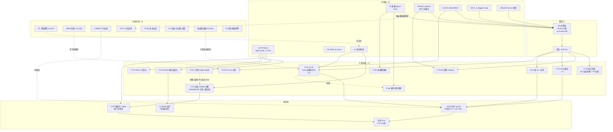
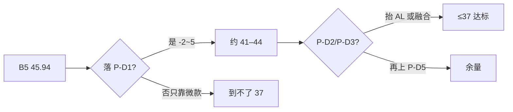
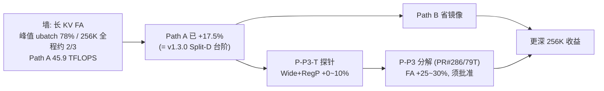

# 4 · 项目规划拓扑图

> 全项目连接关系：**目标 → 已突破 → 计划突破 → 失败/死路**。  
> 节点 id 可在汇报中直接指代（与 `PLAN-GRAPH.md` 呼应；冲突以本图 + 三份主文档为准）。

## 4.1 主拓扑

## 4.2 吐字冲刺路径（到 37.0）

## 4.3 预填充路径（256K）

## 4.4 节点索引

| 图上 id | 文档 |
|---|---|
| T8 / SEL / SM70 / C45 / FAD / NCCL / FIXD / PROBE | [`2-已突破方向.md`](2-已突破方向.md) |
| P-D* / P-P* / P-M* | [`1-计划突破方向.md`](1-计划突破方向.md) |
| X_* | [`3-失败记录.md`](3-失败记录.md) |

**接线义务**：新实验必须先挂到本图（突破→改 DONE；失败→改灰进 DEAD；计划→PLAN），再回写三份主文档。
